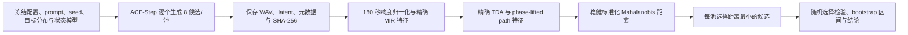

# ACE-Step 1.5 精确拓扑特征后验重排：云端运行手册

> **历史流水线声明（2026-08-03）**：本手册及其四维 Mahalanobis 目标仍对应
> 已停用的 `focus_topology_fingerprint_open_v1`，包含两个 Vietoris–Rips TDA
> 端点，不能用于当前正式实验。现行目标是 51 维纯 Path Homology
> `focus_path_homology_fingerprint_v2`；冻结定义与迁移后的分阶段方案见
> `docs/focus-path-homology-fingerprint-v2-analysis.md` 和
> `docs/ace-step-frozen-topology-inference-guidance-plan.md`。在重排代码完成 v2
> 适配前，本手册只作历史审计，不得执行为当前方案。

## 1. 已实现的验证边界

这条流水线验证的是“先生成多个候选，再用精确拓扑特征选择最接近目标拓扑的候选”，不是在扩散/流匹配的中间步骤直接修改潜变量。

正式配置固定为：

- 32 个 prompt 池；
- 每池 8 个候选，共 256 首；
- 每首 180 秒；
- ACE-Step 1.5 Turbo，8 步，shift 3.0，ODE/Euler；
- 不启用语言模型，不改变上游 ACE-Step 源码；
- 保存每个候选的最终 latent，供下一阶段研究“拓扑方向—潜变量方向”的对应关系；
- 后验评分只使用已经在 discovery 集上确定的 4 个拓扑特征。

流水线按以下顺序运行：



生成数据被隔离在 `runs/ace_rerank/<run_id>/`，不会写回原始 discovery 或 validation 数据表。

## 2. 重排使用的精确特征

固定特征顺序为：

1. `acoustic_novelty_delay__h0_max_persistence`
2. `rhythm__h0_total_persistence`
3. `path_acoustic_phase__loop_score`
4. `path_rhythm_phase__loop_score`

目标分布只从 `focus / discovery / 180s` 的完整交集估计。加入第 200 首 Focus 曲目并补齐 TDA 后，当前完整样本数为 130。中心采用中位数，尺度优先采用 IQR 稳健估计，相关性采用收缩协方差的伪逆。

候选分数为：

```text
d(x) = sqrt(z(x)^T P z(x))
```

其中 `z(x)` 是相对于 discovery Focus 目标中心和尺度的标准化特征，`P` 是冻结的精度矩阵。每个 prompt 池选择 `d(x)` 最小的候选。正式配置中的技术质量权重为 0，因此拓扑距离不会被未预注册的主观指标混入；削波率和 RMS 仍会写入结果用于审计。

## 3. 上传到云端前必须包含的文件

若直接上传整个工作目录，确认下列文件没有被云盘或 Git 忽略：

```text
ACE-Step-1.5/
configs/ace_rerank_180s.toml
configs/pipeline.toml
generation/prompts/ace_rerank_formal.csv
metadata/tda_features.csv
metadata/repetition_homology_features.csv
features/models/state_model.npz
features/models/state_model.json
src/
pyproject.toml
scripts/run_ace_rerank_cloud.sh
```

特别注意：`features/` 中的派生产物通常不会由 Git 自动上传。缺少冻结状态模型时，预检会直接失败。

## 4. 云端环境安装

建议使用 Linux、Python 3.11 或 3.12，并先确认 NVIDIA 驱动可见：

```bash
nvidia-smi
```

进入项目后，用 ACE-Step 自己的环境承载 ACE 与本项目依赖：

```bash
cd /workspace/focus_music_GLMY/ACE-Step-1.5
uv sync
uv pip install --python .venv/bin/python -e "../[audio,stats,tda]"
cd ..
```

若已按 ACE-Step 官方方式创建环境，只需把根项目以 editable 方式安装到同一个 Python 环境。模型 checkpoint 缺失时，ACE-Step 初始化会按其自身机制下载；无外网服务器应事先把 checkpoint 放入 `ACE-Step-1.5/checkpoints/`。

正式实验会保存 256 个 float WAV 和 latent，另有 checkpoint、缓存与派生特征。部署前应预留充足磁盘空间，并避免把运行目录放到会自动回收的临时盘。

## 5. 正式运行

推荐先运行预检和计划检查：

```bash
PY=ACE-Step-1.5/.venv/bin/python

"$PY" -m generation.rerank_cli preflight \
  --root . \
  --config configs/ace_rerank_180s.toml \
  --backend ace

"$PY" -m generation.rerank_cli plan \
  --root . \
  --config configs/ace_rerank_180s.toml \
  --backend ace
```

计划检查应显示 `prompt_pools=32`、`candidates=256`、`duration_seconds=180.0`。

之后可用一条命令执行完整流程：

```bash
bash scripts/run_ace_rerank_cloud.sh
```

也可以分阶段执行，便于分别安排 GPU 生成和 CPU 特征计算：

```bash
PY=ACE-Step-1.5/.venv/bin/python

"$PY" -m generation.rerank_cli generate \
  --root . \
  --config configs/ace_rerank_180s.toml \
  --backend ace \
  --retry-failed

"$PY" -m generation.rerank_cli score \
  --root . \
  --config configs/ace_rerank_180s.toml \
  --backend ace
```

同一个 `run_id` 可以安全续跑：已通过哈希验证的候选会跳过，失败候选只有加 `--retry-failed` 才会重试。若配置、目标表或冻结状态模型发生变化，必须使用新 `run_id`：

```bash
RUN_ID=ace_rerank_180s_v2 bash scripts/run_ace_rerank_cloud.sh
```

不要为了复用旧目录而修改其中的 `experiment.json`、`target_profile.json` 或候选清单。

## 6. 输出目录与审计文件

默认输出位于：

```text
runs/ace_rerank/ace_rerank_180s_v2/
```

关键文件：

| 文件 | 内容 |
|---|---|
| `experiment.json` | 完整配置、配置哈希、ACE-Step commit、冻结状态模型哈希 |
| `target_profile.json` | 4 维目标中心、尺度、精度矩阵、源表哈希 |
| `manifests/candidates.csv` | prompt、seed、状态、音频/latent 哈希、错误信息 |
| `data_raw/candidates/*.wav` | ACE-Step 原始候选 |
| `latents/*.npz` | ACE-Step 返回的最终 `pred_latents` |
| `descriptors.csv` | 每个候选的 4 个精确拓扑特征及技术音频指标 |
| `scores.csv` | 距离、池内名次、baseline 与 selected 标记 |
| `pool_summary.csv` | 每个 prompt 池的候选 0 基线、胜者及相对改善 |
| `summary.json` | 正式总体结论、置信区间和随机选择检验 |

若候选音频、latent 或元数据缺失或哈希不一致，该候选会重新生成；一旦发生重生，旧的最终描述符和评分会自动失效，避免“新音频使用旧分数”。

## 7. 预注册式判定

`summary.json` 只有同时满足以下条件才给出 `verdict="pass"`：

- 生成长度与目标长度同为 180 秒；
- 至少 20 个完整 prompt 池；
- 相对候选 0 基线的池级中位改善不低于 10%；
- 条件于已生成候选池的随机选择置换检验 `p < 0.05`。

这只支持“精确拓扑后验重排优于随机/固定首候选”的结论。它不自动证明：

- 听感质量不下降；
- prompt 遵循度不下降；
- 对 ADHD 或专注表现存在临床效果；
- 潜空间中间步骤的拓扑引导已经有效。

听感与 prompt 对齐需要另做盲评非劣效验证。若后验重排通过，保存的成对 latent、拓扑描述符和池内排名可作为下一阶段训练局部代理模型或估计 steering direction 的数据。

## 8. 本地无 GPU 冒烟检查

本地只验证工程连通性，不验证 ACE 生成或科学效果：

```powershell
focus-ace-rerank run `
  --root . `
  --config configs/ace_rerank_smoke.toml `
  --backend fake `
  --retry-failed
```

该配置生成 60 秒合成占位音频，而目标仍为 180 秒，因此结论必须是：

```text
smoke_only_scale_mismatch
```

任何由该冒烟配置得到的改善比例都不得作为论文实验结果。
