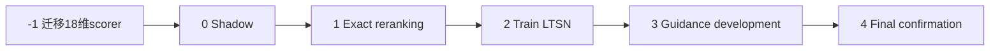

# ACE-Step 冻结 18 维 Path Homology 指纹推理期引导方案

更新日期：2026-08-17

逻辑指纹 ID：`focus_path_homology_fingerprint_v2`

指纹规格：Pitch 16 维 + Acoustic phase 1 维 + Chroma phase 1 维

适用生成：ACE-Step 1.5 Turbo、PyTorch、180 s text-to-music

当前工程状态：18 维机器可读 scorer 已重建、复现并签发；exact scoring 与 shadow
已解锁，experimental reranking 待效果门槛，LTSN 与采样引导仍保持阻断

## 摘要

本方案以论文中冻结的 18 维纯 Path Homology 指纹替换旧 51 维目标。当前主目标
只包含三个输入：

- $L$：Pitch 局部状态转移 Path Homology，16 维、有效秩 13；
- $P$：Acoustic phase 与 Chroma phase 的六节点相位环 `loop_score`；
- $\Phi_{PH}$：$L$ 与 $P$ 的等块融合，共 18 维。

在联合平方距离中，Pitch 权重为 $1/2$，Acoustic phase 与 Chroma phase 各为
$1/4$。Rhythm、Modulation、Rhythm phase 和 Structure 均不进入当前指纹、主损失
或采样梯度；它们可以保留为独立研究结果，但不能被运行时悄然重新加入。

validation/180 s 中，Pitch、Phase、Pitch+Phase 的 pseudo-$F$ 分别为 7.588、
20.580、13.486。Phase 加入 Pitch 的配对增量为 $+5.898$、BH-FDR $q=0.002$；
Pitch 加入 Phase 的增量为 $-7.094$、$q=1$。辅助分类中三者 balanced accuracy
分别为 0.933、0.683、0.925，AUROC 分别为 0.988、0.733、0.982。因此联合指纹
适合作为同时包含局部状态组织和长程周期闭合的描述空间，但不能称为优于最佳
单块的模型。Phase \(\mid\) Pitch 条件残差在主要尺度未通过 FDR（$q=0.230$），
所以也不能把 Phase 写成已经通过条件验证的独立信息源。

工程路线按硬门槛推进：

1. 重建并冻结 18 维 exact scorer；
2. shadow scoring；
3. 同 prompt 候选池 exact reranking；
4. 训练 18 维 latent-to-topology surrogate（LTSN）；
5. 在 ACE-Step 中段步骤施加弱、可撤销的代理梯度；
6. 解码后使用 exact scorer 复核，并执行音质和 prompt 一致性非劣检验。

第 1 步已完成并产生新 SHA-256；旧 51 维 JSON 已归档且运行时拒绝加载。当前仍
没有验证 exact reranking、LTSN 或采样期引导有效。

## 1. 冻结拓扑目标

### 1.1 Pitch 局部块 $L$

Pitch 使用冻结的 Pitch-v2 状态表示：beat-synchronous Chroma 映射到 Tonnetz，
再由 discovery 拟合的 16 状态码本产生有向状态序列。固定的 20 个图与 Path
Homology 描述子覆盖状态/边数量、密度、互惠、自转移、转移/路径熵、定向复现，
以及 H0/H1 Betti 与 persistence 汇总。删除 discovery 常量列后保留 16 个坐标。

Pitch 是唯一进入当前主指纹的局部块。H1 高度零膨胀，不能被单独设为“越高越好”
的控制目标；运行时必须通过完整冻结变换和判别边界计算分数。

### 1.2 双相位块 $P$

相位提升从块级距离矩阵选择主导周期 $P^*$，映射到六个有序相位节点，并计算
跨周期复现与相邻相位边权：

$$
P^*=\arg\min_{P\in\mathcal P}\operatorname{median}_i D_{i,i+P},
\qquad
r_i=\exp(-D_{i,i+P^*}/s),
$$

$$
q_i=\left\lfloor\frac{(i\bmod P^*)6}{P^*}\right\rfloor,
\qquad
w_k=\min(c_k,c_{k+1}),
\qquad
\texttt{loop\_score}=\min_k w_k.
$$

当前 $P$ 只包含：

- `path_acoustic_phase__loop_score`；
- `path_chroma_phase__loop_score`。

Rhythm phase 在 validation/180 s 未通过三视角 BH-FDR，不进入当前目标。六节点环
是预定义相位提升诱导的 Path $H_1$，不能解释为普通状态图中普遍存在的自然环。

### 1.3 18 维融合

各输入沿用 discovery 拟合的中位数填补、常量列删除、伪逆白化与有效秩归一化：

$$
L=Z_{\mathrm{Pitch}},
\qquad
P=\frac{1}{\sqrt 2}
[Z_{\mathrm{Acoustic}}\mid Z_{\mathrm{Chroma}}],
$$

$$
\Phi_{PH}=\frac{1}{\sqrt 2}[L\mid P].
$$

| 输入 | 输出维数 | 有效秩 | 在 $\Phi_{PH}$ 平方距离中的权重 |
|---|---:|---:|---:|
| Pitch Path Homology | 16 | 13 | 1/2 |
| Acoustic phase `loop_score` | 1 | 1 | 1/4 |
| Chroma phase `loop_score` | 1 | 1 | 1/4 |
| 合计 | 18 | -- | 1 |

权重、输入顺序和保留列均为版本身份的一部分，不允许使用 validation 或已开启
holdout 再搜索。


[分类消融 SVG](../runs/pitch_phase_hierarchical_fusion/figures/pitch_phase_classification_ablation.svg)

## 2. 阶段 -1：18 维 exact scorer（已完成）

以下产物已经迁移并由 release manifest 签发：

- `configs/focus_path_homology_fingerprint_v2.toml`；
- `scripts/build_focus_path_homology_fingerprint.py`；
- `metadata/focus_path_homology_fingerprint_v2.json`；
- `metadata/focus_path_homology_fingerprint_v2_scores.csv`；
- `metadata/focus_path_homology_fingerprint_v2_directions.csv`；
- `metadata/focus_path_homology_fingerprint_v2_summary.json`。

新增签发清单为 `metadata/focus_path_homology_fingerprint_v2_release.json`。当前
profile SHA-256 为
`c76a94dc0d122420728f20be738f6817dc92186ea7b3482ed772d53a2018f592`，分类器
SHA-256 为 `c23c39ddfeb25b59781f561146018dd05eb257fd6e533a89b3a9d7102144ce03`。
旧 51 维产物已归档至
`metadata/archive/focus_path_homology_fingerprint_v2_legacy_51d_9bf64f3c1d79/`。

本次签发已经完成并记录：

1. 归档旧 51 维 JSON 与 SHA-256，不覆盖其审计记录；
2. 将 `local_views` 固定为 `['pitch']`，将 `phase_views` 固定为 Acoustic/Chroma，
   删除主配置中的 Rhythm、Modulation、Structure 与所有 TDA 端点；
3. 使用 discovery/180 s 重新拟合 18 维块变换；
4. 仅在 discovery 内五折选择 L2 逻辑回归，当前分析对应 $C=10$；
5. 序列化 18 维特征顺序、填补值、保留列、白化矩阵、有效秩、融合权重、分类器
   系数与截距；
6. 从 discovery Focus logit 计算目标带下界 $\tau_F$，不得用 validation 调整；
7. 记录输入 CSV、配置、代码和模型的 SHA-256；
8. 在 validation/180 s 复算 BA、AUROC、pseudo-$F$ 与配对增量，确认与冻结报告
   一致后才签发新 scorer hash。

迁移后的 JSON 至少必须包含：

```text
fingerprint_id
spec_revision
dimensions = 18
feature_order = [16 pitch coordinates, acoustic phase, chroma phase]
distance_weights = [1/2, 1/4, 1/4]
block_transforms
classifier_coef
classifier_intercept
focus_band_threshold
input_sha256
code_sha256
```

## 3. Exact teacher 与目标带损失

### 3.1 为什么 exact Path Homology 不直接反传

精确管线包含状态量化、top-k、硬阈值、矩阵秩、周期 `argmin`、相位分箱和最弱边
`min`。这些运算适合离线标签、候选重排和最终复核，不适合在每个采样步直接求导。

因此：

- exact PH 是教师与最终裁判；
- LTSN 只提供采样内的可微近似；
- 代理分数改善必须由解码后的 exact 18 维 scorer 复核。

### 3.2 Focus 判别分数

在 discovery/180 s 上拟合冻结 L2 逻辑回归：

$$
S_F(x)=w^\top\Phi_{PH}(x)+b,
\qquad
p_F(x)=\sigma(S_F(x)).
$$

为了避免无限抬高判别分数，使用 discovery Focus logit 的预设低分位数
$\tau_F$ 作为进入目标带的下界：

$$
L_{PH}(x)=\left[\max(0,\tau_F-S_F(x))\right]^2.
$$

进入目标带后梯度归零。$p_F$ 只表示当前 Open Focus--Classical 数据边界上的
判别概率，不是注意力有效概率、音乐质量分数或因果效应。

### 3.3 正确的轨迹标签

ACE-Step flow 模型的预测干净潜变量为

$$
\hat x_0=x_t-tv_t.
$$

必须解码被选中采样步骤各自的 $\hat x_0$，再计算该快照自己的 18 维坐标、
Focus logit、OOD 状态与音频质量标签。不能把最终音频标签复制给全部中间步骤。

训练数据应包括：

- 真实 Focus/Classical 的 VAE 重建；
- 多 prompt、多 seed 的无引导 ACE-Step 输出；
- 第 4--6 步 $\hat x_0$ 快照；
- 静音、削波、机械短循环、过度平滑等安全负例。

同一曲目、prompt 或生成轨迹的不同版本不得跨训练/验证切分。

## 4. 18 维 LTSN

### 4.1 网络接口

LTSN 输入为 ACE-Step 潜变量 `[B,T,64]` 与可选 timestep，建议结构为：

- LayerNorm；
- 多尺度 strided Conv1D；
- dilation 1/2/4/8 的 TCN residual blocks；
- timestep embedding；
- masked attention pooling + mean/std pooling；
- 输出 18 维坐标、Focus logit、预测方差与 OOD 分数。

完整网络细节可沿用 `docs/ltsn-network-architecture-and-training.md` 的设计，但所有
51 维输出头、块索引和资格门槛必须迁移到当前 18 维定义后才能训练。

### 4.2 块平衡代理损失

坐标损失按冻结平方距离权重平衡，避免 16 维 Pitch 仅因维数更多而支配训练：

$$
L_{coord}=
\frac{1}{2}\frac{1}{16}\sum_{j\in L}
\operatorname{Huber}(\hat z_j-z_j)
+\frac{1}{4}\operatorname{Huber}(\hat z_A-z_A)
+\frac{1}{4}\operatorname{Huber}(\hat z_C-z_C).
$$

其余损失为

$$
L_{score}=\operatorname{Huber}(\hat S_F-S_F),
$$

$$
L_{rank}=\max\left(0,
1-\operatorname{sign}(S_i-S_k)(\hat S_i-\hat S_k)\right),
$$

$$
L_{sur}=L_{coord}+0.5L_{score}+0.2L_{rank}+0.1L_{NLL}+0.1L_{OOD}.
$$

这些系数是 development 起点，必须在最终确认实验前一次冻结；不得借助论文
validation 或已开启 holdout 调整。

### 4.3 LTSN 资格门槛

- Focus logit Spearman $\rho\ge0.70$；
- 18 维坐标中位 Spearman $\rho\ge0.50$；
- Pitch 块距离与 Phase 块距离的 Spearman 均 $\ge0.50$；
- Acoustic/Chroma 两个 `loop_score` 的 Spearman 均 $\ge0.50$；
- 高/低四分位排序准确率 $\ge0.65$；
- 90% 预测区间覆盖率位于 0.85--0.95；
- 在代理优化样本上，exact score 与代理 score 的变化方向一致；
- 不确定度或 OOD 超阈时自动 no-op。

未同时通过上述门槛时，只保留 exact reranking，不进入采样器。

## 5. ACE-Step 采样插入点

旧计划记录的 ACE-Step 1.5 Turbo commit 为
`a5632cda3084f1088e69b2057dde7047e1bb4839`；正式实验前必须重新核对当前 checkout
与采样循环是否仍一致。

初版只修改 PyTorch Turbo ODE/Euler 路径。建议顺序：

```text
DiT velocity
  -> Euler/Heun
  -> DCW
  -> topology corrector
  -> Repaint injection
```

Repaint 保持在最后，避免受保护区域被拓扑梯度覆盖。Turbo 是 CFG-distilled；
`guidance_scale` 不是拓扑控制接口。

## 6. 采样校正公式

DiT 保持 `torch.no_grad()`，只对 detached 的预测干净潜变量求代理梯度：

$$
\tilde x_0=\operatorname{stopgrad}(x_t-tv_t),
\qquad
\tilde x_0.\mathrm{requires\_grad}=\mathrm{True}.
$$

主损失为

$$
\mathcal L_t=
L_{PH}(g_\phi(\tilde x_0,t))
+\lambda_uU_{OOD}
+\lambda_qL_{quality}.
$$

当前目标中不存在 Structure、Rhythm 或 Modulation 梯度项。质量/OOD 项只负责
no-op 或安全约束，不能改变冻结拓扑指纹的组成。

$$
g_t=\nabla_{\tilde x_0}\mathcal L_t,
\qquad
\delta_t=-\eta_k\operatorname{LPF}(M\odot g_t).
$$

应用有效帧掩码与逐样本 RMS clip：

$$
\delta_t\leftarrow\delta_t
\min\left(1,
\frac{\rho\operatorname{RMS}(\tilde x_0)}
{\operatorname{RMS}(\delta_t)+\epsilon}\right).
$$

映射回下一时刻：

$$
x_{t_{next}}\leftarrow
x_{t_{next}}+(1-t_{next})a_k\delta_t.
$$

## 7. 步骤窗口与强度

默认 8 步、shift=3.0 的时间序列为

$$
[1.000,0.955,0.900,0.833,0.750,0.643,0.500,0.300].
$$

初始设计只在第 4--6 步启用，三角权重为 `[0.5,1.0,0.5]`。跳过高噪声前三步
和直接输出 $x_0$ 的最后一步。RMS clip development 候选为 0.25%、0.5%、1.0%；
只能在独立 development prompts 上选择一次，之后冻结。


[步骤窗口 SVG](../runs/ace_topology_guidance_design/figures/sampler_guidance_schedule.svg)

## 8. Corrector 接口

```python
class TopologyCorrector(Protocol):
    def __call__(
        self,
        *,
        xt_next: Tensor,
        xt_before_step: Tensor,
        velocity: Tensor,
        timestep: float,
        next_timestep: float,
        step_index: int,
        attention_mask: Tensor,
        repaint_mask: Tensor | None,
    ) -> Tensor: ...
```

伪代码：

```python
xt_next = euler_step(xt, velocity, timestep, next_timestep)
xt_next = dcw_corrector.apply(xt_next, pred_clean, timestep)

if topology_corrector is not None:
    xt_next = topology_corrector(
        xt_next=xt_next,
        xt_before_step=xt,
        velocity=velocity,
        timestep=timestep,
        next_timestep=next_timestep,
        step_index=step_index,
        attention_mask=attention_mask,
        repaint_mask=repaint_mask,
    )

xt_next = repaint_injection(xt_next, ...)
```

corrector 为 `None`、强度为零、步骤不在窗口、18 维 scorer hash 不匹配、预测
OOD 或出现 NaN/Inf 时必须逐位 no-op。

## 9. 分阶段实验与硬门槛



### 阶段 -1：评分产物迁移

第 2 节全部迁移、回归测试与新 SHA 签发已经通过；允许进入 shadow 与 exact
reranking，但这不等于 reranking 效果已通过。

### 阶段 0：Shadow mode

- 不改变生成；
- 保存第 4--6 步轨迹、最终潜变量和音频；
- exact 计算 18 维坐标、Focus logit 与安全指标；
- 记录 ACE 模型、VAE、scorer、配置、输入和代码 SHA-256。

### 阶段 1：Exact reranking

32 prompt × 8 seed，共 256 首 180 s 候选。比较：

1. 第一个候选；
2. 仅质量重排；
3. 质量 + exact 18 维 `focus_band_loss` 重排。

通过门槛：

- 对初始 exact loss 大于零的候选池，选中样本的中位 loss 改善至少 10%；
- 按 prompt 聚类 bootstrap 95% CI 不跨 0；
- 目标带命中率提高；
- 质量、prompt 一致性满足非劣；
- 候选多样性没有明显下降。

### 阶段 2：LTSN

在未见 prompt、seed family 和轨迹上执行第 4.3 节资格测试。未通过时停止升级，
保留 exact reranking。

### 阶段 3：采样开发

比较 0.25%、0.5%、1.0% RMS clip。可以报告 $L$ only、$P$ only、$L+P$ 的诊断
消融，但这些消融不得用于改变冻结的最终指纹或重新搜索块权重。最终强度只选择
一次。

### 阶段 4：一次最终确认

32 prompt × 8 seed，每个 seed 生成 baseline/guided 配对，共 512 首 180 s 音频。
使用未参与代理训练、强度选择或阶段 1 的新 prompt/seed。结果不得再次用于修改
指纹、代理损失或采样窗口。

## 10. 评价指标

### 10.1 主要终点

$$
\Delta_i=L_{PH}^{guided}(i)-L_{PH}^{base}(i).
$$

负值表示生成更接近冻结 Focus 目标带。报告中位差、Hodges--Lehmann 位移和按
prompt 聚类 bootstrap 95% CI，并同时报告目标带命中率。

### 10.2 拓扑诊断

- exact Focus logit/probability；
- $L$、$P$ 与 $L+P$ 的距离；
- 16 个 Pitch 坐标与两个 phase `loop_score`；
- 代理与 exact 的坐标、分数和排序误差；
- OOD 率与 no-op 率。

旧计划中的“40 项方向签名”、Rhythm/Modulation 块距离和 Structure 指标不属于
当前主终点。

### 10.3 质量与安全

- prompt/CLAP 一致性或冻结等价指标；
- LUFS、true peak、削波与静音率；
- 频谱异常、过度平滑和机械短循环；
- 音频质量及“Focus-like 但不过度单调”的双盲评分；
- 推理耗时、峰值显存、NaN 和失败率。

质量采用预先冻结的非劣检验。若 exact PH 改善但质量或 prompt 一致性越界，仍判
引导失败。

## 11. 风险与停止规则

### 旧产物误载

若维数不是 18、特征顺序不匹配、出现 Rhythm/Modulation/Structure/TDA 字段或
SHA 不一致，立即拒绝启动，不能自动兼容旧 51 维 scorer。

### Proxy gaming

若代理分数改善但解码后的 exact PH 不改善，立即停止；不能只报告 LTSN 分数。

### Pitch 过度平滑

持续减少状态数、熵和 H0 可能产生单调或贫乏输出。目标带损失、弱中段校正、
RMS clip 和质量非劣共同限制该风险。

### Phase 机械循环

持续抬高最弱相位边可能产生短而机械的重复。进入目标带后梯度必须归零，并监测
重复坍缩、音质与 prompt 一致性。

### 因果边界

即使实验成功，也只能称为“frozen Path Homology fingerprint steering”，不能
声称提高专注力、学习效果、治疗作用或生产率。

### 停止条件

出现任一情况即停止升级：

- 阶段 -1 不能复现冻结的 18 维 validation 结果；
- exact reranking 改善不足 10%；
- LTSN 未通过相关、排序、校准或 OOD 门槛；
- 代理与 exact 系统性背离；
- 质量、prompt 一致性或多样性越过非劣界；
- 机械循环、过度平滑、NaN、OOM 或失败率明显增加；
- 需要利用论文 validation 或已开启 holdout 继续调参。

## 12. 实施文件

当前 18 维分析依据：

- `scripts/run_pitch_phase_hierarchical_fusion_analysis.py`；
- `metadata/pitch_phase_hierarchical_summary.json`；
- `metadata/pitch_phase_hierarchical_*.csv`；
- `docs/focus-path-homology-fingerprint-v2-analysis.md`；
- `runs/pitch_phase_hierarchical_fusion/figures/`。

已迁移并签发：

- `configs/focus_path_homology_fingerprint_v2.toml`；
- `scripts/build_focus_path_homology_fingerprint.py`；
- `metadata/focus_path_homology_fingerprint_v2*.json`；
- `metadata/focus_path_homology_fingerprint_v2*.csv`；
- 依赖旧四端点或旧 51 维 scorer 的 reranking 配置。

后续实现：

```text
src/generation/path_homology_surrogate.py
src/generation/path_homology_corrector.py
scripts/collect_ace_path_homology_trajectories.py
scripts/train_path_homology_surrogate.py
scripts/evaluate_path_homology_guidance.py
tests/test_path_homology_corrector.py
tests/test_path_homology_surrogate.py
```

## 13. 最低测试要求

- 维数必须等于 18；
- 特征顺序必须是 16 个 Pitch 坐标、Acoustic phase、Chroma phase；
- 距离权重必须是 $1/2,1/4,1/4$；
- scorer、输入和代码 SHA 不匹配时拒绝启动；
- 出现 Rhythm、Modulation、Structure 或 TDA 主输入时拒绝加载；
- `None`/零强度逐位恒等；
- 相同 seed 确定性；
- 只在冻结步骤窗口调用；
- RMS clip 不越界；
- padding/Repaint 区域不被改写；
- OOD/NaN/Inf 自动 no-op；
- batch 与单样本一致；
- guided 输出必须执行 exact verifier；
- 代理优化样本必须检查 exact score、两个 phase 分数与 Pitch 块距离。

## 14. 最终执行状态

当前冻结目标是 18 维 Pitch+双相位 Path Homology 指纹，而不是旧 51 维
Pitch/Rhythm/Modulation+双相位指纹。Structure 不再是辅助主层或 no-op gate。

签发后的当前状态为：

```text
frozen_18d_spec = enabled
legacy_51d_scorer = reject
exact_scoring = enabled
shadow_mode = enabled
experimental_reranking = enabled_pending_separate_effect_gate
ltsn_labeling = blocked_until_exact_reranking_gate
sampling_guidance = disabled_until_all_gates_pass
```

下一步不是直接训练 LTSN 或开启采样器，而是运行阶段 0 shadow 与阶段 1 exact
reranking，验证同 prompt 候选空间的冻结拓扑差异和质量非劣。只有 reranking
效果门槛通过后，才能用本次签发 scorer 构建 LTSN 标签。
