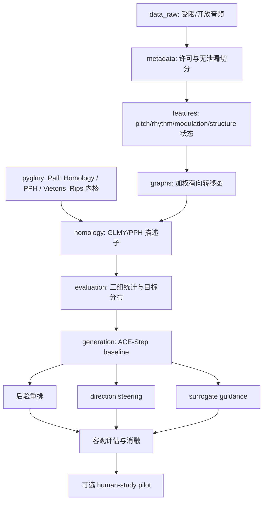

# 工程架构

## 模块契约

- `data.manifest`：读取并验证许可台账、曲目索引和公开边界。
- `features.states`：把连续 MIR 特征量化为可复现的离散状态序列。
- `features.structure`：从短时声学向量构建余弦自相似矩阵，以对角棋盘核检测宏观段落边界，并将段落汇聚为高阶结构状态。
- `graphs.transition`：构建带权有向图，支持 top-k 稀疏化与阈值 filtration。
- `packages/pyglmy`：领域无关的 GLMY/PPH 与 Vietoris–Rips 底层库；音乐工程通过适配层调用。
- `homology.glmy`：兼容旧导入路径并把有向转移图转换为 `pyglmy.WeightedDiGraph`。
- `generation.rerank`：实现必须具备的“多采样 + 拓扑重排”基线。
- `generation.steering`：只提供与模型无关的 schedule 和线性方向更新。
- `generation.ace_adapter`：隔离 ACE-Step 版本变化；上游子仓库无需直接打补丁。

## 实验层级

1. 主结果：三组音乐的调制图、节奏图、音高图和宏观结构图拓扑是否存在稳定差异。
2. 必做生成基线：相同 prompt/seed 预算下的后验重排。
3. 主干预：拟合 latent-to-topology 局部线性方向并在采样中段小步更新。
4. 升级项：可微 surrogate head；必须单独报告其预测误差。
5. 增强证据：经过审批的人因 pilot，不用于宣称临床疗效。
