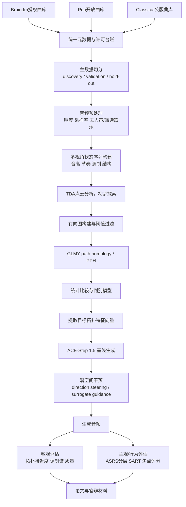

# 基于 GLMY 路径同调与 ACE-Step 1.5 潜空间干预的 ADHD 专注音乐研究报告

## 前提与假设

- 我已获得 Brain.fm 的研究授权，因此可以把 Brain.fm 的 focus 音乐作为**受限使用的正对照数据源**来做分析，但我默认**不能公开再分发原始音频**，公开时应只释放派生特征、匿名化统计量、图结构和可复现实验代码。
- 我将本课题优先定位为**丘成桐中学生科学奖“计算机奖”**项目，而不是医学或生物临床试验；神经科学与 ADHD 文献用于支撑研究动机和评估方案，但不把本研究包装成临床疗效证明。丘奖官方明确分设计算机奖，且计算机奖要求题目与计算机学科相关、给出清晰算法实现与详尽实验结果；同一篇论文不得同时参加两个学科。
- 我把 Brain.fm 视为“**工程参考标准/正对照**”，而不是“医学金标准”或“唯一标准”；因为它确实是为专注与 ADHD 场景设计的功能音乐，并有官方科学页面与同行评议研究支撑，但 ADHD 与音乐研究整体证据仍存在方法异质性。
- 如果受试者招募、伦理审批或时间窗口不足，我会先完成“**音频拓扑分析 + 生成优化**”这条主线，把人因实验作为增强证据，而不让整个课题失败在临床样本招募上。

## 执行摘要

这个课题**总体可行，而且很适合做成丘成桐中学生科学奖的计算机奖项目**，前提是把研究问题清晰收敛为三步：先回答“Brain.fm 风格的 focus 音乐在有向拓扑上是否与流行/古典显著不同”，再回答“这种差异能否被 GLMY path homology 稳定检出并形成可解释特征”，最后回答“这些特征能否在 ACE-Step 1.5 的推理阶段被显式引导，从而让生成音乐更接近目标拓扑分布”。丘奖计算机奖强调学科相关性、原创性、算法实现与详尽实验结果，这一课题恰好把拓扑方法、音乐信息检索和生成模型控制结合在一起；同时，2026 中国内地赛区官方时间表显示，7 月 1 日至 9 月 15 日为网上注册报名与提交材料窗口，因此项目必须采用**先做出可验证主结果、再逐步扩展**的策略。

我对“是否以 Brain.fm 作为标准”的明确结论是：**可以，但应表述为“正对照”和“工程参考标准”，不应表述为“金标准”**。一方面，Brain.fm 官方明确把产品定位为为专注和 ADHD 设计的功能音乐，强调其安慰剂对照、EEG、fMRI 与同行评议证据；另一方面，2024 年发表于 *Communications Biology* 的研究表明，音乐中加入特定速率的幅度调制，尤其是 beta 范围的调制，可在高 ADHD 症状人群中更有效地支持持续注意，这与 Brain.fm 官方对专注音乐的技术叙述方向一致。另一方面，系统综述也提示 ADHD 与音乐研究总体上存在样本、任务、诊断和干预方式不一致的问题，因此从科研写作上，把 Brain.fm 设为“正对照”最稳妥。

方法上，最有价值的创新点不是简单把 persistent homology 套到音频点云上，而是利用 GLMY 理论对**有向音乐状态转移图**做 path homology：音乐天然是有向时序对象，旋律、节奏、包络调制与结构切换都具有方向性；GLMY 路径同调正是为 digraph/path complex 设计，具备对有向结构的自然敏感性。现有我检索到的音乐拓扑代表性工作更常使用 persistent homology，而非 GLMY 路径同调，这使你的课题具备明显的方法学新意，但也意味着你必须用更严格的消融、稳定性和复现实验来证明方法不是“数学包装”。

工程上，ACE-Step 1.5 是一个现实可用的骨干模型。官方技术报告将其描述为由语言模型规划器与 Diffusion Transformer 声学渲染器组成的混合架构，采用 4–8 步蒸馏采样，本地运行资源需求较低；官方教程又明确说明参考音频会被 VAE 编码为 latent 条件送入 DiT，推理 API 还显式暴露了 `reference_audio`、`src_audio`、`audio_cover_strength`、`inference_steps` 等关键入口。这意味着“在推理阶段对潜空间施加拓扑干预”不是空想，而是可以通过**采样环 latent steering**或**latent-to-topology surrogate guidance**实现的。

## 课题定位与可行性结论

### 课题应当投哪个学科

从丘奖官方规则与评审标准看，这个项目最稳妥的落点是**计算机奖**。原因不是它没有数学深度，而是竞赛层面的主贡献更接近“计算机科学中的算法与系统实现”：你会构建数据集、设计图表示、实现拓扑特征抽取、做统计判别、改造生成模型、完成客观与主观评测。官方对计算机奖的表述很直接：题目可以是所有计算机科学与技术领域问题，既可以是基础理论研究，也可以是技术问题探索；同时要求问题定义清晰、算法推导或实现完备、实验结果详尽，并建议提交视频、可执行程序包、源代码等资料。由于官方 FAQ 还明确说**同一篇论文不得参加两个科目**，因此不建议在“数学奖/计算机奖”之间摇摆，直接以计算机奖申报更有利。

### Brain.fm 作为标准的可行性结论

**明确结论：可行，但应限定为“正对照”，不是“医学金标准”。**  
支持可行性的理由有三层。第一，Brain.fm 官方将自己定位为“为 ADHD 设计的第一款音乐 app”，并在科学页面中强调自家的功能音乐并非对已有歌曲做简单筛选，而是针对预期脑状态进行设计，还声称使用安慰剂控制、EEG 与 fMRI 来测试效果。第二，同行评议论文显示，快速幅度调制音乐在高注意困难人群中能够产生更好的持续注意表现，并伴随 attentional networks 的 fMRI 活动增强与更强的 EEG stimulus-brain coupling；论文进一步发现，beta 范围的调制更有利于高 ASRS 人群。第三，系统综述与音乐-ADHD 综述都提示音乐可能对 ADHD 的若干维度有帮助，但总体证据仍有方法不一致；因此最科学的说法不是“Brain.fm 证明了专注音乐应该怎样”，而是“Brain.fm 提供了一个经过工程优化且已有实验支持的强正对照分布”。

### Brain.fm 与两类对照组的定位

| 组别 | 研究角色 | 建议来源 | 许可状态 | 主要价值 | 主要风险 |
|---|---|---|---|---|---|
| Brain.fm focus | 正对照/目标分布 | Brain.fm 授权曲库 | 已获授权，默认不公开再分发 | 直接代表“功能性专注音乐”工程实践；与 ADHD/专注场景高度相关 | 商业曲库、内部设计逻辑不可完全见；不能写成医学金标准 |
| Pop 对照 | 负对照或弱对照 | MTG-Jamendo 的 pop 标签曲目；必要时以 FMA 补充 | CC 许可或开放许可，需逐条校验 | 可以代表更强主旋律/更强吸引注意的流派分布 | 若含人声会严重混入歌词干扰；建议主分析先用 instrumental pop |
| Classical 对照 | 传统学习音乐对照 | Musopen 公版/免版税古典录音 | 公版或免版税资源 | 能代表低歌词、较稳定结构、常见学习背景音乐 | 古典内部风格跨度极大，必须控制时期、编制和录音条件 |

上表中的数据源选择是现实可执行的：Musopen 官方提供公版/免版税古典录音资源；MTG-Jamendo 数据集官方说明其建立于 Jamendo 上的 Creative Commons 音频并包含大规模标签；FMA 官方也强调平台以开放许可音乐为主。

### 研究新意应如何表述

建议把“创新点”写成三条，而不是堆概念。第一，**把 GLMY 路径同调用于功能音乐的有向时序分析**；第二，**把拓扑目标从分析指标转化为生成期可控的 latent guidance 目标**；第三，**用 Brain.fm–pop–classical 三组建立一个可解释的拓扑参照系**。GLMY 路径同调的优势来自其对 digraph 的天然适配、对 homotopy/Cartesian product/join 等图论操作的良好性质；而现有音乐拓扑工作更常落在 persistent homology 或一般 TDA 框架上，这使你的课题不是“重复别人做法换个数据集”，而是提出一条新方法链。

## 数据采集与实验设计

### 总体研究流程



### 数据采集与许可方案

建议把数据管理从第一天就做成“**许可先行**”而不是“先下再说”。Brain.fm 数据单独放在受限目录，使用内部 track ID 与哈希，不在公开仓库出现原始文件名；pop 与 classical 数据建立一张 `licenses.csv`，记录来源页面、许可类型、下载时间与是否允许再分发。这样做一方面符合学术诚信，另一方面也有利于丘奖答辩时说清楚“你为何能合法使用这些数据”。丘奖官方 FAQ 与评审导向反复强调诚信、材料真实与学术规范；计算机奖还明确建议提交代码与程序包作为真实性支撑。

我建议主数据源按下表配置：

| 数据组 | 首选来源 | 备用来源 | 说明 |
|---|---|---|---|
| Brain.fm focus | Brain.fm 授权 focus 曲库 | 无 | 只做受限研究使用；公开视频和开源仓库不放原始音频 |
| Pop | MTG-Jamendo 中 `genre/pop` 且优先 instrumental 标记曲目 | FMA 中开放许可流行/电子流行器乐 | 主分析优先用器乐流行；歌词会成为强混杂因素 |
| Classical | Musopen 公版/免版税录音 | 其他明确公版古典源 | 尽量限定为钢琴独奏/室内乐两个子池，减小编制混杂 |

该表的源头依据分别来自 Jamendo 数据集官方说明、Musopen 官网与 FMA 官方许可说明。

### 样本量与分组建议

用户未指定样本量。考虑到这是中学生科研项目、又需要做 GLMY 与生成模型双线实验，我建议把样本分成“发现集—验证集—保留集”三层，而不是一次性把数据都丢进去。

| 模块 | 当前状态 | 建议范围 | 说明 |
|---|---|---|---|
| 音频分析 discovery set | 未指定 | 每组 80–150 首 | 用于探索哪些拓扑特征最稳定 |
| 音频分析 validation set | 未指定 | 每组 30–50 首 | 固化参数后做确认性比较 |
| 生成目标建模 hold-out set | 未指定 | Brain.fm 20–30 首 | 只用于定义目标分布，不参与参数试错 |
| 人因实验受试者 | 未指定 | 24–60 人 | 若含 ADHD 人群，优先招募成人；可按 ASRS 分层 |
| 每首分析片段长度 | 未指定 | 120–180 秒 | 过短会损失中程结构，过长会增加计算负担 |
| 滑窗长度 | 未指定 | 30 秒，50% 重叠 | 兼顾局部稳定性与样本数 |

在人因验证上，最可执行的路线不是马上招募“临床确诊 ADHD 中学生”，而是先做**成人被试 + ASRS 分层**。这与 2024 年 *Communications Biology* 研究用 ASRS 对注意困难分层的思路一致，也能显著降低伦理门槛。ASRS 本身有成熟的 18 项量表和 6 项 screener；SART 则是经典持续注意任务，已广泛用于持续注意评估。

### 预处理流程与参数建议

下表为**建议配置**，不是必须值；未指定部分请在预注册中固定。

| 步骤 | 建议参数 | 是否必须 | 目的 |
|---|---|---|---|
| 主归档音频 | 48 kHz, stereo | 是 | 与 ACE-Step 1.5 音频接口保持一致 |
| 分析副本 | 22.05 kHz, mono | 是 | 降低 MIR 与拓扑计算负担 |
| 响度标准化 | 未指定；建议 -16 LUFS 到 -14 LUFS 区间 | 建议 | 降低录音电平差异的混杂 |
| 裁剪策略 | 中段 120–180 s；不足则整曲 | 是 | 避免前奏/尾奏过强偏差 |
| 去人声策略 | 未指定；建议主分析仅保留器乐，或做 vocal stem 剔除 | 强烈建议 | 控制歌词对专注与拓扑的干扰 |
| Beat 同步 | 未指定；建议 0.5 beat 或 1 beat 网格 | 是 | 统一状态序列构建粒度 |
| 特征缓存 | HDF5/Parquet | 是 | 提高复现实验效率 |
| 划分策略 | 按艺术家/专辑/作曲家分层切分 | 是 | 防止信息泄漏 |

如果你需要把 Brain.fm 作生成目标分布，额外建议保存三类衍生特征：音频包络调制谱、beat-synchronous chroma 序列、节拍间隔/起音强度序列。之所以要这样设计，是因为 *Communications Biology* 那项研究直接把“幅度调制速率”和“持续注意表现”连在一起，而 Brain.fm 官方科学页面又把其核心机制表述为神经 entrainment、相位锁定、针对注意网络的作用；因此“调制谱 + 时序有向图”将是你最自洽的一条主线。

## GLMY path homology 分析方案

### 为什么这一步应该用 GLMY 而不是只用普通 TDA

GLMY 理论把路径复形与有向图同调系统化了。其核心优点不是“更高深”，而是**更适合方向性数据**：在 digraph 上，允许路径、边界算子、同调群、homotopy 不变量都有明确的定义与理论保证。Grigor’yan、Lin、Muranov、Yau 的工作把 path homology 建立在 path chain complex 之上，并强调它对 morphism、Cartesian product、join、homotopy 等图操作具有良好性质；这正好契合音乐序列的方向性——旋律是从前往后、节奏是从前往后、结构段落的转移也是从前往后。

在 GLMY 记号下，设 digraph 为 \(G=(V,E)\)。一个 elementary \(p\)-path 是顶点序列 \(i_0,\dots,i_p\)；边界算子写作  
\[
\partial e_{i_0\cdots i_p}=\sum_{q=0}^{p}(-1)^q e_{i_0\cdots \hat{i_q}\cdots i_p}.
\]
对 digraph 而言，只有当每一对相邻顶点满足 \(i_k\to i_{k+1}\) 时，路径才是 allowed path；进一步，只保留 \(\partial\)-invariant 的 allowed paths，才能形成真正用于 path homology 的链复形。这一点尤其重要，因为它说明“不是所有时间序列路径都自动有拓扑意义”，必须先经过 digraph 约束。

### 音乐到有向图的三视角表示

建议不要一上来做一个过于复杂的统一图，而是采用**三视角主图 + 一个可选扩展图**。这样既符合中学生项目的可实现性，也方便解释。

| 图视角 | 顶点定义 | 有向边定义 | 主要捕捉内容 | 是否主分析 |
|---|---|---|---|---|
| 音高转移图 | beat-synchronous chroma 的离散状态；建议 12 pitch class + 1 不确定态 | 相邻 beat 状态转移，权重为频数或转移概率 | 和声稳定性、旋律游走、回环 | 是 |
| 节奏转移图 | IOI/起音密度分箱状态，建议 8–12 个状态 | 相邻时间窗节奏状态转移 | 节律重复与节奏控制 | 是 |
| 调制状态图 | 包络调制谱在若干频带上的量化状态；重点关注 8、12–20、32 Hz 邻域 | 相邻窗调制状态转移 | 与注意相关的时间调制纹理 | 是 |
| 结构段转移图 | 由 self-similarity / novelty 检出的 section 标签 | 段落间顺序转移 | 大尺度曲式稳定性 | 可选扩展 |

这四种表示中，最关键的是**调制状态图**。原因很直接：Nature 那篇研究用参数化幅度调制操纵了持续注意差异，且指出 beta 范围的调制对高 ASRS 人群更有帮助。你的课题不是要简单复现他们的心理学实验，而是把这个神经/行为启发转化为“拓扑目标”，因此调制状态图应当是 hypotheses 的中心。

### GLMY 实现细节与参数建议

建议采用“**主做 \(H_0\) 与 \(H_1\)，谨慎探索 \(H_2\)**”的策略。因为在音乐状态图里，一维回路通常最容易解释：它们可对应到重复—偏离—回归的组织方式；而更高维同调虽然理论上可算，但在中学生项目时间内，计算与解释成本都偏高。对于 persistent 版本，可对边权阈值做 filtration，形成 persistent path homology；这在 directed networks 上已有较成熟的理论与算法脉络，也有现成开源代码可做核对。

下面给出一套可预注册的建议参数：

| 模块 | 用户当前状态 | 建议设置 |
|---|---|---|
| 系数域 | 未指定 | 主分析用 \(\mathbb{Q}\) 或 \(\mathbb{R}\) 的秩计算；稳健性检验用 \(\mathbb{F}_2\) |
| 最大同调维数 | 未指定 | `p_max = 2`；发现集可试 `p_max = 3` 但不作为主结果 |
| 边权 | 未指定 | 转移概率 \(w_{ij}=c_{ij}/\sum_j c_{ij}\) |
| filtration | 未指定 | 量化阈值 \(\tau \in \{0.50,0.60,\dots,0.95\}\) |
| 稀疏化 | 未指定 | 每节点保留 top-k 出边，建议 `k=5~8`，并同时做最小权重阈值对照 |
| 主拓扑指标 | 未指定 | \(\beta_0(\tau), \beta_1(\tau)\)、总 persistence、最大寿命、出生/死亡阈值 |
| 扩展指标 | 未指定 | \( \Delta_1 \) 的零空间维数、最小非零特征值、harmonic representative 长度 |
| 统计阈值 | 未指定 | 主检验 \(\alpha=0.05\)；多重比较用 BH-FDR，建议 `q=0.10` |

如果你想让数学部分更扎实，可以把 Hodge Laplacian 作为“补充解释层”。GLMY 后续综述明确把 Hodge Laplacian 纳入 path chain complex 的谱分析框架；在实现上，你可以不把它作为主结论，只用它解释“某些回路是短寿命噪声，某些回路是稳定 harmonic mode”。

### 统计检验与结果图表模板

建议把统计设计分为“单变量确认”“多变量判别”“分布距离比较”三层。

| 问题 | 首选检验 | 备选检验 | 报告指标 |
|---|---|---|---|
| Brain.fm、pop、classical 的单个拓扑指标是否不同 | Welch ANOVA 或 Kruskal–Wallis | 置换检验 | p 值、效应量、95% CI |
| 三组的整体拓扑向量是否可区分 | MANOVA / PERMANOVA | 距离置换检验 | 全局 p 值、组间距离 |
| 仅用拓扑特征能否分类三组 | 嵌套交叉验证分类器 | 简单线性判别作为基线 | macro-F1、AUROC、混淆矩阵 |
| 生成音乐是否更接近目标分布 | MMD / EMD / Fréchet-like 距离 | energy distance | 目标距离下降百分比 |
| 人因实验中不同条件对表现是否有影响 | 线性混合效应模型 | Friedman/Wilcoxon | 条件主效应、顺序效应、ASRS 交互 |

建议预先承诺至少画出六张图：  
一是三组 \(\beta_1\) 的 violin/box 图；二是 filtration 下 \(\beta_1(\tau)\) 折线；三是 persistent barcode 或 lifetimes summary 图；四是拓扑特征空间的 UMAP/PCA；五是生成模型在不同 steering 强度下的“目标距离–音质距离”折衷曲线；六是人因实验中的 SART 表现与主观专注评分图。因为丘奖计算机奖强调详尽实验结果，图表完整度会直接影响答辩说服力。

### GLMY 计算伪代码

```python
# 伪代码：从音乐状态序列构建 digraph 并计算 GLMY path homology
from collections import defaultdict
import numpy as np

def build_transition_graph(state_seq, normalize=True, top_k=None):
    counts = defaultdict(int)
    out_counts = defaultdict(int)

    for a, b in zip(state_seq[:-1], state_seq[1:]):
        if a is None or b is None:
            continue
        counts[(a, b)] += 1
        out_counts[a] += 1

    edges = []
    for (a, b), c in counts.items():
        w = c / out_counts[a] if normalize else c
        edges.append((a, b, w))

    if top_k is not None:
        by_src = defaultdict(list)
        for a, b, w in edges:
            by_src[a].append((a, b, w))
        pruned = []
        for a, lst in by_src.items():
            lst = sorted(lst, key=lambda x: x[2], reverse=True)[:top_k]
            pruned.extend(lst)
        edges = pruned

    vertices = sorted(set([u for u, _, _ in edges] + [v for _, v, _ in edges]))
    return vertices, edges

def threshold_filtration(vertices, edges, tau):
    # tau 可以是绝对阈值，也可以是边权分位数阈值
    kept = [(u, v) for u, v, w in edges if w >= tau]
    return vertices, kept

def allowed_paths(vertices, edge_set, p_max=2):
    # 这里只演示生成 allowed elementary paths
    E = set(edge_set)
    paths = {0: [(v,) for v in vertices]}
    paths[1] = [(u, v) for (u, v) in E]

    for p in range(2, p_max + 1):
        paths[p] = []
        for path in paths[p - 1]:
            last = path[-1]
            for nxt in vertices:
                if (last, nxt) in E and nxt != last:    # regular path: no consecutive equal vertices
                    cand = path + (nxt,)
                    paths[p].append(cand)
    return paths

def boundary_matrix(paths_p, paths_pm1):
    # 按 GLMY 的 boundary operator 构造边界矩阵
    idx_pm1 = {path: i for i, path in enumerate(paths_pm1)}
    B = np.zeros((len(paths_pm1), len(paths_p)), dtype=float)

    for j, path in enumerate(paths_p):
        for q in range(len(path)):
            face = path[:q] + path[q+1:]
            if face in idx_pm1:
                B[idx_pm1[face], j] += (-1) ** q
    return B

def betti_number(Bp, Bp1, tol=1e-9):
    # betti_p = dim ker(Bp) - rank(Bp1)
    rank_Bp = np.linalg.matrix_rank(Bp, tol=tol)
    null_Bp = Bp.shape[1] - rank_Bp
    rank_Bp1 = np.linalg.matrix_rank(Bp1, tol=tol) if Bp1.size else 0
    return max(null_Bp - rank_Bp1, 0)

def compute_ph_descriptor(state_seq, taus, p_max=2):
    V, Ew = build_transition_graph(state_seq, normalize=True, top_k=6)
    desc = []

    for tau in taus:
        Vt, Et = threshold_filtration(V, Ew, tau)
        paths = allowed_paths(Vt, Et, p_max=p_max)

        B1 = boundary_matrix(paths[1], paths[0]) if len(paths[1]) > 0 else np.zeros((len(paths[0]), 0))
        B2 = boundary_matrix(paths[2], paths[1]) if p_max >= 2 and len(paths[2]) > 0 else np.zeros((len(paths[1]), 0))

        beta0 = betti_number(B1.T * 0, B1) if len(paths[0]) > 0 else 0  # 这里只示意
        beta1 = betti_number(B1, B2) if len(paths[1]) > 0 else 0
        desc.append({"tau": tau, "beta1": beta1, "n_edges": len(Et)})

    return desc
```

如果你不想从零写全部线代内核，建议做“双轨实现”：一条是你自己的最小可解释版本；另一条是用开源 PathHom 之类的实现做结果核对。这样既能保证你真正理解 GLMY，又能降低实现失误风险。citeturn16search0turn16search7

## ACE-Step 1.5 生成优化方案

### 为什么 ACE-Step 1.5 适合作为骨干模型

ACE-Step 1.5 的官方技术报告把模型描述为“语言模型负责高层规划、Diffusion Transformer 负责声学渲染”的混合架构；其 4–8 步蒸馏推理和低显存本地运行能力，使它特别适合做**多次小规模采样 + 推理期干预**实验。官方教程进一步说明，参考音频会通过 VAE 编码成 latent，并作为条件进入 DiT；推理 API 还开放了 `task_type`、`reference_audio`、`src_audio`、`audio_cover_strength`、`inference_steps`、`timesteps` 等参数。也就是说，你完全可以把“拓扑目标”作为额外的推理引导，而不必重训整个模型。

对于“要从哪里插手 latent”这个关键问题，当前仓库讨论与文档也给了足够线索。官方教程讲清楚了参考音频 latent 的生成与使用；仓库中的开发讨论则指出，ACE-Step 1.5 当前使用的是 1-D audio latents，形状约为 `[B, T, 64]`，时间分辨率约 25 Hz，主采样循环位于 `generate_audio` 一类的核心函数附近。虽然这类信息不如正式论文稳定，但足够支持你写出一个**可跑的研究原型**。

### 推荐的三层干预策略

我不建议一上来做最难的“完全可微拓扑损失直接反传到解码音频”，而是按可行性分三层推进：

| 层级 | 名称 | 可行性 | 创新性 | 建议地位 |
|---|---|---:|---:|---|
| A | 后验筛选基线 | 很高 | 低 | 必做基线 |
| B | latent direction steering | 高 | 中高 | **主方案** |
| C | surrogate gradient guidance | 中 | 很高 | 论文亮点升级版 |

A 层很简单：ACE-Step 1.5 按相同 prompt 生成多条候选，计算每条的拓扑描述子 \(T(x)\)，选择最接近 Brain.fm 目标分布中心的样本。这一层不算真正“干预 latent”，但必须做，因为任何更复杂的控制都要先证明它优于“多采样 + 重排”。

B 层是我最推荐的主方案：先收集一批基线生成样本及其 latent snapshot/最终 latent，再拟合一个“拓扑方向矩阵” \(W\)，学习 latent 变化与拓扑描述子变化之间的局部线性关系。推理时，让采样轨迹沿着 \(W\Delta T\) 的方向做小步修正。这种方法的核心优点是**不需要直接对非可微的 path homology 反传梯度**，工程可行性远高于端到端拓扑反传。它也更适合中学生项目，因为你可以清晰解释：我不是重训模型，而是在推理时依据目标拓扑向量做“局部 steering”。

C 层则是升级版：训练一个 differentiable surrogate \(f_\psi(z_t)\rightarrow \hat{T}\)，输入是中间 latent 或其低维投影，输出是拓扑目标的预测；在采样时对 surrogate loss 取梯度，用它来更新 \(z_t\)。这一步创新性最高，但需要更严谨地做 surrogate 误差验证，否则答辩时容易被问“你优化的是 surrogate，不是真正的拓扑”。

### 建议的目标函数

建议把目标函数写成下面这种可答辩的形式：

\[
\mathcal{L}_{total}(z_t)
=
\lambda_{topo}\mathcal{L}_{topo}(f_\psi(z_t), T^\*)
+
\lambda_{stay}\|z_t-z_t^{base}\|_2^2
+
\lambda_{smooth}\mathcal{L}_{smooth}
\]

其中：

- \(T^\*\) 是从 Brain.fm hold-out 集估计出来的目标拓扑向量或目标分布中心；
- \(\mathcal{L}_{topo}\) 可以是加权均方误差，也可以是到目标簇中心的 Mahalanobis 距离；
- \(\lambda_{stay}\) 用来保护音质与 prompt adherence，避免 steering 太猛导致崩坏；
- \(\mathcal{L}_{smooth}\) 用来惩罚高频噪声、过强瞬态或不自然包络。

如果你要强调“专注”这一语义，建议把 \(T^\*\) 设计成**多目标**而不是单一 Brain.fm 质心，例如：  
\[
T^\*=[\text{topology centroid}, \text{beta-band modulation range}, \text{low-distraction spectral profile}]
\]
这样可以避免模型只是在拟合某个商业曲库的风格表面，而是拟合一组更可解释的约束。

### ACE-Step 1.5 潜空间干预伪代码

```python
# 伪代码：在 ACE-Step 1.5 的 DiT 采样循环中加入 topology steering
# 假设已有：
# - dit_step(x_t, cond, t): 原始采样一步
# - topo_head(x_t): 从 latent 预测 target topology descriptor
# - target_topo: 目标拓扑向量（来自 Brain.fm hold-out）
# - base_x_t: 未干预时同 seed 的参考轨迹（可选）

def steer_scale(t, t_start=0.25, t_end=0.80, max_scale=0.15):
    # 仅在中前期介入，避免最后几步音质大崩
    if t < t_start or t > t_end:
        return 0.0
    # 三角窗或余弦窗都可以，这里简化
    center = (t_start + t_end) / 2
    width = (t_end - t_start) / 2
    return max_scale * max(0.0, 1.0 - abs(t - center) / width)

def generate_with_topology_guidance(x_init, cond, scheduler, topo_head, target_topo):
    x_t = x_init

    for t in scheduler.timesteps:
        x_next = dit_step(x_t, cond, t)  # ACE-Step 原生一步

        # surrogate topology prediction
        topo_pred = topo_head(x_next)

        # primary topology loss
        topo_loss = ((topo_pred - target_topo) ** 2).mean()

        # stay-close regularization
        # 如果有未干预参考轨迹，可防止 steering 过强
        if hasattr(scheduler, "base_latent_dict") and t in scheduler.base_latent_dict:
            base_x_t = scheduler.base_latent_dict[t]
            stay_loss = ((x_next - base_x_t) ** 2).mean()
        else:
            stay_loss = 0.0

        total_loss = 1.0 * topo_loss + 0.2 * stay_loss

        # 对 latent 求梯度
        grad = autograd(total_loss, x_next)

        # 归一化更新，避免数值爆炸
        grad = grad / (grad.norm() + 1e-8)

        # 只在指定阶段加 steering
        lam = steer_scale(float(t))
        x_t = x_next - lam * grad

    return x_t
```

如果你采用 B 层主方案，可以把 `grad` 替换成预先学到的方向向量 `delta = W @ (target_topo - topo_pred)`。这样速度更快，也更容易在资源有限时做大规模 ablation。

### 硬件资源建议

| 资源 | 当前状态 | 建议范围 | 备注 |
|---|---|---|---|
| GPU | 未指定 | 建议 1×24GB 显存卡；最小可从 8–12GB 起步 | ACE-Step 1.5 官方称本地可低于 4GB VRAM 运行，但做批量采样、缓存 latent 与代理头训练时，24GB 更稳妥 |
| CPU | 未指定 | 8–16 核 | 用于音频预处理与同调矩阵构建 |
| RAM | 未指定 | 64–128 GB | persistent/path homology 批量计算时更从容 |
| 存储 | 未指定 | 1–2 TB SSD | 音频、特征缓存、生成结果与日志 |

ACE-Step 官方报告给出的模型运行指标非常亮眼，但那是“模型推理本身”的数据；你的研究场景还叠加了特征抽取、图构建、同调计算、批量采样与代理头训练，所以硬件预算要比“能跑模型”略高。

## 评估、伦理与可重复性

### 客观评估设计

客观评估建议至少包含四类指标。第一类是**拓扑目标达成度**：生成样本到 Brain.fm 拓扑目标中心的距离、与 Brain.fm/Pop/Classical 三组中心的相对距离、persistent lifetime 的分布相似度。第二类是**机制相关指标**：调制谱中 beta 邻域能量、调制状态图的 \(\beta_1\) 与 total persistence、节奏与音高图的有向回环特征。第三类是**生成质量守恒指标**：与未干预基线之间的音质距离、爆音/静音异常率、重复率。第四类是**可控性指标**：不同 steering 强度下拓扑目标改善是否单调，以及 prompt 保真是否明显退化。这里最重要的是把“更像 Brain.fm”与“更接近专注目标拓扑”区分开写，避免被评委质疑成简单模仿。citeturn5search0turn10view0turn20search0

### 主观与行为实验设计

我建议采用**双阶段人因评估**。  
第一阶段是主观听感实验：邀请受试者在随机顺序下试听 3–5 个条件，包括 Brain.fm、baseline ACE-Step、topology-guided ACE-Step，必要时加入 classical 或 silence。每段试听后记录 7 点量表：专注感、分心感、疲劳感、愉悦度、可持续聆听性。  
第二阶段是行为实验：采用短版 SART，做被试内交叉设计，每个条件 6–8 分钟，并记录正确率、commission error、RT 变异度、block-wise decline。SART 是标准持续注意任务，ASRS 可用于事前分层或回归协变量；Nature 的研究也正是用 SART 与 ASRS 来建立音乐调制和注意困难之间的关系。

一个务实的受试者分层方案如下：

| 方案 | 当前状态 | 建议 |
|---|---|---|
| 受试者年龄 | 未指定 | 优先成人；若包含未成年人，必须增加监护人同意与学校审批 |
| ADHD 定义 | 未指定 | A 方案：正式诊断成人 ADHD；B 方案：按 ASRS 高低分层的注意困难成人 |
| 设计类型 | 未指定 | 被试内交叉设计，条件顺序做 Latin square 或随机区组 |
| 主要终点 | 未指定 | SART 误差率、RT 变异度、主观专注评分 |
| 协变量 | 未指定 | ASRS 分数、睡眠时长、咖啡因摄入、是否习惯边听音乐边学习 |
| 统计模型 | 未指定 | 线性混合效应模型：`score ~ condition + order + ASRS + (1|participant)` |

如果伦理条件有限，你完全可以把人因实验降级成“小样本可行性验证”，而把主论文贡献放在**音频拓扑发现 + 生成控制**上。这在丘奖计算机奖语境里是合理的，因为官方最看重的是研究方法、实现与结果的真实性，而不是你是否做成了大规模临床试验。

### 伦理措施

本课题虽然不属于医疗干预，但涉及 ADHD 相关人群与商业授权音乐，因此应至少落实以下伦理措施。第一，不做医学治疗承诺，不把“改善专注”写成“治疗 ADHD”。第二，若招募 ADHD 受试者，优先成人；若含未成年人，必须取得监护人知情同意，并让任务难度、音量与时长都控制在安全范围内。第三，问卷与行为数据做去标识化处理，只保留匿名编号。第四，Brain.fm 原始音频不进入公开仓库与公共下载链接。第五，若生成系统发生明显风格记忆或可识别复制，应停止发布对应样本。Brain.fm 是商业产品，官方科学页面与市场页面都把其音乐定位为具有特定功能的专有工程成果，因此你最好公开“目标拓扑统计”而不是“目标音频模板”。

### 可重复性与数据管理计划

建议你把复现实验做成一个“最低公开单元”，包含：

| 模块 | 公开内容 | 是否公开原始音频 |
|---|---|---|
| 代码 | 图构建、GLMY/PPH 计算、统计分析、生成干预脚本、环境文件 | 是 |
| 元数据 | 曲目 ID、许可类型、分组标签、切分文件、哈希值 | 是 |
| 派生特征 | 调制谱、chroma 状态序列、节奏状态序列、图边表、拓扑描述子 | 是 |
| Brain.fm 原始音频 | 仅本地受限保存 | 否 |
| 生成人工样本 | 视授权与版权风险而定；建议只公开不含明显风格复制的样本 | 视情况 |
| 报告材料 | 预注册、实验日志、失败实验说明、随机种子列表 | 是 |

建议采用如下目录结构：

```text
project/
  ACE-Step-1.5/
  data_raw/
    focus_music/
    pop_music/
    classical_music/
  metadata/
    licenses.csv
    track_index.csv
    split_discovery.csv
    split_validation.csv
    split_holdout.csv
  features/
    modulation/
    chroma/
    rhythm/
  graphs/
    pitch/
    rhythm/
    modulation/
  homology/
    descriptors/
    persistence/
  generation/
    prompts/
    seeds/
    baseline/
    steered/
  human_study/
    consent_forms/
    anonymized_scores/
  reproducibility/
    env.yml
    commit_hash.txt
    preregistration.md
```

丘奖 FAQ 说明总决赛阶段必须提交英文研究报告与 PPT 并进行英文答辩；与此同时，计算机奖评审标准强调详尽实验结果和学术道德。对你来说，最好的准备方式是：从一开始就把代码、日志、失败尝试、参数表和随机种子全部留档。

## 时间表、论文大纲与答辩要点

### 时间表与里程碑

2026 中国内地赛区官方时间表显示，7 月 1 日至 9 月 15 日为注册报名和材料提交阶段，之后依次是材料审核、分赛区评审与总决赛；官方 FAQ 还说明总决赛必须提交英文研究报告和英文 PPT。基于这个窗口，建议使用“**先主结果、后增强**”的压缩时间表。

| 时段 | 里程碑 | 最低交付件 |
|---|---|---|
| 第一个两周 | 数据台账与预处理完成 | 许可清单、统一切分、预处理脚本、器乐筛选规则 |
| 第二个两周 | GLMY 主分析跑通 | 三组拓扑描述子、首批显著性结果、核心图表 |
| 第三个两周 | 生成基线与后验筛选完成 | ACE-Step baseline、topology-aware reranking 结果 |
| 第四个两周 | latent steering 主方案完成 | 至少一个有效 steering 版本、消融对比 |
| 提交前最后阶段 | 论文整合与英文材料 | 中文长报告、英文摘要、英文 PPT、答辩演讲稿 |

### 预期结果与主要风险

| 风险 | 表现 | 对策 |
|---|---|---|
| 三组拓扑差异不显著 | Brain.fm、pop、classical 的差异被风格内部方差淹没 | 先做器乐流行；控制编制/速度/响度；从调制状态图切入而非只看音高图 |
| GLMY 实现过难 | 自写代码结果不稳定 | 先做 \(H_1\)；用开源 PathHom 交叉核验；persistent 版本只做主 descriptor |
| 生成干预无效 | steered 样本距离目标没变或音质变差 | 先做后验筛选基线；再上 direction steering；最后再尝试 surrogate gradient |
| 人因实验来不及 | 招募 ADHD 样本困难 | 改为成人 ASRS 分层；或将人因实验写成 pilot study |
| 版权与授权问题 | 无法公开数据 | 只公开派生特征、图结构和匿名统计，原始 Brain.fm 音频不公开 |

按照现有文献与工程条件，我认为最可能出现的主结果是：Brain.fm 在“调制状态图”的 \(\beta_1\) 曲线、persistent lifetime 和 beta 邻域调制组织上与 pop/classical 显著不同；而 topology-guided ACE-Step 能在不显著损害生成质量的前提下，缩小与 Brain.fm 目标分布的距离。至于“是否一定能提升 ADHD 人群的客观持续注意表现”，我建议把它写成**待检验假设**而不是既定结论，因为综述研究提示 ADHD 与音乐的总体证据方向正面，但仍有明显异质性。

### 可直接用于丘奖的论文大纲

下面这个大纲适合直接展开成正式研究报告：

1. **题目**  
   拓扑导向的 ADHD 专注音乐生成：基于 GLMY 路径同调与 ACE-Step 1.5 潜空间干预的研究

2. **摘要**  
   研究问题、方法、主要发现、贡献、局限。

3. **引言**  
   ADHD 与持续注意；功能音乐与 Brain.fm；现有音乐拓扑研究的不足；本文贡献。

4. **相关工作**  
   功能音乐与注意；GLMY path homology；persistent path homology；开源音乐生成模型与控制。

5. **数据与许可**  
   Brain.fm 授权曲库、Jamendo/FMA、Musopen；切分原则；许可与公开边界。

6. **方法**  
   预处理；三视角状态序列；有向图构建；GLMY/PPH 描述子；统计检验；ACE-Step 干预策略。

7. **实验结果**  
   Brain.fm vs pop vs classical；稳健性分析；生成前后目标接近度；人因实验或 pilot 结果。

8. **消融实验**  
   不同图视角、不同阈值、不同系数域、不同 steering 强度、是否器乐控制。

9. **讨论**  
   拓扑指标的音乐学解释；与 ADHD 文献的关系；为何不是“医学金标准”；局限与未来工作。

10. **结论**  
    核心结论与应用前景。

11. **附录**  
    参数总表、伪代码、额外图表、许可说明、失败样例。

### 答辩 PPT 要点

- **第一页**：一句话问题定义  
  “我不是在问什么音乐‘听起来像专注’，而是在问专注音乐是否存在可测的有向拓扑结构，并能否反过来指导生成。”

- **第二页**：为什么选 Brain.fm  
  正对照，不是金标准；有官方科学定位和同行评议支撑，但我避免把商业产品当临床标准。

- **第三页**：为什么选 GLMY  
  音乐是有向时序对象，path homology 比无向 TDA 更契合方向性。

- **第四页**：数据与许可  
  Brain.fm 授权、Jamendo/FMA、Musopen；公开时只放派生特征与代码。

- **第五页**：核心方法图  
  用一页流程图说明“音频 → 状态序列 → digraph → GLMY/PPH → 目标拓扑向量 → ACE-Step steering”。

- **第六页**：第一主结果  
  三组在调制状态图拓扑上存在显著差异。

- **第七页**：第二主结果  
  topology-guided 生成比 baseline 更接近目标拓扑分布。

- **第八页**：第三主结果  
  pilot 人因实验中，guided 条件在主观专注或 SART 指标上优于 baseline。

- **第九页**：局限  
  Brain.fm 不是临床金标准；样本量有限；surrogate guidance 仍需更多验证。

- **第十页**：贡献总结  
  新表示、新指标、新控制方法、可复现工程流程。

### 最后一句研究定位建议

如果要把整篇论文压缩成一句最有力量的摘要，我建议写成：  
**“本文提出一种面向 ADHD 专注音乐的有向拓扑分析与生成框架：以 Brain.fm 为正对照，利用 GLMY 路径同调识别 focus 音乐的目标拓扑特征，并在 ACE-Step 1.5 推理阶段实施潜空间干预，使生成音乐向该目标拓扑分布收敛。”**