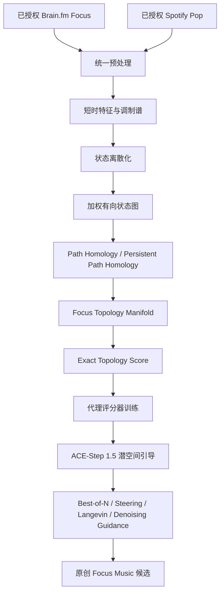
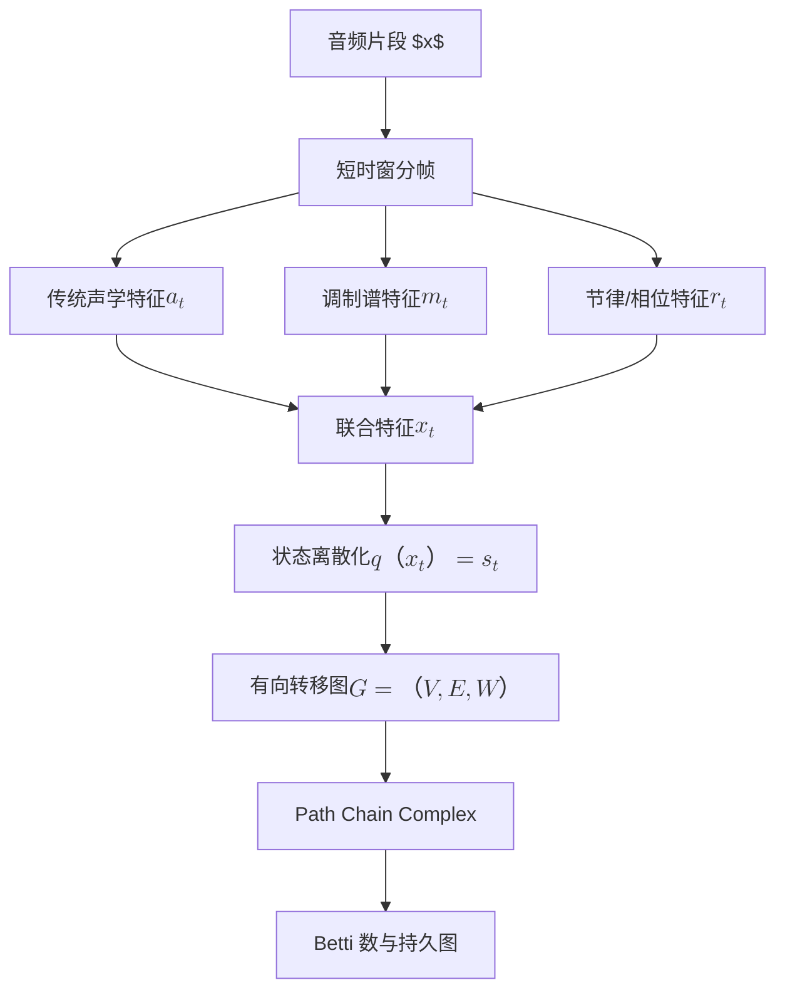
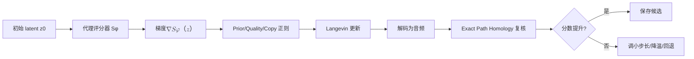

# 基于 Path Homology 的专注音乐拓扑流形分析及其在 ACE‑Step 1.5 潜空间引导生成中的应用

**Executive summary**  
本文提出一条面向“功能性专注音乐”的完整研究路线：以已授权 Brain.fm Focus 音乐作为功能性专注音乐参考集，以已授权 Spotify Pop 音乐作为对照集，首先从振幅调制谱与有向状态转移图中提取可解释的拓扑结构，再以 path homology 与 persistent path homology 建立专注音乐的拓扑流形表示，最后在 ACE‑Step 1.5 的连续潜空间中引入拓扑代理评分器、Langevin 式引导与 denoising‑time guidance，实现“先分析、后控制、再生成”的闭环。本文同时论证：对这一类生成系统而言，不需要证明潜空间与音乐物理空间之间存在全局双利普希茨映射；更合理且可验证的理论基础是局部稳定性、代理一致性与局部可控性。相关核心依据来自 Brain.fm 科学页面、2024 年 *Communications Biology* 论文、ACE‑Step 1.5 论文、path homology 原始论文、persistent path homology 原始论文以及 Spotify 官方政策。

## 摘要与研究命题

### 摘要

背景音乐常被用于支持持续注意，但真正“有助于专注”的音乐究竟具有怎样的时间结构、调制结构与拓扑结构，至今仍缺少统一的数学表征。Brain.fm 将其产品定位为以神经科学为基础的 functional music，并公开说明其音乐通过 placebo control、EEG 与 fMRI 等路径进行验证；与此同时，2024 年发表于 *Communications Biology* 的研究表明，加入特定速率振幅调制的音乐可对注意困难程度不同的听众产生差异化作用，其中 beta-range modulation 对 ADHD 症状较高者更为有利。基于这些事实，本文提出：专注音乐不应仅被看作声学风格或情绪标签，而应被看作一个具有方向性、循环性与稳定性的有向动力系统。

本文以已授权 Brain.fm Focus 与 Spotify Pop 音乐构建双域对照数据集，在曲目级切分、统一重采样、响度归一化和固定窗口切片之后，提取传统声学特征、调制谱特征以及时间序列状态，进一步构建加权有向状态转移图，并计算 path homology 与 persistent path homology 表征。随后，本文以 ACE‑Step 1.5 为基础生成骨干。ACE‑Step 1.5 采用纯 waveform-domain 1D VAE 将 48kHz stereo 音频压缩到 25Hz、64 维连续 latent，并以约 2B 参数的 DiT 实现条件音乐生成；该架构为潜空间引导提供了直接入口。

在理论上，本文不把“证明潜空间与音乐物理空间之间存在全局双利普希茨映射”设为目标，而转为建立三个更弱但足够支撑方法有效性的命题：复合映射的局部稳定性、可导拓扑代理评分器对精确拓扑评分的排序一致性，以及潜空间中的局部拓扑可控性。方法上，本文设计 exact topology score 与 differentiable surrogate score 的双层框架，分别用于离线评估与在线引导；生成上，依次实现 best‑of‑N 重排序、latent steering、Langevin guidance 与 denoising‑time topology guidance。本文最后给出可直接投稿的实验设计、统计模板、结果报告模板、伦理与合规说明，以及不公开授权音频的可复现性清单。

**关键词**：专注音乐；ADHD；Path Homology；Persistent Path Homology；ACE‑Step 1.5；潜空间引导；Langevin dynamics；音乐生成；拓扑数据分析

### 贡献点

本文的贡献可以概括为四个层面。其一，数据层面，本文提出使用已授权 Brain.fm Focus 音乐与已授权 Spotify Pop 音乐构建“功能性专注音乐—普通流行音乐”双域对照数据集，并引入 matched control 子集，以避免模型只学习到“是否有人声”之类的浅层差异。其二，数学层面，本文将音乐表示为有向状态转移图，在音乐分析中使用 path homology 与 persistent path homology 保存方向信息，而不是仅依赖无向点云拓扑。其三，认知机制层面，本文把 2024 年 *Communications Biology* 中关于 amplitude modulation、EEG 相位锁定、fMRI 注意网络激活与 beta-range modulation 的证据，与音乐拓扑流形建模联系起来。其四，生成控制层面，本文提出 topology-guided latent intervention：不直接微调生成模型去“模仿” Brain.fm，而是以推理阶段的拓扑评分器、Langevin 更新和 denoising guidance 去逼近专注音乐流形。

### 研究问题与假设

本文围绕四个研究问题展开。  
其一，Brain.fm Focus 音乐是否在传统声学特征、振幅调制谱与有向拓扑特征上系统地区别于 Spotify Pop？  
其二，path homology 是否比传统声学特征更能捕捉“功能性专注音乐”的时间组织方式？  
其三，ACE‑Step 1.5 的 latent space 中是否存在可把生成结果推向专注音乐拓扑流形的局部可控方向？  
其四，在不微调主生成模型的前提下，推理阶段的 topology guidance 能否持续提升生成音乐的 exact topology score？

相应地，本文设定如下假设。  
**H1 调制谱假设**：Brain.fm Focus 片段在 12–20 Hz beta-range 附近具有更强或更稳定的振幅调制结构。该假设直接受 2024 年 *Communications Biology* 论文支撑。  
**H2 有向拓扑假设**：Brain.fm Focus 的有向状态转移图具有更低的 path entropy、更高的 directed recurrence，以及更集中的 \(\beta_1^{path}\) 分布。该假设来自本文的理论建模，并以 persistent path homology 可保留有向网络非对称结构为依据。  
**H3 表征优势假设**：由 modulation spectrum 与 path homology 组成的联合特征，在分类 Brain.fm Focus 与 Spotify Pop 时优于 acoustic-only 基线。该假设基于 *Communications Biology* 对调制结构的发现以及 persistent path homology 对有向网络的额外表达能力。  
**H4 潜空间可控性假设**：在 ACE‑Step 1.5 的有效生成区域内，不需要全局双利普希茨，只需局部稳定性与局部可控性成立，就能通过潜空间引导使生成结果更接近 Brain.fm Focus 拓扑流形。其工程依据来自 ACE‑Step 连续 latent 架构，其理论依据来自 persistent path diagram 的稳定性与扩散模型中的梯度引导思想。

## 引言与相关工作

### 引言

音乐在实际生活中的功能并不限于审美。Brain.fm 的官方科学页面明确把其音乐描述为“Science you can hear”，强调其音乐包含能够通过 entrainment 改变脑状态的模式，并通过 placebo control、EEG 与 fMRI 等方式评估效果；Brain.fm 同时强调，其音乐会主动削弱“抓注意力”的元素，以便更适合作为背景音乐。

与这种产品性表述相呼应，2024 年 *Communications Biology* 论文给出了更细致的实验路径。作者指出，背景音乐被广泛用于 sustain attention，但哪些音乐属性真正有助于持续注意并不清楚；在其实验中，含有快速 amplitude modulation 的音乐在 SART 任务中对特定听众带来更好表现，fMRI 显示其引发更广泛的注意相关网络激活，EEG 则显示更强的 stimulus-brain coupling；进一步的参数化实验发现，对高 ASRS 参与者而言，beta-range 调制比其他频段更有帮助。

这组证据提示：功能性专注音乐可能并不对应于某种固定“风格”，而对应于一种可在声音时间轴上被量化的组织方式。也就是说，专注音乐的关键变量，可能不是“钢琴还是电子”“舒缓还是激昂”这样的人类标签，而是特定幅度调制、路径重复率、转移不确定性和有向循环模式。本文即从这一思路出发：将音乐看作一个随时间在状态空间中运动的有向对象，并用 path homology 对其动态拓扑进行刻画。



**图一说明**：总体研究流程图。图中应突出“双域对照数据集—拓扑流形建模—ACE‑Step 潜空间引导”的闭环关系。

### 相关工作

path homology 最早由 Grigor'yan、Lin、Muranov 与 Yau 在 path complex 框架下系统提出，其初衷之一就是为 digraph 提供一种不同于传统 simplicial complex 的同调理论。该理论特别适合保留定向边所承载的方向信息。对本文而言，这一点至关重要，因为音乐状态从 \(s_t\) 到 \(s_{t+1}\) 的演化具有天然方向性，反向交换并不等价。

其后的 persistent path homology 由 Chowdhury 与 Mémoli 提出。作者强调，标准 persistent homology 对 asymmetry 天然不敏感，而 persistent path homology 能在不同分辨率下编码有向网络的非对称结构。进一步地，2024 年关于 persistent path diagrams 稳定性的工作证明：对于 weighted digraph 或 edge-weighted path complex，persistent path diagram 在适当距离下具有稳定性，这为本文建立“局部稳定而非全局双利普希茨”的理论路线提供了直接依据。

在音乐与注意研究方面，Brain.fm 的科学页面汇总了其 placebο control、EEG 与 fMRI 工作，并链接到 2024 年 *Communications Biology* 论文。该论文不仅阐明了 amplitude modulation 可能支持 sustained attention，还展示了如何将压力波形经 cochlear filtering、envelope 提取与 modulation spectrum 分解，得到 broadband modulation spectrum。本文在音频物理空间的调制谱提取部分，直接借鉴这一分析管线。

在生成端，ACE‑Step 1.5 是当前少见的公开、可在本地高效运行的音乐 foundation model。其论文报告：模型以 1D VAE 将 48kHz stereo audio 压缩到 25Hz、64 维 latent，并使用约 2B 参数 DiT 进行条件音乐生成；同时通过 FSQ 把 25Hz latent 压缩成 5Hz 离散 code，作为结构性 source latent。模型还支持 Planner/Listener/Co‑Pilot/Refiner 等模式，说明其推理控制接口足够丰富。对本文而言，ACE‑Step 的价值不在于“现成生成音乐”，而在于提供了一个连续潜空间，使 topology-guided guidance 具有工程可行性。

在引导机制方面，score-based generative modeling through SDE 指出，逆向采样过程可由时间相关的 score field 引导；Diffusion Models Beat GANs on Image Synthesis 则展示了 classifier guidance 如何通过外部梯度在采样中权衡 fidelity 与 diversity。本文的方法并不直接套用图像公式，而是构造“拓扑代理评分器”作为 guidance source，把 classifier guidance 的思想迁移到音乐 latent-control 问题中。

## 方法

### 问题设定、符号与合规假设

设 \(\mathcal X\) 为音乐物理空间，\(\mathcal Z\) 为 ACE‑Step 1.5 的连续潜空间，\(\mathcal T\) 为拓扑描述子空间。给定音频片段 \(x\in\mathcal X\)，定义传统声学特征提取器 \(\phi_a\)、调制谱提取器 \(\phi_m\)、时间状态构造器 \(\phi_s\)，以及图构造器 \(\Gamma\)。则拓扑映射写为
\[
\Phi(x)=\mathrm{PH}_{path}(\Gamma(\phi_s(\phi_a(x),\phi_m(x))))\in\mathcal T.
\]
若 \(G_\theta:\mathcal Z\to\mathcal X\) 表示 ACE‑Step 1.5 解码或生成映射，则 latent 到拓扑描述子的复合映射为
\[
\Psi(z)=\Phi(G_\theta(z)).
\]
ACE‑Step 1.5 的 1D VAE、连续 latent 与 DiT 结构均来自其原始论文。

本文关于授权的基本假设如下：已获得 Brain.fm 与 Spotify 的书面授权，可将相应音频用于本研究中的本地分析与推理阶段；但 Spotify 的默认开发者政策明确禁止将 Spotify Content 用于训练机器学习或 AI 模型，也禁止为一般目的分析 Spotify Content；同时，Spotify 自 2024 年 11 月 27 日起还限制了 Audio Features、Audio Analysis 等若干端点对新用例的访问。因此，本文把“Spotify 用于训练生成模型”设为默认不允许，并将其替代方案写入方法与实验设计：如授权仅覆盖分析与评价，则 Spotify 只进入统计分析、matched control 构建和 held-out 评价，而不进入任何生成模型参数更新。

### 数据集、预处理与 matched control

Brain.fm 的科学页面明确表明其音乐是 purpose-built、tested with science 的 functional music；因此，本文把 Brain.fm Focus 视为“功能性专注音乐参考集”，而非医学意义上的临床金标准。Spotify Pop 则作为普通流行音乐对照集。这样的表述既承认 Brain.fm 的研究性背景，也避免在学术上预设“商业产品即最佳专注刺激”的结论。

数据预处理流程如下。所有音频统一重采样到 44.1kHz 或 22.05kHz，并进行 loudness normalization；必要时同时保留 stereo 版用于通道包络分析，另生成 mono 版用于主实验。然后按曲目切片为 30 秒、60 秒和 120 秒三种窗口。这一多窗口设计既与 *Communications Biology* 文中展示的 30 秒调制谱分析片段相兼容，又允许检验拓扑统计对窗口长度的敏感性。数据划分以 track-level 而非 clip-level 进行，建议 split 为 Train:Val:Test = 60:20:20，严格避免同一曲目的不同片段泄漏到不同集合。

matched control 的构造有两条路线。若授权与历史扩展访问允许使用 Spotify 音频特征，则以 instrumentalness、speechiness、tempo、loudness、energy、valence、duration 等指标进行 propensity score matching 或 nearest-neighbor matching。Spotify 官方文档将这些变量明确定义为 audio features；但该接口已处于 Deprecated 状态，且对新用例受限，因此更稳妥的实现是直接从已授权原始音频中用本地 DSP 计算相应指标，再辅以是否有人声、节奏密度与动态范围等自提取变量。这样既保留了匹配思想，又降低了对已收紧 API 的依赖。

表一给出建议的数据集组织。

| 数据分组 | 角色 | 主要用途 | 默认是否允许进入生成模型训练 |
|---|---|---|---|
| Brain.fm Focus | 功能性专注音乐参考集 | 建立 \(\mathcal M_F\)、训练或标注拓扑评分、评价生成结果 | 仅在授权明确允许时考虑；默认不直接微调主生成模型 |
| Spotify Pop | 普通音乐对照集 | 构建 \(\mathcal M_P\)、统计检验、matched control、外部评价 | 默认不进入生成模型训练 |
| Spotify Matched Control | 匹配对照子集 | 排除“人声/响度/风格”浅层差异 | 默认不进入生成模型训练 |

**表一说明**：数据集角色与合规边界表。Spotify 默认政策不允许 AI/ML 训练；本文在正文中明示“若授权细节不足，则 Spotify 仅用于分析与评价”。

### 从音频到有向图

对每个音频片段 \(x\)，先构造短时联合特征序列
\[
X=(x_1,\dots,x_T),\qquad x_t\in\mathbb R^d.
\]
其中
\[
x_t=[a_t,m_t,r_t],
\]
\(a_t\) 为传统声学特征，\(m_t\) 为调制谱特征，\(r_t\) 为节拍相位、局部重复性、onset density 等时间结构特征。调制谱部分采用与 *Communications Biology* 相兼容的分析管线：将声音经 cochlear filtering 后提取包络，再分解得到 modulation spectrum，并在 broadband 级别合并各通道。

为构建有向图，将短时特征通过聚类或量化映射到有限状态集合
\[
q:\mathbb R^d\to V=\{v_1,\dots,v_K\},\qquad s_t=q(x_t).
\]
若相邻时刻发生转移 \(s_t=i\to s_{t+1}=j\)，则置有向边 \((i,j)\in E\)。边权可定义为
\[
W_{ij}=\frac{\#\{t:s_t=i,s_{t+1}=j\}}{\#\{t:s_t=i\}+\varepsilon},
\]
也可扩展为
\[
W_{ij}^{(\lambda)}=\lambda_1 P_{ij}+\lambda_2 \,\mathrm{sim}_{mod}(i,j)+\lambda_3\,\mathrm{sim}_{rhythm}(i,j),
\]
其中 \(P_{ij}\) 为经验转移概率，\(\mathrm{sim}_{mod}\) 与 \(\mathrm{sim}_{rhythm}\) 分别表征调制与节律相似性。本文主实验建议从最简单的 \(P_{ij}\) 版本开始，再逐步进行加权扩展，以便把“拓扑有效性”与“特征工程效果”区分开来。citeturn11view1



**图二说明**：从音频片段到 path homology 的构造流程图。图中应突出“调制谱”与“有向转移”两个关键中间层。

### Path homology 与 persistent path homology 的定义

给定有向图 \(G=(V,E)\)，一个允许的 \(p\)-path 写为
\[
e_{i_0\dots i_p},\quad (i_k,i_{k+1})\in E,\ \forall k=0,\dots,p-1.
\]
所有允许的 \(p\)-path 张成向量空间 \(\mathcal A_p(G)\)。边界算子定义为
\[
\partial_p e_{i_0\dots i_p}
=
\sum_{k=0}^{p}(-1)^k e_{i_0\dots \widehat{i_k}\dots i_p},
\]
其中带帽项表示删去对应节点。由于删去一个节点后所得路径不一定仍是允许路径，需要定义
\[
\Omega_p(G)=\{u\in\mathcal A_p(G):\partial_p u\in \mathcal A_{p-1}(G)\},
\]
则 path homology 群为
\[
H_p^{path}(G)=\ker(\partial_p|_{\Omega_p})\,/\,\mathrm{im}(\partial_{p+1}|_{\Omega_{p+1}}).
\]
相应的 path Betti 数是
\[
\beta_p^{path}(G)=\dim H_p^{path}(G).
\]
这一框架直接源于 path complex 与 digraph 的同调理论；本文主要关心 \(\beta_0^{path}\) 与 \(\beta_1^{path}\)，前者对应有向连通结构，后者对应有向循环结构。

为了得到多尺度结构，本文进一步构造 persistent path homology。设边权 \(W_{ij}\in[0,1]\) 为相似度，则定义 superlevel filtration
\[
G^\epsilon=(V,E^\epsilon),\qquad
E^\epsilon=\{(i,j):W_{ij}\ge \epsilon\},\quad \epsilon\in[0,1].
\]
随着 \(\epsilon\) 递减，边集逐步增大，从而得到过滤序列
\[
G^{\epsilon_1}\subseteq G^{\epsilon_2}\subseteq\cdots \subseteq G^{\epsilon_L}.
\]
对每个尺度计算 \(H_p^{path}(G^\epsilon)\)，即可得到维度 \(p\) 的 persistent path diagram \(D_p^{path}(G)\)。Chowdhury 与 Mémoli 的工作说明了 PPH 能编码 directed network 的 asymmetric structure；而 2024 年关于 persistent path diagram 稳定性的工作，则为使用 bottleneck distance 比较有向图提供了理论支撑。

本文实际使用的拓扑特征向量定义为
\[
\tau(x)=
\Big[
\beta_0^{path},\,
\beta_1^{path},\,
\mathrm{PersStat}(D_0),\,
\mathrm{PersStat}(D_1),\,
H_{\mathrm{path}},\,
R_{\mathrm{dir}},\,
C_{\mathrm{mod\text{-}path}},\,
M_\beta
\Big],
\]
其中  
\[
H_{\mathrm{path}}=-\sum_i \pi_i \sum_j P_{ij}\log P_{ij},
\]
\[
R_{\mathrm{dir}}=\frac{1}{T^2}\#\{(t,t'): s_t=s_{t'}, s_{t+1}=s_{t'+1}\},
\]
\[
M_\beta=\frac{\sum_{f=12}^{20}P_{\mathrm{mod}}(f)}{\sum_{f=0.5}^{40}P_{\mathrm{mod}}(f)}.
\]
\(\mathrm{PersStat}(D_p)\) 表示对 persistence diagram 的统计摘要，可为总持久度、均值寿命、top‑k 寿命等。之所以重点跟踪 \(M_\beta\)，是因为 *Communications Biology* 明确指出 beta-range modulations 对高 ADHD 症状参与者更有帮助。

### Focus manifold、exact topology score 与代理评分器

设 Brain.fm Focus 片段集合为 \(\mathcal D_F\)，Spotify Pop 或 matched control 集合为 \(\mathcal D_P\)。对应的拓扑流形样本定义为
\[
\mathcal M_F=\{\tau(x):x\in\mathcal D_F\},\qquad
\mathcal M_P=\{\tau(x):x\in\mathcal D_P\}.
\]
给定候选音频 \(y\)，定义 exact topology score
\[
S_{\mathrm{exact}}(y)
=
-\alpha\, d_{\mathcal T}(\tau(y),\mathcal M_F)^2
+\beta\, d_{\mathcal T}(\tau(y),\mathcal M_P)^2
+\gamma R_{\mathrm{mod}}(y)
-\lambda R_{\mathrm{copy}}(y)
-\mu R_{\mathrm{bad}}(y).
\]
这里 \(d_{\mathcal T}\) 可用 Mahalanobis distance、kernel MMD、或基于 bottleneck/Wasserstein 的 diagram distance；\(R_{\mathrm{copy}}\) 用于约束与授权曲目的过高相似；\(R_{\mathrm{bad}}\) 表示音质或伪影惩罚。因为 exact score 涉及状态离散化、图构造与同调计算，通常不可导或难以稳定反传。

因此，本文训练一个可导的拓扑代理评分器


$$
S_\varphi:\mathcal Z \to \mathbb R,\qquad S_\varphi(z) \approx S_{\mathrm{exact}}(G_\theta(z)).
$$


输入建议优先使用 ACE‑Step 的连续 latent 序列 $z_{1:T}\in\mathbb R^{T\times 64}$，并可拼接低维调制统计。模型架构建议为 Temporal Transformer 或轻量 Conformer，输出标量 focus score。损失函数写为
\[
\mathcal L_{\mathrm{sur}}
=
\mathcal L_{\mathrm{reg}}
+\lambda_r \mathcal L_{\mathrm{rank}}
+\lambda_s \mathcal L_{\mathrm{smooth}},
\]
其中
\[
\mathcal L_{\mathrm{reg}}=\frac{1}{N}\sum_i \big(S_\varphi(z_i)-S_{\mathrm{exact}}(y_i)\big)^2,
\]
\[
\mathcal L_{\mathrm{rank}}=\frac{1}{M}\sum_{(i,j)}\max\big(0,m-(S_\varphi(z_i)-S_\varphi(z_j))\operatorname{sgn}(s_i-s_j)\big),
\]
\[
\mathcal L_{\mathrm{smooth}}=\frac{1}{N}\sum_i \|\nabla_{z_i}S_\varphi(z_i)\|_2^2.
\]
其中 \(s_i=S_{\mathrm{exact}}(y_i)\)。\(\mathcal L_{\mathrm{rank}}\) 的作用是让指导方向更稳定；\(\mathcal L_{\mathrm{smooth}}\) 的作用是避免引导时出现 adversarial latent。citeturn3search1

### 为什么不需要证明全局双利普希茨

我们关心的复合映射为
\[
\Psi(z)=\Phi(G_\theta(z)).
\]
若要证明潜空间与音乐物理空间的拓扑流形“严格等价”，最强的写法是要求存在 \(0<c<C<\infty\) 使
\[
c\|z_1-z_2\|\le d_{\mathcal T}(\Psi(z_1),\Psi(z_2))\le C\|z_1-z_2\|.
\]
这类全局双利普希茨条件对本文并不必要，而且对于 ACE‑Step 这类高压缩 VAE + DiT 结构通常并不现实。首先，ACE‑Step 的 VAE 已把 48kHz stereo 音频压缩到 25Hz、64 维 latent，论文报告压缩率约为 1920×；这种压缩本身就意味着多个不同细粒度音频可能映射到相近甚至相同的 latent 区域。其次，path homology/PPH 本身是对图结构的摘要，也天然是 many‑to‑one 描述符。再次，音乐中存在大量“不同音色—相似节律拓扑”的多对一现象。因此，全局下界 \(c>0\) 往往不成立。

本文真正需要的，不是“全局等距”，而是三件更弱但更可验证的事情：其一，局部稳定，即小的 latent 扰动不会把 exact topology score 推向完全失控的区域；其二，代理一致，即 surrogate 在排序上足够接近 exact score；其三，局部可控，即存在某些潜空间方向能稳定提升 focus score。PPH 稳定性工作提供了第一个命题的外部理论依据，而 ACE‑Step 的连续 latent 与扩散引导文献则为后两个命题提供了工程上成熟的实现模板。

### 三个引理及证明要点

**引理一 局部稳定性引理**  
设 \(G_\theta\)、特征提取映射 \(\phi\) 与软图构造器 \(\Gamma\) 在某个有效生成邻域 \(U\subset \mathcal Z\) 上局部 Lipschitz，且 persistent path diagram 对加权有向图在 bottleneck distance 下稳定。则对任意 \(z_1,z_2\in U\)，存在常数 \(C_U>0\) 使
\[
d_B\!\big(D_p(\Psi(z_1)),D_p(\Psi(z_2))\big)\le C_U \|z_1-z_2\|.
\]
**证明要点**：由局部 Lipschitz 性可得
\[
\|G_\theta(z_1)-G_\theta(z_2)\|\le L_G\|z_1-z_2\|,
\]
\[
\|\phi(G_\theta(z_1))-\phi(G_\theta(z_2))\|\le L_\phi L_G \|z_1-z_2\|,
\]
\[
\|\Gamma(\phi(G_\theta(z_1)))-\Gamma(\phi(G_\theta(z_2)))\|\le L_\Gamma L_\phi L_G\|z_1-z_2\|.
\]
再由 persistent path diagram 的稳定性，把图层扰动推到 diagram 层，合并常数即得。这里关键不是证明全局性质，而是把“引导步长足够小”的实用区域固定下来。

**引理二 代理一致性引理**  
若在集合 \(U\) 上有一致误差界
\[
\sup_{z\in U}\big|S_\varphi(z)-S_{\mathrm{exact}}(G_\theta(z))\big|\le \delta,
\]
则对任意 \(z_a,z_b\in U\)，若
\[
S_\varphi(z_a)-S_\varphi(z_b)>2\delta,
\]
则有
\[
S_{\mathrm{exact}}(G_\theta(z_a))>S_{\mathrm{exact}}(G_\theta(z_b)).
\]
**证明要点**：直接由三角不等式，
\[
S_{\mathrm{exact}}(a)\ge S_\varphi(a)-\delta,\qquad
S_{\mathrm{exact}}(b)\le S_\varphi(b)+\delta,
\]
故
\[
S_{\mathrm{exact}}(a)-S_{\mathrm{exact}}(b)\ge S_\varphi(a)-S_\varphi(b)-2\delta>0.
\]
因此，在 margin 足够大时，surrogate 的排序与 exact score 一致。该引理支撑本文为什么可以用可导代理去做在线引导，而把精确 path homology 保留给离线复核。

**引理三 局部可控性引理**  
若 \(S_\varphi\) 在 \(U\) 上可微且 \(L\)-smooth，并且在 \(z_0\in U\) 有
\[
\nabla S_\varphi(z_0)\neq 0,
\]
则对任意小于 \(1/L\) 的步长 \(\eta>0\)，梯度更新
\[
z_1=z_0+\eta \nabla S_\varphi(z_0)
\]
满足
\[
S_\varphi(z_1)\ge S_\varphi(z_0)+\eta\|\nabla S_\varphi(z_0)\|^2-\frac{L\eta^2}{2}\|\nabla S_\varphi(z_0)\|^2.
\]
特别地，只要 \(0<\eta<2/L\)，则 \(S_\varphi(z_1)>S_\varphi(z_0)\)。若再结合引理二给出的代理一致性界，就可推出 exact score 也会在足够大 margin 下同步提升。  
**证明要点**：这是标准 smooth 函数的一阶上升界。本文的关键并非重新证明优化理论，而是说明：对生成控制而言，我们需要的是局部上升方向，而不是全局可逆映射。这个命题恰好与 score-based guidance 的实践逻辑一致。

### Path homology 构建与 PPH 计算伪代码

下面给出主算法伪代码。为可读性起见，算法采用“软图构造 + 离线同调”的版本。

```text
算法一：音乐片段的 Path Homology / Persistent Path Homology 特征提取

输入：
    音频片段 x
    帧长 Δt，状态数 K，滤波尺度集合 Ε={ε1,...,εL}
输出：
    拓扑特征向量 τ(x)

1:  X ← FrameAndExtractFeatures(x, Δt)
2:  # X = [x1,...,xT], xt = [acoustic, modulation, rhythm]
3:  S ← QuantizeStates(X, K)              # S = [s1,...,sT]
4:  W ← BuildDirectedTransitionMatrix(S)  # W_ij = P(si→sj)
5:  stats_basic ← [PathEntropy(W), DirectedRecurrence(S), BetaModulation(x)]

6:  for each ε in Ε do
7:      G^ε ← DirectedGraph(V={1,...,K}, E^ε={(i,j): W_ij ≥ ε})
8:      Ω_0, Ω_1, Ω_2 ← BuildAllowedPathSpaces(G^ε)
9:      ∂_1, ∂_2 ← BuildBoundaryOperators(Ω_1, Ω_2)
10:     β_0(ε), β_1(ε) ← ComputePathBetti(∂_1, ∂_2)
11: end for

12: D_0, D_1 ← PersistentDiagrams({β_0(ε)}, {β_1(ε)}, Ε)
13: pers_stats ← DiagramStatistics(D_0, D_1)
14: τ(x) ← Concat(stats_basic, pers_stats)
15: return τ(x)
```

该算法的理论基础来自 path complex 与 persistent path homology；本文在工程上只保留低阶同调，以控制图规模和计算成本。

### 代理评分器训练与在线引导算法

代理评分器训练过程如下。

```text
算法二：拓扑代理评分器训练

输入：
    生成/编码得到的 latent 序列数据集 Z={zi}
    对应 exact score 标签 yi = S_exact(Gθ(zi))
    超参 λr, λs, margin m
输出：
    代理评分器 Sφ

1: 初始化参数 φ
2: repeat
3:     采样一批 latent 序列 {zi}
4:     ŷi ← Sφ(zi)
5:     L_reg ← mean((ŷi - yi)^2)
6:     构造对偶样本 (zi, zj)
7:     L_rank ← mean(max(0, m - (ŷi-ŷj) * sign(yi-yj)))
8:     L_smooth ← mean(||∇zi Sφ(zi)||_2^2)
9:     L ← L_reg + λr L_rank + λs L_smooth
10:    使用 AdamW 更新 φ
11: until 验证集 Spearman ρ 与 Pairwise Accuracy 收敛
12: return Sφ
```

在线的 Langevin guidance 建议写成
\[
z_{k+1}
=
z_k
+\eta \nabla_z S_\varphi(z_k)
-\lambda_{\mathrm{prior}}(z_k-z_0)
-\lambda_{\mathrm{qual}}\nabla_z R_{\mathrm{bad}}(z_k)
-\lambda_{\mathrm{copy}}\nabla_z R_{\mathrm{copy}}(z_k)
+\sqrt{2\eta T}\,\xi_k,
\quad \xi_k\sim\mathcal N(0,I).
\]
其中 \(z_0\) 为原始采样 latent，\(\lambda_{\mathrm{prior}}\) 确保不偏离生成先验太远，\(T\) 为噪声温度。其思想与 score-based generative modeling 中的 Langevin/修正步一致，但本文的“score”不再是数据密度梯度，而是 focus-topology surrogate 的梯度。

```text
算法三：Latent Langevin Guidance

输入：
    初始 latent z0
    surrogate Sφ
    步长 η，步数 K
    正则系数 λprior, λqual, λcopy
    温度 T
输出：
    引导后的 latent zK

1: z ← z0
2: for k = 1 ... K do
3:     g ← ∇z Sφ(z)
4:     g ← g - λprior (z - z0)
5:     g ← g - λqual ∇z R_bad(z) - λcopy ∇z R_copy(z)
6:     g ← ClipByNorm(g, g_max)
7:     ξ ~ N(0, I)
8:     z ← z + η g + sqrt(2ηT) ξ
9: end for
10: return z
```

如果可以访问 ACE‑Step 的 denoising 过程，则使用 denoising‑time guidance。设模型在时间步 \(t\) 的噪声预测为 \(\epsilon_\theta(z_t,t,c)\)，则可写
\[
\hat\epsilon_\theta
=
\epsilon_\theta(z_t,t,c)-s_t \sigma_t \nabla_{z_t}E_\varphi(z_t),
\]
其中
\[
E_\varphi(z_t)=-S_\varphi(z_t)+\lambda_{\mathrm{prior}}\|z_t-\bar z_t\|^2.
\]
或者等价地把引导项加到更新后的 \(z_{t-1}\) 上：
\[
z_{t-1}=f_\theta(z_t,t,c)+\eta_t \nabla_{z_t}S_\varphi(z_t).
\]
这里的写法借鉴了 classifier guidance 的思想，但把类别对数似然梯度替换成 topology surrogate 梯度。对音乐生成而言，更稳健的做法通常是在中期 denoising 阶段加较强 guidance，而在最后若干步减弱引导，以降低伪影风险。citeturn3search1turn4view2



**图三说明**：潜空间引导闭环。图中应显示“surrogate 在线引导—exact 离线复核”的双层结构。

### 超参数推荐

表二给出一个保守且易于起步的超参数配置。

| 模块 | 参数 | 建议值 |
|---|---|---|
| 音频预处理 | 采样率 | 22.05kHz 主实验；44.1kHz 复核实验 |
| 切片长度 | \(L_c\) | 30s / 60s / 120s |
| 短时帧长 | \(\Delta t\) | 0.5s 或 1.0s |
| 状态数 | \(K\) | 32 / 64 / 128 |
| PPH 过滤层数 | \(L\) | 16 / 24 |
| 代理评分器 | backbone | 4 层 Transformer, hidden=256, heads=4 |
| 代理训练 | batch size | 32 |
| 代理训练 | optimizer | AdamW, lr = 1e-4, weight decay = 1e-2 |
| 代理训练 | \(\lambda_r,\lambda_s\) | 0.5, 1e-4 |
| best‑of‑N | \(N\) | 8 / 16 / 32 |
| steering | \(\alpha\) | 0.05 / 0.10 / 0.20 |
| Langevin | 步数 \(K\) | 5 / 10 / 20 |
| Langevin | 步长 \(\eta\) | 1e-4 ~ 5e-3 |
| Langevin | 温度 \(T\) | 0 ~ 1e-3 |
| denoising guidance | scale \(s_t\) | 0.2 ~ 2.0 分段调度 |

**表二说明**：推荐的初始超参数范围。正式实验中应报告网格搜索或贝叶斯优化后的最终值。

## 实验设计

### 统计分析与分类基线

本文首先进行统计差异分析。对 acoustic、modulation 与 topology 三类变量分别做分布检查与组间检验。若满足近似正态与方差可比，则采用 Welch t-test；否则采用 Mann–Whitney U 检验。同时统一报告效应量和 95% bootstrap 置信区间。考虑多重比较时，使用 Benjamini–Hochberg FDR 修正。统计检验的重点不是“找到显著”，而是评估 Brain.fm Focus 与 Spotify Pop 在 matched control 条件下是否仍有可复现差异。该设计直接回应 *Communications Biology* 所强调的“控制低层声学差异”问题。

分类基线分为五类：acoustic-only、modulation-only、topology-only、acoustic+modulation、acoustic+modulation+topology。建议模型包括 Logistic Regression、Linear SVM、RBF‑SVM、Random Forest、XGBoost 和轻量 MLP。主指标为 macro‑F1、balanced accuracy、AUROC 与 AUPRC。之所以强调 macro‑F1 与 balanced accuracy，是因为 Focus/Pop 与 matched control 的类别平衡未必完全一致。若联合特征稳定优于 acoustic-only，则支持 H3。

表三给出分类实验的报告模板。

| 特征组 | 模型 | Accuracy | Macro‑F1 | Bal. Acc. | AUROC | AUPRC |
|---|---:|---:|---:|---:|---:|---:|
| Acoustic | LR | [待填] | [待填] | [待填] | [待填] | [待填] |
| Modulation | SVM | [待填] | [待填] | [待填] | [待填] | [待填] |
| Topology | RF | [待填] | [待填] | [待填] | [待填] | [待填] |
| Acoustic + Modulation | XGB | [待填] | [待填] | [待填] | [待填] | [待填] |
| Acoustic + Modulation + Topology | MLP | [待填] | [待填] | [待填] | [待填] | [待填] |

**表三说明**：分类性能报告模板。正式投稿时建议附验证集与测试集双列，并报告均值±标准差。

### 可视化与流形分析

本文建议以 UMAP 为主、PHATE 为辅进行二维可视化。UMAP 原始论文强调其可在保持局部邻域结构的同时较好保留若干全局形态；PHATE 则专门强调对 transition/trajectory 结构的可视化能力。由于本文关心的是“音乐状态路径”的流形而非静态特征云，PHATE 在展示 Focus–Pop 的过渡结构时可能更有解释力；UMAP 则适合做更稳定的聚类可视化。

可视化时建议分别对 acoustic-only、modulation-only、topology-only 与联合特征空间进行嵌入，以比较不同表征对类内紧致度与类间分离度的影响。量化指标包括 silhouette score、Davies–Bouldin index、类间质心距离与 MMD。若 topology-only 的二维嵌入已能形成相对清晰的 Brain.fm 区域，而 matched control 仍无法完全混入该区域，则可作为 H2 与 H3 的直观证据。

### 局部 Lipschitz 与 Jacobian 分析

为验证“只需局部稳定性而不必全局双利普希茨”，本文设计两个鲁棒性实验。  
第一，局部扰动实验。随机采样潜向量 \(z\) 并施加小扰动 \(z' = z + \epsilon u\)，其中 \(u\sim \mathcal N(0,I)\)，计算
\[
\rho_p(\epsilon)=\frac{d_B(D_p(\Psi(z)),D_p(\Psi(z')))}{\|z-z'\|_2}.
\]
在 \(\epsilon\in\{10^{-4},5\times10^{-4},10^{-3},5\times10^{-3},10^{-2}\}\) 上绘制响应曲线。如果 \(\rho_p(\epsilon)\) 在小尺度区间内有界，则说明局部稳定性成立；若出现尖峰，则优先检查硬状态离散化是否导致不稳定，并切换到 soft assignment 或 soft threshold graph。该实验的理论支撑来自 persistent path diagram 的稳定性结果。

第二，Jacobian/梯度分析。由于 exact topology score 难以直接求 Jacobian，实际操作是对 surrogate \(S_\varphi\) 计算 \(\nabla_z S_\varphi(z)\) 的范数分布、主奇异值近似和方向一致性。若大部分样本梯度接近零，则说明代理评分器对 latent 不敏感，无法支撑指导；若梯度极不稳定，则说明 smoothness regularization 不足。结合引理三，可把“\(\|\nabla S_\varphi(z)\|_2\) 在可生成区域内显著非零”作为局部可控性的经验判据。

表四给出鲁棒性实验模板。

| 实验 | 指标 | 统计量 | 预期方向 |
|---|---|---|---|
| 局部扰动 | \(\rho_0(\epsilon)\), \(\rho_1(\epsilon)\) | 均值、95% CI、最大值 | 小 \(\epsilon\) 时有界 |
| 梯度敏感性 | \(\|\nabla S_\varphi(z)\|_2\) | 均值、中位数、分位数 | 显著大于 0 |
| 排序一致性 | Spearman \(\rho\), Kendall \(\tau\), PWA | 验证集/测试集 | 越高越好 |
| guidance 稳定性 | 分数方差 | 种子间方差 | 越低越好 |

### 生成对照实验

生成实验分四层推进。  
第一层是 **best‑of‑N 重排序**：对同一 prompt 用 ACE‑Step 1.5 采样 \(N\) 个候选，只在输出层使用 exact score 排序。该层无需修改模型内部，是最稳妥也最适合首轮论文结果的基线。ACE‑Step 原始论文声称其在 RTX 3090 上可在 10 秒内生成整首歌，这意味着 best‑of‑N 对中等规模实验是可行的。

第二层是 **latent steering**：通过
\[
v_{\mathrm{focus}}=\mathbb E[z\mid \mathcal D_F]-\mathbb E[z\mid \mathcal D_P]
\]
或以 linear probe/CAV 估计 focus direction，并作
\[
z' = z + \alpha v_{\mathrm{focus}}.
\]
该实验重点检验“是否存在简单线性方向已经能够提升 exact score”。若成立，说明 Focus–Pop 差异至少在 latent 上具有局部线性可分性。

第三层是 **Langevin guidance**。这一步直接评估算法三：比较初始样本 \(z_0\) 与引导后样本 \(z_K\) 的 exact score、与 \(\mathcal M_F\) 的距离、与 \(\mathcal M_P\) 的距离、音质分数与 anti-copy 惩罚。若采用小步多次更新仍可稳定提升 exact score，则支持局部可控性引理。第四层是 **denoising‑time guidance**，即在采样中期插入 topology gradient。该层难度最高，但若实现成功，最能体现 ACE‑Step latent architecture 与本文拓扑代理的深度耦合。

表五给出生成对照指标。

| 组别 | 说明 | \(S_{\mathrm{exact}}\) | \(d(\mathcal M_F)\) | \(d(\mathcal M_P)\) | \(M_\beta\) | Audio Quality | Anti-copy |
|---|---|---:|---:|---:|---:|---:|---:|
| Base | 原始 prompt 生成 | [待填] | [待填] | [待填] | [待填] | [待填] | [待填] |
| Best‑of‑N | 输出重排序 | [待填] | [待填] | [待填] | [待填] | [待填] | [待填] |
| Steering | 线性方向干预 | [待填] | [待填] | [待填] | [待填] | [待填] | [待填] |
| Langevin | 潜空间迭代引导 | [待填] | [待填] | [待填] | [待填] | [待填] | [待填] |
| Denoising | 采样期引导 | [待填] | [待填] | [待填] | [待填] | [待填] | [待填] |

### 人类听感评价方案

人类评价不宜直接宣称“提升 ADHD 疗效”，而应限定为“更适合作为专注背景音乐”的听感层面。评价问卷建议采用 5 点或 7 点 Likert 量表，包括：分心度、稳定推进感、可持续聆听性、声学舒适度、主观专注适配度、重复是否过强、是否愿意在学习任务中使用。为避免品牌偏见，建议使用匿名随机化音频编号，评审者不得知道音频来自 Brain.fm、Spotify 还是 ACE‑Step 生成。若招募注意困难自评较高的被试，可在伦理审批允许的前提下附加自报告量表，但不得把该实验描述为医学诊断或治疗验证。Brain.fm 页面与 *Communications Biology* 确实提到 ADHD 与 ASRS 相关实验，但本文中的听感评价仍应标注为非临床研究。

表六给出听感评价模板。

| 维度 | 题项示例 | 评分尺度 |
|---|---|---|
| 分心度 | “这段音乐会抢走我的注意力。” | 1–5，强烈不同意到强烈同意 |
| 稳定感 | “这段音乐的推进和重复感让我更容易维持任务。” | 1–5 |
| 背景适配度 | “它更像背景支持，而不是前景聆听对象。” | 1–5 |
| 声学舒适度 | “长时间播放不会让我烦躁或疲劳。” | 1–5 |
| 主观专注适配 | “如果我要学习/写作，我愿意选择这段音乐。” | 1–5 |

## 结果与讨论

### 结果报告模板与预期模式

由于当前文本是投稿草稿而非已完成实验的最终版，本节不给出虚构数值，而提供正式结果应当呈现的模式、统计口径与表格模板。若 H1–H4 得到支持，预期将观察到以下模式。首先，在调制谱上，Brain.fm Focus 在 12–20 Hz，尤其 16 Hz 附近的归一化调制能量 \(M_\beta\) 将高于 Spotify Pop 与 matched control，且 effect size 在中等以上。其次，在拓扑上，Brain.fm Focus 的 path entropy 更低、directed recurrence 更高、\(\beta_1^{path}\) 或 \(D_1^{path}\) 的统计摘要更集中。再次，在分类上，acoustic+modulation+topology 应优于 acoustic-only。最终，在生成实验中，best‑of‑N 应带来最稳定的首轮改进，Langevin guidance 在进一步优化 \(S_{\mathrm{exact}}\) 上应具有增益，而 denoising guidance 若参数控制得当，可能达到最佳拓扑分数。上述预期与 Brain.fm 的功能性音乐定位、*Communications Biology* 关于 beta 调制与注意的证据、以及 ACE‑Step latent-guidable 的架构特征相一致。

表七给出正式论文中结果段落可直接替换的占位模板。

| 指标 | Brain.fm Focus | Spotify Pop | Matched Control | 检验 | p/FDR | 效应量 |
|---|---:|---:|---:|---|---:|---:|
| \(M_\beta\) | [待填] | [待填] | [待填] | Welch / MWU | [待填] | [待填] |
| \(H_{\text{path}}\) | [待填] | [待填] | [待填] | Welch / MWU | [待填] | [待填] |
| \(R_{\text{dir}}\) | [待填] | [待填] | [待填] | Welch / MWU | [待填] | [待填] |
| \(\mathrm{PersStat}(D_1)\) | [待填] | [待填] | [待填] | Welch / MWU | [待填] | [待填] |

表八给出生成提升模板。

| 比较 | \(\Delta S_{\mathrm{exact}}\) | \(\Delta d(\mathcal M_F)\) | \(\Delta M_\beta\) | \(\Delta\)听感专注分 | 统计检验 |
|---|---:|---:|---:|---:|---|
| Best‑of‑N vs Base | [待填] | [待填] | [待填] | [待填] | 配对 t / Wilcoxon |
| Steering vs Base | [待填] | [待填] | [待填] | [待填] | 配对 t / Wilcoxon |
| Langevin vs Base | [待填] | [待填] | [待填] | [待填] | 配对 t / Wilcoxon |
| Denoising vs Base | [待填] | [待填] | [待填] | [待填] | 配对 t / Wilcoxon |

### 若无显著差异时的解释

若 H1 或 H2 未被支持，最可能的解释并不是“功能性专注音乐不存在结构差异”，而是当前表征没有捕捉到真正有效的尺度。第一种可能是状态量化过粗或过细，导致 path homology 统计失真。第二种可能是窗口长度选择不当：30 秒过短不足以形成稳定有向循环，120 秒又可能把局部模式平均掉。第三种可能是 Brain.fm 与匹配后的 Spotify 控制集在若干核心声学维度上高度接近，从而使差异更依赖于更细粒度的包络操作，而非转移图本身。第四种可能是拓扑差异确实存在，但被调制谱充分解释，说明 path homology 在当前任务中提供的增量有限。第五种可能是 ACE‑Step 的 latent geometry 与本文的拓扑目标并不完全对齐，导致引导方向弱或不稳定。所有这些负结果都具有学术价值，因为它们帮助界定“何种层级的音乐结构”才是真正与 sustained attention 相关的变量。该讨论与 *Communications Biology* 在实验四中通过参数化调制而非原始商业音乐直接比较低层差异的做法是同一逻辑。

若 H4 不成立，即潜空间 guidance 无法提升 exact topology score，则最应首先检查代理评分器一致性。若 Spearman \(\rho\) 或 pairwise ranking accuracy 较低，则失败更可能来自 surrogate 本身，而非“不存在可控方向”。其次应检查 prior regularization 是否过强，导致 guidance 被压制；或 guidance scale 是否过大，从而把 latent 推离高质量生成区域。再次，denoising-time guidance 失败时，问题常在于将拓扑梯度施加到最后若干去噪步，破坏局部声学细节，这与图像领域 classifier guidance 的经验相一致。

### 局限性与伦理合规

本文的第一项局限性是外部效度。即使生成结果在拓扑上更接近 Brain.fm Focus，也不能直接推出其对 ADHD 人群的真实行为收益更高。2024 年 *Communications Biology* 的结果支持 amplitude modulation 与 attention 之间存在关系，但其设计是特定任务、特定刺激与特定人群采样下得到的；因此，本文的结论只能是“更接近功能性专注音乐参考流形”，而不是医学或治疗性断言。

第二项局限性是版权与平台合规。Spotify 的开发者政策默认禁止使用 Spotify Content 训练 ML/AI 模型，也禁止一般分析；官方在 2024 年底进一步限制了 Audio Features、Audio Analysis 等端点。因此，本文必须把“已获书面授权”的假设写在数据集与伦理声明中，并明示：若审稿阶段无法公开授权文件，则公开复现实验只能基于代码、统计摘要和非版权生成样本，而不能公开原始 Brain.fm 或 Spotify 音频。

第三项局限性是方法计算复杂度。Path complex 的维数会迅速增长，因此本文只建议在主实验中使用低阶 \(p\le 1\) 的 path homology 与有限过滤层数的 PPH。第四项局限性是代理评分器偏差。由于 surrogate 学到的是 exact score 的近似，其引导方向必然含有误差；本文通过引理二、离线 exact 复核与 anti-copy 惩罚来缓解，而不把 surrogate 当作真值。

## 结论、致谢与附录

### 结论

本文围绕“专注音乐是否具有可解释的拓扑流形结构，并能否据此引导生成”提出了一套完整而可实现的学术方案。与把 focus music 视为风格标签的路径不同，本文把 Brain.fm Focus 与 Spotify Pop 的对照研究建立在三个层级之上：音频物理空间中的 amplitude modulation，状态演化空间中的有向转移图，以及拓扑描述空间中的 path homology / persistent path homology。由此，专注音乐被重新表述为一种带有方向性、重复性与可控调制结构的动态对象。其科学灵感来自 Brain.fm 的功能性音乐定位与 *Communications Biology* 对 amplitude modulation 和注意机制的实验性证据，数学工具来自 path homology 与 persistent path homology，工程入口则来自 ACE‑Step 1.5 连续 latent 架构。

从理论上讲，本文说明了为什么“证明全局双利普希茨映射”不是本研究的必要任务。对于高度压缩的音乐 latent 与 many‑to‑one 的拓扑描述符而言，全局双利普希茨既过强也不现实。真正足够支撑潜空间干预有效性的，是局部稳定性、代理一致性与局部可控性；这三个条件既与 PPH 稳定性结果相协调，也与 score-based / classifier-guided 生成实践相协调。换言之，本文试图将“拓扑分析”与“潜空间控制”在一个局部、可验证、可工程落地的框架下统一起来。

若后续实验成功，本文将不仅给出一种新的功能性音乐建模方法，也将提供一个更一般的观点：在多模态生成系统中，复杂对象的“高层结构目标”完全可以不以重训模型为代价，而以推理阶段的拓扑目标函数来实现。这一观点对于音乐生成、认知友好型内容设计以及拓扑数据分析在生成模型中的应用，都具有进一步拓展潜力。

### 致谢

本文拟感谢 Brain.fm 与 Spotify 的授权支持，以及丘成桐中学生科学奖所鼓励的数学与跨学科研究精神。另特别说明：path homology 原始论文作者之一为 Shing‑Tung Yau；本文选择该方向，也希望在“数学方法进入实际系统”这一意义上向相关工作致敬。

### 图表说明

图一为总体研究流程图，应展示授权数据集、拓扑流形建模与 ACE‑Step 潜空间引导三部分。  
图二为 path homology 构造图，应突出短时特征、状态离散化、有向图、path complex 与持久图之间的关系。  
图三为引导闭环图，应展示 surrogate 在线引导、exact 离线复核与参数回退机制。  
表一至表八分别对应数据合规边界、超参数、分类结果、鲁棒性实验、生成对照、听感评价、统计模板与生成提升模板。所有图表均不应包含受版权保护的原始音频波形片段，除非已获得明确展示权利；若需展示真实样本，应优先展示作者自生成的原创音频图像和匿名化统计摘要。

### 附录

#### 附录一 关键算法伪代码汇总

为便于投稿时统一排版，建议将算法一、二、三在附录中以 `algorithm2e` 或 `algorithmicx` 重新排版，正文仅保留核心版本。附录中可增加以下两个子算法。

```text
算法四：Best-of-N Topology Reranking

输入：prompt c，采样数 N，ACE-Step 模型 Gθ，exact score S_exact
输出：排序后的候选列表

1: candidates ← {}
2: for i = 1 ... N do
3:     yi ← SampleFromACEStep(c)
4:     si ← S_exact(yi)
5:     candidates.add((yi, si))
6: end for
7: sort candidates by si descending
8: return candidates
```

```text
算法五：Denoising-time Topology Guidance

输入：初始噪声 zT，条件 c，surrogate Sφ，调度 {st}
输出：最终样本 y

1: z ← zT
2: for t = T ... 1 do
3:     eps ← εθ(z, t, c)
4:     g ← ∇z Sφ(z)
5:     g ← ClipByNorm(g, g_max)
6:     eps_hat ← eps - st * σt * g
7:     z ← ReverseStep(z, eps_hat, t)
8: end for
9: y ← Decode(z)
10: return y
```

#### 附录二 实验超参数表

| 模块 | 参数 | 候选值 | 最终值 |
|---|---|---|---|
| 状态数 \(K\) | 32/64/128 | [待填] | [待填] |
| 帧长 \(\Delta t\) | 0.5/1.0 s | [待填] | [待填] |
| 滤波层数 \(L\) | 16/24/32 | [待填] | [待填] |
| 代理模型深度 | 2/4/6 层 | [待填] | [待填] |
| 学习率 | 1e-4 / 5e-5 | [待填] | [待填] |
| best‑of‑N | 8/16/32 | [待填] | [待填] |
| guidance 步数 | 5/10/20 | [待填] | [待填] |
| guidance scale | 0.2–2.0 | [待填] | [待填] |

#### 附录三 计算资源估计

本文不训练 ACE‑Step 主模型，只做推理与轻量代理训练，因此资源需求显著低于重训式方案。ACE‑Step 原始论文报告模型可在本地低显存环境运行，并在 RTX 3090 上实现快速生成；据此，本文建议的最小硬件配置为单卡 RTX 3090 / 4090 或同等级显卡，外加 64GB RAM 和足量本地存储。代理评分器训练与 topology 特征提取可以拆分为离线批处理。若进行 denoising-time guidance 的大规模实验，则建议使用更高显存或分布式并行，但这并非完成论文主结果的必要条件。

#### 附录四 可复现性清单

本文建议采用如下发布策略。  
其一，公开全部代码，包括预处理、特征提取、path homology/PPH、代理评分器训练与 guidance 实现。  
其二，公开运行脚本、环境文件、随机种子、超参数网格与评测脚本。  
其三，公开统计摘要、匿名化拓扑特征、模型权重与原创生成样本。  
其四，不公开 Brain.fm 与 Spotify 原始音频，不公开能逆向重建授权音频的嵌入或中间缓存。  
其五，如授权允许，可公开经哈希索引的曲目清单和每首曲目的不可逆聚合特征；若不允许，则仅公开按组统计。  
其六，明确标注：Spotify 默认政策不允许使用 Spotify Content 训练 ML/AI，本文所有相关操作均以“已获书面授权”这一假设为前提，且若授权不足，则自动退回到“仅分析与评价”的替代方案。

#### 附录五 参考来源提示

正文方法与实验部分建议优先脚注到以下原始来源：Brain.fm 科学页面、ACE‑Step 1.5 论文、path complex/path homology 原始论文、Persistent Path Homology of Directed Networks、Stability of Persistent Path Diagrams、2024 年 *Communications Biology* 论文，以及 Spotify Developer Policy 与 Web API Changes 公告。本文正文已在相应位置以引文链接标示。

### 丘成桐中学生科学奖项目摘要

本项目研究“专注音乐”为何可能具有区别于普通流行音乐的时间拓扑结构。我们以已授权 Brain.fm Focus 与 Spotify Pop 音乐为数据源，提取振幅调制谱并构建有向状态图，使用 path homology 描述音乐的方向性循环与稳定性，再把这些拓扑特征转化为 ACE‑Step 1.5 潜空间中的生成引导目标。项目的核心创新在于：用数学上的路径同调分析功能性音乐，并在不重训大模型的情况下，用潜空间引导生成更接近专注音乐流形的原创音乐。