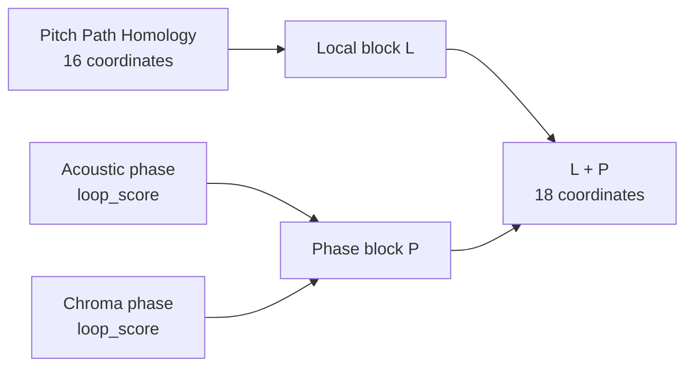

# Focus Music 纯 Path Homology 拓扑指纹 v2：Pitch + 双相位更新

更新日期：2026-08-17

逻辑指纹 ID：`focus_path_homology_fingerprint_v2`

数据切分：每组 195 discovery / 60 validation / 45 holdout

主要尺度：180 s

当前状态：18 维 exact scorer 已重建、回归验证并签发；旧 51 维评分器已归档并拒绝加载

## 摘要

当前主指纹只使用三个输入：

1. Pitch 局部状态转移 Path Homology 描述子；
2. Acoustic phase 的六节点相位环 `loop_score`；
3. Chroma phase 的六节点相位环 `loop_score`。

其中，Pitch 构成局部块 $L$，Acoustic/Chroma 两个相位分数先等权组成宏观
长程周期块 $P$，再将 $L$ 与 $P$ 等块融合为 $L+P$。这不是三个原始输入
直接各占三分之一：在联合平方距离中，Pitch 占 $1/2$，Acoustic phase 与
Chroma phase 各占 $1/4$。

当前方案不再把 Rhythm、Modulation 或 Structure 纳入主指纹。Rhythm 与
Modulation 仍可作为独立解释通道；Structure 已从当前主方案删除。180 s 下，
Pitch 删除 discovery 常量列后为 16 维，两个相位输入各为 1 维，因此当前
$L+P$ 表示为 18 维，而不是旧报告中的 51 维。

validation/180 s 中，Pitch、Phase 与 Pitch+Phase 的 PERMANOVA pseudo-$F$
分别为 7.588、20.580 与 13.486，三者 BH-FDR $q=0.001$。在 Pitch 上加入
Phase 的配对增量为 $+5.898$、$q=0.002$；反向在 Phase 上加入 Pitch 的
增量为 $-7.094$、$q=1$。因此可以说 Phase 改善了 Pitch 基线的距离几何，
但不能说融合优于最强单块 Phase。

辅助分类给出不同排序：Pitch、Phase 与 Pitch+Phase 的 balanced accuracy
分别为 0.933、0.683 与 0.925，AUROC 分别为 0.988、0.733 与 0.982。融合没有
提高 Pitch 的逐曲预测性能。因此，$L+P$ 应被定义为联合拓扑描述空间，而不是
“在所有指标上最优”的模型。

本次局部块与相位组成是在查看既有 validation 结果后重新确定的，属于结果知情
后的重新冻结与探索性重跑。300 s 仅是同曲目时长敏感性，已开启 holdout 仅作
描述性审计，二者都不是新的独立确认。

## 1. 本次更新替换了什么

旧版 v2 报告把 Pitch、Rhythm 与 Modulation 等权融合成 49 维局部块，再加入
两个相位分数得到 51 维指纹；同时把 Structure 作为辅助宏观层。当前分析已明确：

- 局部多视角融合没有稳定优于 Pitch，因此 $L$ 只保留 Pitch；
- 180 s 主要相位分析支持 Acoustic phase 与 Chroma phase，不支持 Rhythm phase；
- Structure 不再属于当前多尺度方案；
- 主指纹由 51 维缩减为 18 维。

| 项目 | 旧 v2 报告 | 当前 v2 分析规格 |
|---|---|---|
| 局部块 $L$ | Pitch+Rhythm+Modulation | Pitch only |
| 相位块 $P$ | Acoustic+Chroma phase | Acoustic+Chroma phase |
| Structure | 独立辅助层 | 从当前方案删除 |
| 主表示维数 | 51 | 18 |
| validation/180 s BA | 0.933 | 0.925 |
| validation/180 s AUROC | 0.982 | 0.982 |
| 主要几何增量 | $L+P-L=+6.910$ | $L+P-L=+5.898$ |

历史 `focus_topology_fingerprint_open_v1` 中的 Vietoris--Rips H0 端点仍只作为
历史审计，不回到当前纯 Path Homology 指纹。

## 2. 当前指纹组成



### 2.1 Pitch 局部块

Pitch 使用冻结的 Pitch-v2 状态表示：beat-synchronous Chroma 映射到 Tonnetz，
再由 discovery 拟合的 16 状态码本产生有向状态序列。对固定过滤阈值上的状态图
计算 20 个预设图与 Path Homology 描述子，包括状态/边数量、密度、互惠、
自转移、转移/路径熵、定向复现，以及 H0/H1 Betti 与 persistence 汇总。

融合变换删除 discovery 内常量列后保留 16 个坐标，有效秩为 13。Pitch 是当前
指纹中唯一的局部块；Rhythm 与 Modulation 的单视角结论不再进入主评分坐标。

### 2.2 Acoustic/Chroma 相位块

相位提升先从块级距离矩阵寻找主导周期：

\[
P^*=\arg\min_{P\in\mathcal P}\operatorname{median}_iD_{i,i+P}.
\]

周期位置映射到六个有序相位节点，并计算跨周期复现强度与相邻相位边权：

\[
q_i=\left\lfloor\frac{(i\bmod P^*)6}{P^*}\right\rfloor,
\qquad
r_i=\exp(-D_{i,i+P^*}/s),
\]

\[
c_k=\operatorname{mean}\{r_i:q_i=k\},
\qquad
w_k=\min(c_k,c_{k+1}).
\]

六节点有向环在超水平过滤中完整保留的临界值为

\[
\texttt{loop\_score}=\min_k w_k.
\]

当前 $P$ 只含 Acoustic phase 与 Chroma phase。Rhythm phase 在 180 s 的
BH-FDR $q=0.099$，未进入主要相位块。六节点环是预定义相位提升构造诱导的
Path $H_1$，不能解释为普通状态图中自然发现的普遍环结构。

## 3. 块变换与融合权重

沿用局部融合的 discovery 拟合流程：对每个输入块执行中位数填补、常量列删除、
伪逆白化及有效秩归一化。当前方案不同之处只在于块的组成：

\[
L=Z_{\mathrm{Pitch}},
\qquad
P=\frac{1}{\sqrt 2}
[Z_{\mathrm{Acoustic}}\mid Z_{\mathrm{Chroma}}],
\]

\[
LP=\frac{1}{\sqrt 2}[L\mid P].
\]

主尺度的坐标与距离权重为：

| 输入 | 输出维数 | 有效秩 | 在 $LP$ 平方距离中的权重 |
|---|---:|---:|---:|
| Pitch | 16 | 13 | 1/2 |
| Acoustic phase | 1 | 1 | 1/4 |
| Chroma phase | 1 | 1 | 1/4 |
| 合计 | 18 | -- | 1 |

权重固定，不使用 validation 或 holdout 搜索。Pitch 输入完整；discovery 中一首
Classical 曲目的 Acoustic/Chroma 相位值缺失，仅使用对应 discovery 中位数填补。

## 4. validation/180 s 证据

### 4.1 单块与联合距离几何

| 表示 | 维数 | pseudo-$F$ | 置换 $p$ | BH-FDR $q$ |
|---|---:|---:|---:|---:|
| $L$：Pitch | 16 | 7.588 | 0.001 | 0.001 |
| $P$：Acoustic+Chroma phase | 2 | 20.580 | 0.001 | 0.001 |
| $L+P$ | 18 | 13.486 | 0.001 | 0.001 |


[PERMANOVA SVG](../runs/pitch_phase_hierarchical_fusion/figures/pitch_phase_permanova_ablation.svg)

三种表示均有组间距离差异，但 Phase 单块 pseudo-$F$ 最高，联合表示居中。
联合空间显著只表示它保留组间结构，不表示它优于两个单块。

### 4.2 双向增量消融

| 比较 | \(\Delta F\) | 单侧 \(p\) | BH-FDR \(q\) | 零分布 95% 区间 |
|---|---:|---:|---:|---:|
| 在 Pitch 上加入 Phase | +5.898 | 0.001 | 0.002 | [-0.715, 1.920] |
| 在 Phase 上加入 Pitch | -7.094 | 1.000 | 1.000 | [-1.728, 0.877] |


[增量消融 SVG](../runs/pitch_phase_hierarchical_fusion/figures/pitch_phase_incremental_tests.svg)

当前证据支持“Phase 改善 Pitch 基线”，不支持“融合优于最强单块”。

### 4.3 条件非冗余

| 条件检验 | discovery \(R^2\) | validation \(R^2\) | 残差 pseudo-\(F\) | \(p\) | \(q\) |
|---|---:|---:|---:|---:|---:|
| Phase \(\mid\) Pitch | 0.195 | 0.114 | 1.481 | 0.230 | 0.230 |
| Pitch \(\mid\) Phase | 0.055 | -0.015 | 5.191 | 0.001 | 0.002 |


[条件残差 SVG](../runs/pitch_phase_hierarchical_fusion/figures/pitch_phase_conditional_residuals.svg)

Phase \(\mid\) Pitch 未通过主要尺度 FDR，因此不能把正配对增量进一步写成
“Phase 已含有经条件验证的独立组别信息”。Pitch \(\mid\) Phase 显著，说明
Pitch 保留了 Phase 不能线性解释的信息；但这些信息加入 Phase 后没有提高整体
pseudo-$F$。

### 4.4 辅助分类

| 表示 | Balanced accuracy | Macro-F1 | AUROC |
|---|---:|---:|---:|
| Pitch | 0.933 | 0.933 | 0.988 |
| Acoustic+Chroma phase | 0.683 | 0.683 | 0.733 |
| Pitch+Phase | 0.925 | 0.925 | 0.982 |


[辅助分类 SVG](../runs/pitch_phase_hierarchical_fusion/figures/pitch_phase_classification_ablation.svg)

Pitch+Phase 相对 Pitch 的 balanced-accuracy 差为 -0.008，95% CI
[-0.042, 0.017]；AUROC 差为 -0.006，95% CI [-0.019, 0.003]。分类结果不支持
融合提高逐曲预测。pseudo-$F$ 与分类性能回答不同问题，不能择优引用其中一项。

### 4.5 两块关系与二维投影

Pitch 与 Phase 的 validation/180 s 成对距离 Spearman 相关为 0.228，说明二者
有关但并非同一几何。三联 PCA 分别在对应表示的 discovery/180 s 数据上拟合，
再投影同一批 validation 样本；三幅图坐标不能直接横向比较。


[PCA SVG](../runs/pitch_phase_hierarchical_fusion/figures/pitch_phase_pca_validation_180.svg)

$L$ 的 PC1/PC2 各解释 7.7%，$P$ 分别解释 79.9%/20.1%，$L+P$
分别解释 40.9%/10.4%。椭圆是投影空间中的组内协方差范围，不是 bootstrap
置信区间；PCA 只提供低维直觉，不参与 PERMANOVA 或增量检验。

## 5. 时长敏感性与 holdout 边界

300 s 与 180 s 来自同一曲目，仅作时长敏感性。300 s 中三种表示的主要距离
几何排序与 180 s 一致：Phase 最高，Pitch+Phase 居中；在 Pitch 上加入 Phase
仍为正增量，反向加入 Pitch 仍无正增量。该结果不是独立复制，也不用于重新选择
权重或相位组成。

holdout 已在既往研究中开启，不是 pristine 外部确认集。其描述值不用于新的
显著性检验、超参数选择、相位筛选或权重调整，因此不进入当前主证据链。

## 6. 指纹的解释方式

当前 18 维指纹包含两类功能不同的信息：

- Pitch 描述局部谐波状态的覆盖、转移、复现与连通结构，并提供当前最稳定的
  逐曲分类；
- Acoustic/Chroma phase 描述完整片段中的长程周期闭合，提供较强的组间距离
  几何，但单独分类较弱；
- $L+P$ 同时保存局部状态组织与宏观长程周期闭合，适合作为联合描述空间。

Pitch 的主要单视角方向是：Open Focus 使用更少的局部状态与边，路径/转移熵及
多项 H0 汇总量更低，自转移率与 directed recurrence 更高。Acoustic/Chroma
phase 的 `loop_score` 在 Open Focus 中更高。上述方向用于解释，不应被简化成
“所有图指标越高越好”；联合判别器中的系数还受白化与坐标相关性影响。

Rhythm 与 Modulation 的独立分析结果仍可在论文中报告，但它们不再是当前主指纹
坐标，也不能在生成评分时被悄然重新加入。

## 7. 面向 ACE-Step 的使用边界

### 当前允许

- 使用已签发的 18 维 Pitch+双相位 scorer 执行 exact scoring；
- shadow mode：只记录分数，不改变采样；
- 在同一 prompt/seed 候选池中做实验性 exact reranking；
- 作为未来 LTSN 的教师目标与最终 exact verifier。

### 当前不允许声称

- Pitch+Phase 在分类上优于 Pitch；
- 联合空间优于 Phase 的距离几何；
- 拓扑分数提高注意力、生产率、治疗效果或音乐质量；
- 采样期梯度引导已经有效；
- Rhythm、Modulation 或 Structure 仍属于当前主损失；
- 可继续使用当前 validation/holdout 搜索更有利的权重、相位组成或阈值。

采样期控制仍需完成 exact reranking 可辨识性、代理模型未见轨迹资格、配对生成
实验、音质非劣与 exact 复核。

## 8. 实现与签发状态

当前分析结果由以下入口产生：

- `scripts/run_pitch_phase_hierarchical_fusion_analysis.py`
- `metadata/pitch_phase_hierarchical_permanova.csv`
- `metadata/pitch_phase_hierarchical_incremental.csv`
- `metadata/pitch_phase_hierarchical_residuals.csv`
- `metadata/pitch_phase_hierarchical_classification.csv`
- `metadata/pitch_phase_hierarchical_classification_deltas.csv`
- `metadata/pitch_phase_hierarchical_correlations.csv`
- `metadata/pitch_phase_hierarchical_summary.json`
- `runs/pitch_phase_hierarchical_fusion/figures/`

下列 v2 产物已于 2026-08-17 迁移为当前 18 维定义：

- `configs/focus_path_homology_fingerprint_v2.toml`
- `scripts/build_focus_path_homology_fingerprint.py`
- `metadata/focus_path_homology_fingerprint_v2.json`
- `metadata/focus_path_homology_fingerprint_v2_scores.csv`
- `metadata/focus_path_homology_fingerprint_v2_directions.csv`
- `metadata/focus_path_homology_fingerprint_v2_summary.json`
- `metadata/focus_path_homology_fingerprint_v2_release.json`
- `runs/focus_path_homology_fingerprint_v2/figures/`

签发的 profile SHA-256 为
`c76a94dc0d122420728f20be738f6817dc92186ea7b3482ed772d53a2018f592`，分类器
SHA-256 为 `c23c39ddfeb25b59781f561146018dd05eb257fd6e533a89b3a9d7102144ce03`。
validation/180s 的 Pitch、Phase、联合 pseudo-$F$、双向增量、联合 BA 与 AUROC
均在 $10^{-9}$ 容差内复现冻结报告，实际最大绝对误差低于 $1.8\times10^{-15}$。

旧 51 维 profile 及其配置、构建器、表格和配图保存在
`metadata/archive/focus_path_homology_fingerprint_v2_legacy_51d_9bf64f3c1d79/`；旧
profile SHA-256 为 `9bf64f3c1d79c12ec428f1d9f552827d07e9f5c445d9236e7ab676699a62ef1f`，
运行时必须拒绝加载。当前允许 exact scoring 与 shadow mode；experimental reranking
仍需单独通过效果门槛，LTSN 标签构建在该门槛前保持阻断，采样引导继续关闭。

## 9. 最终定义

```text
局部块 L
  = Pitch Path Homology（16 维，rank 13）

宏观长程周期块 P
  = Acoustic phase loop_score
  + Chroma phase loop_score

当前主指纹
  = equal-block(L, P)
  = 18 维 Pitch + 双相位 Path Homology 表示

平方距离权重
  = Pitch 1/2
  + Acoustic phase 1/4
  + Chroma phase 1/4
```

当前证据支持把该表示称为同时包含局部状态组织和长程周期闭合的联合拓扑指纹；
不支持宣称其优于最佳单块、是注意力因果指标，或已通过生成实验成为有效控制器。
