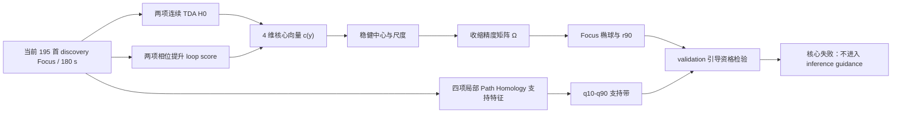

# Open Focus 拓扑指纹构建报告：`focus_topology_fingerprint_open_v1`

> **历史版本声明（2026-08-03）**：本报告记录项目早期“2 个 TDA H0 + 相位
> Path Homology”的 `open_v1` 指纹。最新纯 Path Homology 实验已将当前指纹更新为
> `focus_path_homology_fingerprint_v2`；详见
> `docs/focus-path-homology-fingerprint-v2-analysis.md`。本文件保留用于审计，
> 不再代表当前 ACE-Step 拓扑目标。

生成日期：2026-08-03

## 摘要

本研究按照“4 维核心指导 + 4 维局部软约束 + 1 维 Chroma challenger”的
预设方案，为当前 Open Focus 数据构建了一个版本化拓扑指纹。参考分布仅使用
195 首 discovery/180 s Open Focus；validation、300 s 和 holdout 均未参与
中心、尺度、协方差、目标半径或支持带的估计。旧的 130 首 Brain.fm
`ace_rerank_180s_v2` 目标未被覆盖。

核心指纹由声学新颖度延迟嵌入 H0 最大持久性、节奏 H0 总持久性、声学相位
`loop_score`、节奏相位 `loop_score` 构成。以稳健中位数、IQR/MAD 尺度和
收缩协方差定义 Focus 椭球，discovery Focus 距离的第 90 百分位
\(r_{90}=3.3106\) 被冻结为目标邻域边界。局部软约束使用音高 H0 观测持久性、
音高 path entropy、节奏边密度和节奏互惠性在 discovery Focus 中的
\(q_{10}\)–\(q_{90}\) 带。

构建本身成功且可复现，但核心指纹**没有通过推理引导资格检验**。在
validation/180 s 中，Open Focus 到核心椭球中心的中位距离为 1.660，Classical
仅为 0.900；预设单侧检验 \(P(D_F<D_C)\) 的 p 值约为 1，随机抽取一首 Focus
比一首 Classical 更接近目标的概率只有 0.213。300 s 同样反向。Classical 的
目标邻域覆盖率达到 1.00，高于 Open Focus 的 0.883。这意味着“靠近当前四维
Open Focus 中心”会错误地奖励大量 Classical 样本，不能直接用于 ACE-Step
采样期校正。

相反，预设局部支持带在 validation/180 s 中表现出清晰区分：Focus 支持带
损失中位数 0.014，Classical 为 9.021，单侧 p=5.55e-19，Focus 损失更低的
概率为 0.964；300 s 方向一致。但根据冻结原则，本研究没有在看到 validation
后把支持层提升为核心，也没有重调核心特征、半径或权重。结论是：
`open_v1` 应作为**冻结但未通过资格的候选指纹**保存，用于方法审计和下一版
预注册设计，不应进入当前 ACE-Step inference guidance。

## 1. 研究目的与证据边界

拓扑指纹不是一个“越接近越专注”的因果指标。它只描述当前数据中 Focus
音乐在若干时序拓扑端点上的分布。构建目标分成三个层级：

1. 核心层：低维、适合由 latent-to-topology surrogate 预测的四个精确端点；
2. 支持层：防止局部组织退化的四个分布带约束；
3. challenger：尚未进入主损失的 Chroma phase `loop_score`。



这项构建是在当前 Open Focus/Classical validation 已用于其他研究后执行，因此
属于探索性迁移与工程资格检查，不能被称为新的确认性验证。holdout 已在既往
工作中开启，本报告只给出描述性数值，不计算 holdout p 值，也不据其改变设计。

## 2. 数据与计算

| 数据层 | 数量 | 用途 |
|---|---:|---|
| discovery Focus/180 s | 195 | 唯一的指纹拟合集 |
| discovery Classical/180 s | 195 | 不参与拟合；仅描述覆盖 |
| validation/180 s | 60+60 | 预设资格检验 |
| validation/300 s | 60+60 | 同曲目时长敏感性 |
| holdout/180 s | 45+45 | 已开启后的描述性检查 |
| 全部片段 | 1,200 | 180/300 s 特征与距离计算 |

旧 `metadata/tda_features.csv` 对 Open Focus 只有 130 首 discovery，不对应当前
对称 split。因此本研究使用当前 `feature_segments.csv` 和当前 discovery/180 s
拟合的状态模型，重新计算全部 1,200 个片段的：

- `acoustic_novelty_delay` Vietoris–Rips H0/H1；
- `rhythm` Vietoris–Rips H0/H1。

每个表示最多均匀抽取 64 个点，距离按非零成对距离尺度归一化；本次 1,200 个
片段全部通过质量门槛，共生成 2,400 行 TDA 表。相位与局部 Path Homology
直接使用当前对称数据重跑产物。

## 3. 指纹组成

### 3.1 四维核心

令生成音频 \(y\) 的核心向量为

\[
c(y)=
\begin{bmatrix}
c_{A,H0} & c_{R,H0} & c_{A,P} & c_{R,P}
\end{bmatrix}^{\top}.
\]

| 端点 | 预期方向 | discovery Focus 中位数 | 稳健尺度 |
|---|---|---:|---:|
| Acoustic novelty delay `h0_max_persistence` | 相对对照较低，但不压到 0 | 1.16098 | 0.41427 |
| Rhythm `h0_total_persistence` | 相对对照较低 | 10.85720 | 2.08436 |
| Acoustic phase `loop_score` | 相对对照较高，但不推到 1 | 0.40680 | 0.06380 |
| Rhythm phase `loop_score` | 相对对照较高 | 0.36559 | 0.04969 |

相应的 discovery Focus 分位数为：

| 端点 | q10 | q25 | q50 | q75 | q90 |
|---|---:|---:|---:|---:|---:|
| Acoustic novelty H0 max | 0.8056 | 0.9449 | 1.1610 | 1.5038 | 2.1137 |
| Rhythm H0 total | 7.8032 | 9.6142 | 10.8572 | 12.4261 | 16.1454 |
| Acoustic phase loop | 0.3366 | 0.3695 | 0.4068 | 0.4555 | 0.5112 |
| Rhythm phase loop | 0.2956 | 0.3307 | 0.3656 | 0.3977 | 0.4416 |

### 3.2 四维局部软约束

| 支持端点 | 中位数 | 稳健尺度 | q10 | q90 |
|---|---:|---:|---:|---:|
| Pitch H0 observed persistence | 2.6500 | 1.0563 | 1.2100 | 4.1000 |
| Pitch path entropy | 0.8957 | 0.2422 | 0.6027 | 1.2257 |
| Rhythm edge density | 0.5000 | 0.1522 | 0.3102 | 0.7500 |
| Rhythm reciprocity | 0.7778 | 0.1580 | 0.5333 | 0.9231 |

支持层不规定“越高越好”或“越低越好”，只惩罚落在 discovery Focus
\(q_{10}\)–\(q_{90}\) 之外的结果。

### 3.3 Chroma challenger

`path_chroma_phase__loop_score` 只被冻结为 challenger 描述，不进入核心距离。
其 discovery Focus 的 q10/q25/q50/q75/q90 为
0.3339/0.3611/0.3963/0.4523/0.5556。它在最新相位分析中表现较强，但主版本
选择是在查看 validation 后形成，不能在本次构建中直接晋升为核心端点。

## 4. 拓扑原理

### 4.1 连续轨迹的 Vietoris–Rips H0

给定声学或节奏轨迹点云 \(X=\{x_i\}_{i=1}^{n}\)，在距离阈值 \(\epsilon\)
下构造 Vietoris–Rips 复形：

\[
\mathrm{VR}_{\epsilon}(X)
=\{\sigma:\|x_i-x_j\|\leq\epsilon,
\ \forall x_i,x_j\in\sigma\}.
\]

随着 \(\epsilon\) 增大，H0 连通分支不断合并。若第 \(k\) 个分支的出生与死亡
尺度为 \((b_k,d_k)\)，则

\[
H0_{total}=\sum_k(d_k-b_k),
\qquad
H0_{max}=\max_k(d_k-b_k).
\]

声学新颖度先由相邻 acoustic PCA 块的差分范数构成，再做四维、滞后 2 的
延迟嵌入；节奏 H0 直接在 discovery 模型标准化后的节奏轨迹上计算。

### 4.2 相位提升 Path Homology

相位表示从距离矩阵中选择候选主周期

\[
P^*=\arg\min_{P\in\mathcal P}\operatorname{median}_iD_{i,i+P},
\]

再映射到 \(K=6\) 个相位节点：

\[
q_i=\left\lfloor\frac{(i\bmod P^*)K}{P^*}\right\rfloor,
\qquad
r_i=\exp(-D_{i,i+P^*}/s).
\]

相位一致性与环边权为

\[
c_k=\operatorname{mean}\{r_i:q_i=k\},
\qquad
w_k=\min(c_k,c_{k+1}).
\]

六相位有向环的最弱边

\[
\lambda=\min_kw_k
\]

即 `loop_score`。它是预定义相位环完整出现的临界尺度，不等同于一般状态图中
自然发现的任意 H1 类。

### 4.3 局部有向 Path Homology 支持量

对状态转移有向图 \(G=(V,E,w)\)，允许 \(p\)-路径的边界为

\[
\partial e_{i_0\ldots i_p}
=\sum_{q=0}^{p}(-1)^qe_{i_0\ldots\widehat{i_q}\ldots i_p},
\]

并定义

\[
\Omega_p=\{v\in A_p:\partial v\in A_{p-1}\},
\qquad
H_p=\ker\partial_p/\operatorname{im}\partial_{p+1}.
\]

本指纹只取已验证、可解释的 H0/熵/图密度/互惠性作为支持带，不纳入未获支持的
modulation H1/H2，也不把完整高维 `L` 块直接作为推理损失。

## 5. 稳健分布指纹

### 5.1 中心与尺度

对核心端点 \(j\)，只用 discovery Focus 定义

\[
\mu_j=\operatorname{median}(c_j),
\]

\[
s_j=\begin{cases}
(q_{75,j}-q_{25,j})/1.349,&\mathrm{IQR}>0,\\
1.4826\operatorname{MAD}(c_j),&\text{IQR 退化},\\
\operatorname{sd}(c_j),&\text{再次退化}.
\end{cases}
\]

标准化坐标为 \(z=(c-\mu)/s\)。

### 5.2 收缩 Mahalanobis 距离

设 \(\Sigma\) 是 discovery Focus 稳健坐标的经验协方差，固定收缩系数
\(\gamma=0.2\)：

\[
\Sigma_{shrink}=(1-\gamma)\Sigma+gamma\operatorname{diag}(\Sigma),
\qquad
\Omega=\Sigma_{shrink}^{+}.
\]

核心距离为

\[
D_F^2(y)=z(y)^\top\Omega z(y).
\]

冻结精度矩阵为

\[
\Omega=\begin{bmatrix}
0.3186&-0.0168&0.0531&-0.0211\\
-0.0168&0.2903&-0.0221&0.1068\\
0.0531&-0.0221&0.7696&-0.2091\\
-0.0211&0.1068&-0.2091&0.7907
\end{bmatrix}.
\]

依赖结构整体较弱；声学/节奏相位相关约 0.33，节奏 H0 与节奏相位约 -0.27。


[SVG](../runs/focus_topology_fingerprint_open_v1/figures/core_dependence_matrices.svg)

### 5.3 椭球壳损失

discovery Focus 的距离第 90 百分位为

\[
r_{90}=3.3106.
\]

预设的推理期候选损失不是把所有端点推向中位数，而是只惩罚椭球外样本：

\[
L_{core}(y)
=\left[\max\left(0,D_F^2(y)-r_{90}^2\right)\right]^2.
\]

进入目标邻域后梯度归零，避免持续压低 H0 或把相位环推到 1。

支持带损失为

\[
L_{support}(y)=\sum_j
\left[
\frac{\operatorname{ReLU}(q_{10,j}-s_j(y))^2}{\sigma_j^2}
+
\frac{\operatorname{ReLU}(s_j(y)-q_{90,j})^2}{\sigma_j^2}
\right].
\]

## 6. validation 结果

### 6.1 核心端点分布


[SVG](../runs/focus_topology_fingerprint_open_v1/figures/core_endpoint_validation.svg)

声学与节奏 phase 仍显示 Focus 较高的总体方向，节奏 H0 也大体保持预期方向；
但 Open Focus 分布明显更宽，并包含多个大离群值。Acoustic novelty H0 在当前
Open Focus 中没有保持旧 Brain.fm 目标的低值关系。这种异质性使对称的 Focus
中心距离失去选择性。

### 6.2 核心距离资格检验失败

| 时长 | Focus 中位距离 | Classical 中位距离 | P(Focus 更近) | 单侧 p |
|---:|---:|---:|---:|---:|
| 180 s | 1.660 | 0.900 | 0.213 | ≈1.000 |
| 300 s | 2.081 | 0.879 | 0.171 | ≈1.000 |

预设备择是假设 Focus 距离更小，实际方向完全相反。


[SVG](../runs/focus_topology_fingerprint_open_v1/figures/core_distance_validation.svg)

从覆盖率看，discovery Focus 按定义约有 0.90 落入 \(r_{90}\)；然而 discovery
Classical 覆盖率已经达到 0.943。validation/180 s 中 Focus 为 0.883，
Classical 则为 1.000。这不是边界稍宽的问题，而是 Classical 恰好更集中地落在
Open Focus 四维中心附近。


[SVG](../runs/focus_topology_fingerprint_open_v1/figures/fingerprint_coverage.svg)

PCA 仅用于可视化，不参与距离计算。图中 Classical 云团更紧，Open Focus
云团更分散；这解释了为什么四个端点存在组间方向差异，但“到 Focus 中心的
对称距离”仍会错误偏好 Classical。


[SVG](../runs/focus_topology_fingerprint_open_v1/figures/core_fingerprint_pca.svg)

### 6.3 局部支持层通过迁移检查

| 时长 | Focus 支持损失中位数 | Classical 中位数 | P(Focus 更低) | 单侧 p |
|---:|---:|---:|---:|---:|
| 180 s | 0.014 | 9.021 | 0.964 | 5.55e-19 |
| 300 s | 0.069 | 13.611 | 0.977 | 6.79e-20 |


[SVG](../runs/focus_topology_fingerprint_open_v1/figures/support_band_validation.svg)

音高 H0 观测持久性与 path entropy 对 Classical 的偏离尤其明显；节奏边密度
也提供区分。互惠性重叠较多，主要承担防止异常图结构的保护作用。

这一结果说明局部 `L` 中确有适合约束生成的稳定信息，但不能在看到结果后把
它们升级为核心并重新声称确认。它们仍保持“支持层”身份，下一版必须在新的
冻结方案和新的独立数据上验证。

## 7. holdout 描述性结果

holdout 未参与拟合、选特征、调半径或调权。180 s 描述值为：

| 组别 | 核心距离中位数 | r90 覆盖率 | 支持损失中位数 | 支持零损失率 |
|---|---:|---:|---:|---:|
| Open Focus | 1.727 | 0.867 | 0.114 | 0.356 |
| Classical | 1.041 | 1.000 | 10.538 | 0.000 |

它与 validation 呈同一描述模式：核心距离反向，支持带区分较强。但该 holdout
此前已开启，因此这些数值不能把支持层升级为确认性核心，也不能用于构建
`open_v2`。

## 8. 为什么“端点有差异”不等于“中心距离有效”

单变量组间差异、分类边界与单类密度模型回答不同问题：

- 单变量检验问某一端点的分布位置是否不同；
- 分类器利用有方向的组合边界区分两组；
- 当前 Mahalanobis 指纹只问样本是否接近 Focus 中心，并且对所有方向对称。

当 Focus 本身异质、Classical 更紧凑且位于 Focus 中心附近时，可以同时出现：

1. 多个端点存在 Focus/Classical 差异；
2. Classical 的 Focus 中心距离反而更小；
3. Focus 需要比 Classical 更宽的目标椭球才能保持覆盖。

因此不能用“这些特征曾显著”来替代目标函数的独立资格检验。本次负结果正是
构建后验重排或推理期引导前必须执行的可辨识性检查。

## 9. 面向 ACE-Step 的决定

### 9.1 当前允许的用途

- 保存为版本化、可审计的候选指纹；
- 用作 exact teacher 数据的分析标签；
- 研究 Open Focus 内部异质性和端点迁移失效；
- 作为下一版设计的负基线。

### 9.2 当前禁止的用途

- 不把 \(L_{core}\) 接入 ACE-Step sampler；
- 不训练以该核心距离为唯一目标的 LTSN；
- 不把 Classical 更接近解释为 Classical 更“专注”；
- 不根据 validation 缩小半径、删除 Acoustic H0、加入 Chroma 或提升支持层；
- 不使用已开启 holdout 再挑选权重。

因此资格状态被冻结为：

```text
not_qualified_for_inference_guidance
```

### 9.3 下一版的可检验方向

下一版不应继续使用单类对称中心距离。更合适的候选是预先冻结的对比式目标，
例如同时拟合 Focus 与非 Focus 参考分布：

\[
L_{contrast}(y)
=\operatorname{ReLU}
\left(m+D_F^2(y)-D_C^2(y)\right),
\]

或把局部支持带作为核心候选，并将相位端点作为独立中尺度分支。任何新设计都
需要新的、未参与选择的数据，至少同时包含 Open Focus、Pop 和 Classical；
当前 validation/holdout 不能再次承担确认任务。

若未来对比指纹通过资格门槛，推理期仍应遵循：exact topology 只作教师和最终
复核；可微 surrogate 从 \(\hat x_0=x_t-t v_t\) 预测冻结端点；仅在 2–3 个
中间步骤实施小强度、RMS 裁剪校正，并同时检查音质、提示词一致性和多样性。

## 10. 可复现产物

配置与实现：

- `configs/focus_topology_fingerprint_open_v1.toml`
- `src/generation/topology_fingerprint.py`
- `scripts/build_focus_topology_fingerprint.py`
- `tests/test_topology_fingerprint.py`

冻结指纹与数据：

- `metadata/focus_topology_fingerprint_open_v1.json`
- `metadata/focus_topology_fingerprint_open_v1_tda_features.csv`
- `metadata/focus_topology_fingerprint_open_v1_features.csv`
- `metadata/focus_topology_fingerprint_open_v1_scores.csv`
- `metadata/focus_topology_fingerprint_open_v1_diagnostics.csv`
- `metadata/focus_topology_fingerprint_open_v1_tests.csv`
- `metadata/focus_topology_fingerprint_open_v1_summary.json`

图形：

- `runs/focus_topology_fingerprint_open_v1/figures/`，每图同时提供 PNG 与 SVG。

JSON 冻结了 195 个 reference segment ID、特征顺序、稳健中心与尺度、完整精度
矩阵、\(r_{90}\)、支持分位带、Chroma challenger 分位数、状态模型哈希、配置
哈希及全部输入 SHA-256。旧
`runs/ace_rerank/ace_rerank_180s_v2/target_profile.json` 保持不变。

## 11. 最终结论

`focus_topology_fingerprint_open_v1` 已被完整构建、冻结并复核，但没有通过
ACE-Step 推理引导资格。失败原因不是计算或数据缺失，而是四维单类椭球缺乏
当前 Open Focus/Classical 数据上的选择性：Classical 比 validation Focus 更接近
Focus 中心。

局部 Path Homology 支持带具有很强的迁移信号，说明下一版应更重视 `L` 中的
定向信息，或者采用 Focus/对照双分布的对比目标；但这些变化必须作为新方案
重新冻结并由新数据验证。在此之前，最科学的工程决定是保留 exact reranking
基础设施，同时停止进入 surrogate guidance 层，而不是调参强行制造一个阳性
指纹。
