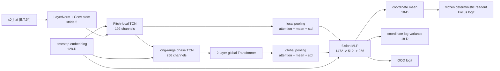
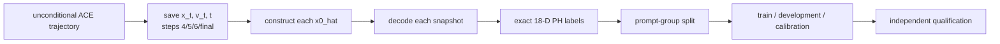

# LTSN 18 维网络架构与训练方案

更新日期：2026-08-17

适用指纹：`focus_path_homology_fingerprint_v2`

冻结规格：Pitch 16 维 + Acoustic phase 1 维 + Chroma phase 1 维

状态：18 维 exact scorer 已签发；训练流水线代码已补齐并通过无 Torch 部分测试，真实标签/训练仍等待 exact reranking 效果门禁和 Linux/NVIDIA 实跑

## 摘要

LTSN（Latent Topology Surrogate Network）是一个小型、时间条件化、可微的时序网络。它接收 ACE-Step 1.5 Turbo 某一步的预测干净潜变量
$$
\hat{x_0}=x_t-tv_t,
\qquad
\hat{x_0}\in\mathbb R^{B\times T\times64},
$$

并预测冻结 Path Homology 指纹的 18 维坐标及其不确定度。18 维由 Pitch 16 个坐标、Acoustic phase `loop_score` 和 Chroma phase `loop_score` 组成。Rhythm、Modulation、Rhythm phase、Structure 和历史 Vietoris--Rips TDA 端点均不进入
主输出、代理损失或采样梯度。

LTSN 不是拓扑算法的替代品。Exact Path Homology 负责逐快照教师标签、候选重排和最终裁判；LTSN 只提供采样期所需的可微近似。任何代理改善都必须通过解码后的 exact 18 维 scorer 复核，否则视为 proxy gaming。

旧 51 维 scorer 已归档并拒绝加载；当前 18 维 profile SHA-256 为
`c76a94dc0d122420728f20be738f6817dc92186ea7b3482ed772d53a2018f592`。LTSN 配图仍有旧 51 维版本，不能引用。LTSN 标注还必须等待 exact reranking 效果门槛通过；训练、资格检验和采样引导均尚未完成。

## 1. 冻结学习目标

### 1.1 18 维坐标

冻结块坐标定义为

$$
L=Z_{\mathrm{Pitch}},
\qquad
P=\frac{1}{\sqrt2}
[Z_{\mathrm{Acoustic}}\mid Z_{\mathrm{Chroma}}],
$$

$$
z=\Phi_{PH}=\frac{1}{\sqrt2}[L\mid P]\in\mathbb R^{18}.
$$

因此 LTSN 直接预测已经包含层级缩放的 18 维 $z$，而不是未加权的原始块拼接。坐标顺序必须固定为：

```text
0..15   Pitch whitened coordinates
16      Acoustic phase whitened loop_score
17      Chroma phase whitened loop_score
```

| 输入 | 维数 | 有效秩 | 在联合平方距离中的权重 |
|---|---:|---:|---:|
| Pitch Path Homology | 16 | 13 | 1/2 |
| Acoustic phase | 1 | 1 | 1/4 |
| Chroma phase | 1 | 1 | 1/4 |

### 1.2 概率输出与冻结读出

LTSN 学习异方差条件分布

$$
g_\phi(\hat x_0,t)
\rightarrow(\hat\mu_z,\log\hat\sigma_z^2,u_{OOD}),
$$

其中 $\hat\mu_z,\log\hat\sigma_z^2\in\mathbb R^{18}$，$u_{OOD}$ 为安全/OOD logit。Focus logit 不使用独立自由分类头，而由迁移后的冻结 scorer 确定性计算：

$$
\hat S_F=w^\top\hat\mu_z+b.
$$

这样可以保证代理坐标与代理分数一致，避免网络只迎合总分而破坏 Pitch 或两个 phase 坐标。

### 1.3 明确不学习的目标

- 不预测旧 51 维坐标或旧四端点目标；
- 不把 Rhythm、Modulation、Structure 或 TDA 端点加入隐藏辅助头；
- 不单独最大化 H1/H2 或任一原始图指标；
- 不输入 prompt 文本、Focus/Classical 标签或 exact 分数，避免信息捷径；
- 不把 LTSN 输出解释成注意力、疗效、生产率或音乐质量概率。

## 2. 输入与时间条件

### 2.1 ACE-Step 潜变量

ACE-Step 1.5 Turbo 的声学潜变量为 64 维、约 25 Hz。180 s 音频约有

$$
T=180\times25=4500
$$

个潜帧。训练和引导使用每个采样步自己的 $\hat x_0$，而不是只使用最终`pred_latents`。必须由真实的 $x_t$、速度 $v_t$ 和噪声时间 $t$ 构造$\hat x_0$。

### 2.2 时间条件

相同幅度的潜变量误差在不同噪声时间上含义不同，第 4 步与第 6 步的预测置信度也可能不同。因此将连续时间 $t$ 与离散 step id 编码为 128 维条件向量：
$$
e_t=\operatorname{MLP}(\operatorname{Fourier}(t,\text{step}))
\in\mathbb R^{128}.
$$

时间嵌入通过 FiLM/AdaLN 调制 TCN 与 Transformer：

$$
\operatorname{FiLM}(h,e_t)
=\gamma(e_t)\odot\operatorname{Norm}(h)+\beta(e_t).
$$

## 3. 网络架构



### 3.1 Stem

输入先做逐帧 LayerNorm，再转为 Conv1d 布局 `[B,64,T]`：

```text
Conv1d(64, 128, kernel=9, stride=5, padding=4)
GroupNorm -> SiLU -> Dropout(0.05)
```

输出长度约 900，每个 token 间隔约 0.2 s。kernel=9 在下采样前覆盖约 0.36 s，用于整合局部潜帧而不过早抹去谐波状态边界。

### 3.2 Pitch-local TCN

Stem 后用 1x1 卷积投影到 192 通道，再串联四个残差 TCN block：

| block | kernel | dilation | 通道 | 作用 |
|---|---:|---:|---:|---|
| 1 | 3 | 1 | 192 | 邻近潜 token |
| 2 | 3 | 2 | 192 | 短时谐波状态变化 |
| 3 | 3 | 4 | 192 | 数秒局部组织 |
| 4 | 3 | 8 | 192 | 较长局部上下文 |

每个 block 使用 depthwise Conv1d、pointwise 1x1、FiLM、SiLU、dropout 0.1 与残差连接。该分支服务 Pitch 局部状态转移代理，不再承担 Rhythm 或 Modulation 输出任务。

### 3.3 Long-range phase TCN

局部特征再经 `Conv1d(192,256,kernel=7,stride=4)` 降至约 225 token，时间间隔约 0.8 s。随后使用 dilation 1/4/16/64 的四个 256通道残差块，以覆盖数秒到数十秒的重复关系。

该分支学习 Acoustic/Chroma phase 的可微代理；exact `loop_score` 中的周期 `argmin`、相位分箱和最弱边 `min` 仍只存在于教师管线。

### 3.4 全局编码器

225 token 允许低成本全长注意力。使用两个 Transformer encoder block：

```text
d_model=256, heads=8, FFN=1024, dropout=0.1, pre-norm
```

该层用于连接相距较远的重复位置，不是 Structure PH 分支，也不预测段落拓扑。

### 3.5 多尺度汇聚与共享表征

对局部序列和全局序列分别计算 masked attention、均值与标准差：

$$
p(h)=[p_{attn}(h)\mid\operatorname{mean}(h)\mid\operatorname{std}(h)].
$$

- 局部分支：$192\times3=576$ 维；
- 全局分支：$256\times3=768$ 维；
- 时间嵌入：128 维。

拼接为 1472 维，再经

```text
Linear(1472,512) -> SiLU -> Dropout(0.1)
Linear(512,256)  -> SiLU
```

得到共享表征。网络预计约 3--4M 参数，不包含 ACE-Step、VAE 或 exact PH。

### 3.6 输出头与 ensemble

共享 256 维表征连接：

1. `coordinate_mean_head`：18 维 $\hat\mu_z$；
2. `coordinate_logvar_head`：18 维 $\log\hat\sigma_z^2$，限制在冻结区间；
3. `ood_head`：1 维 OOD logit；
4. 冻结读出：用新 18 维 scorer 的 $w,b$ 计算 $\hat S_F$。

建议训练三个不同随机种子的 LTSN。成员间方差估计 epistemic uncertainty，单模型
log-variance 估计 aleatoric uncertainty。任一不确定度或 OOD 指标超过冻结阈值
时，topology corrector 必须 no-op。

## 4. 教师标签构建

### 4.1 前置硬门槛

训练标签只能来自已经迁移并通过回归测试的 18 维 exact scorer。旧 51 维 JSON、
旧特征顺序或旧分类器系数必须拒绝加载。新 scorer 至少记录：

```text
fingerprint_id
spec_revision
dimensions = 18
feature_order
block_transforms
distance_weights = [1/2, 1/4, 1/4]
classifier_coef
classifier_intercept
focus_band_threshold
input_sha256
code_sha256
```

### 4.2 每个快照独立标注

训练样本不是“中间 latent + 最终音频标签”。正确流程为：

1. 无引导生成中保存 step 4、5、6 与最终 step 的 $x_t,v_t,t$；
2. 为每一步计算 $\hat x_0=x_t-tv_t$；
3. 分别用 VAE 解码每个 $\hat x_0$；
4. 分别运行 exact Pitch PH、Acoustic phase 与 Chroma phase；
5. 使用冻结块变换得到各自的 18 维 $z$、Focus logit 与 OOD/质量标签。

若把最终标签复制给全部中间步骤，网络会学习错误的时间不变映射，采样梯度也会
系统性偏离 exact 目标。



### 4.3 数据组成

当前 390 首 discovery/180 s 真实音频不足以覆盖生成潜空间。建议起点：

- 锚点：195 Focus + 195 Classical discovery 音频的 VAE 重建；
- 主体：至少 512 development prompts x 4 seeds = 2048 条无引导 180 s 轨迹；
- 快照：每条轨迹标注 step 4/5/6/final，约 8192 个生成快照；
- 安全/OOD：额外 10--15% 静音、削波、极低动态、机械短循环、过度平滑与异常
  latent；
- Qualification：未参与训练和超参数选择的独立 prompt/seed family。

这些数量是工程起点，不是样本量最优性结论。若 exact reranking 尚未证明候选空间
具有可辨识的冻结指纹差异，不应先投入大规模 LTSN 标注。

## 5. 防泄漏切分

必须按真实曲目或 prompt 分组，不能按 latent 快照或 seed 随机切分。同一生成轨迹
的 step 4/5/6/final 必须位于同一分区。

| 分区 | 建议比例 | 用途 |
|---|---:|---|
| train | 70% prompts | 拟合网络参数 |
| development | 15% prompts | 一次选择架构、损失与 early stopping |
| calibration | 15% prompts | 温度缩放、预测区间与 OOD 阈值 |
| qualification | 额外独立 prompts | 冻结后一次资格检验 |

论文的 validation 与已开启 holdout 不得用于 LTSN 架构选择、损失调权、校准或
资格门槛调整。它们用于冻结声学指纹证据，不是可反复使用的代理开发集。

## 6. 损失函数

### 6.1 块平衡坐标损失

直接对 18 维求平均会让 16 个 Pitch 坐标因数量更多而淹没两个 phase 坐标。
按照冻结距离权重，定义

$$
L_{coord}=
\frac12\frac1{16}\sum_{j\in L}
\operatorname{Huber}(\hat\mu_j-z_j)
+\frac14\operatorname{Huber}(\hat\mu_A-z_A)
+\frac14\operatorname{Huber}(\hat\mu_C-z_C).
$$

### 6.2 异方差负对数似然

令 $s_j=\log\hat\sigma_j^2$，则

$$
L_{NLL}=\sum_b\omega_b\frac1{d_b}\sum_{j\in b}
\frac12\left[e^{-s_j}(z_j-\hat\mu_j)^2+s_j\right],
$$

其中 $\omega_L=1/2$、$\omega_A=\omega_C=1/4$。必须限制 $s_j$ 范围，避免网络
通过无限放大方差逃避误差。

### 6.3 Focus 分数一致性

冻结读出给出 $\hat S_F$：

$$
L_{score}=\operatorname{Huber}(\hat S_F-S_F).
$$

该项强化最终引导方向，但不能取代坐标损失。Phase 在主要尺度的条件残差检验未
通过 FDR，因此不能只拟合总分并宣称网络学到了独立相位机制。

### 6.4 同 prompt 排序损失

只在 exact 分数差超过预设 margin 的同 prompt 候选间构造排序对：

$$
L_{rank}=\log\left(1+
\exp[-y_{ik}(\hat S_i-\hat S_k)/\tau]\right),
\qquad
y_{ik}=\operatorname{sign}(S_i-S_k).
$$

### 6.5 轨迹增量损失

不要求相邻 step 的坐标人为平滑，而是匹配 exact 变化：

$$
L_{\Delta}=\operatorname{Huber}
\left[(\hat\mu_{s+1}-\hat\mu_s)-(z_{s+1}-z_s)\right].
$$

### 6.6 OOD 与总损失

安全负例使用二元交叉熵 $L_{OOD}$。development 起点为

$$
L=L_{coord}+0.25L_{NLL}+0.5L_{score}
+0.2L_{rank}+0.2L_{\Delta}+0.1L_{OOD}.
$$

这些系数不是实证结论，只能在 development 上选择一次，并在 qualification 前与
模型结构、数据清单和哈希一起冻结。

## 7. 训练配置

| 项目 | 起始配置 |
|---|---|
| optimizer | AdamW，lr `3e-4`，weight decay `1e-2` |
| schedule | 5% warmup + cosine decay，最低 lr `1e-6` |
| precision | bf16；损失和方差计算使用 fp32 |
| batch | 每卡 8--16，梯度累积至 effective batch 64 |
| gradient clip | global norm 1.0 |
| regularization | dropout 0.1；不做时间打乱或错误标签裁剪 |
| sampler | step 4/5/6/final 平衡；Focus logit 分位平衡；OOD 10--15% |
| stopping | development score error + block Spearman 联合 early stopping |
| ensemble | 三个 seed；架构、数据和切分完全一致 |

训练时不加载 ACE-Step DiT 或 VAE，只读取预计算 latent 与 exact 标签。主要成本在
轨迹生成、逐快照 VAE 解码和 exact PH 标注。

为限制 8192 个 FLOAT WAV 带来的峰值磁盘占用，exact 标注实现默认以 256 个快照为
一批，按 reflink、hardlink、物理复制的顺序物化只读输入；每批 descriptor 与哈希收据
原子提交后立即删除该批可重建的预处理 WAV、特征和 phase 中间文件。批次收据绑定
trajectory manifest、音频/latent 哈希与样本标识，允许中断后验证并续跑，但不允许把
其他数据集的批次结果混入当前标签表。ACE 生成器额外保存、且未被 manifest 引用的最终
WAV 只能通过显式 `--discard-generator-final-audio` 删除；四个逐步快照和 latent 始终保留。

不允许对 180 s latent 随机裁剪后沿用整曲标签，也不允许把时间打乱当作普通数据
增强。若训练短片段模型，必须为每个片段重新计算 exact 标签，并作为不同尺度版本。

## 8. 资格检验与校准

qualification 必须按 step 4/5/6/final 分层报告，不能只给所有步骤的平均。
最低门槛为：

- Focus logit Spearman $\rho\ge0.70$；
- 18 个坐标的 Spearman 中位数 $\rho\ge0.50$；
- Pitch 块距离与 Phase 块距离 Spearman 均 $\ge0.50$；
- Acoustic/Chroma 两个 `loop_score` Spearman 均 $\ge0.50$；
- exact 高/低四分位排序准确率 $\ge0.65$；
- 90% 预测区间覆盖率位于 0.85--0.95；
- 含预设安全负例的 qualification 上 OOD AUROC $\ge0.80$，且 OOD 或高不确定样本
  触发 no-op；
- 在未见 latent 上按代理梯度优化后，至少 65% 的代理改善样本在解码音频上 exact
  score 同向改善，且其中位 exact 改善为正。

还需报告 MAE、RMSE、每块/每坐标/每步误差、校准曲线、prompt-cluster bootstrap
CI、OOD AUROC、推理耗时和显存。任何 Pitch 或 phase 主块失败都不能被总体 logit
相关掩盖。

## 9. 进入采样器的条件

只有全部资格门槛通过后，才能在 step 4--6 对 detached $\hat x_0$ 开启梯度。
目标带能量为

$$
E(\hat x_0)=
\left[\max(0,\tau_F-\hat S_F(\hat x_0))\right]^2.
$$

DiT 保持 `no_grad`；仅对 $\hat x_0$ 经 LTSN 求导：

$$
g=\nabla_{\hat x_0}E,
\qquad
\Delta x=-\eta_s\operatorname{RMSClip}(g,c_s).
$$

只比较 0.25%、0.5%、1.0% latent RMS 三个预设强度，并只在独立 development
prompts 上选择一次。若 ensemble disagreement、预测区间宽度或 OOD 超阈，令
$\Delta x=0$。每个 guided 输出仍须解码后执行 exact PH、质量检查和盲听非劣。

## 10. 实施顺序

1. 归档旧 51 维 scorer，不覆盖审计记录（已完成；旧 LTSN 图形仍待更新）；
2. 重建并验证 18 维 exact scorer，签发新 SHA-256（已完成）；
3. 完成 exact reranking 可辨识性实验；
4. 增加 ACE-Step 中间轨迹记录，不改变采样结果；
5. 建立带哈希的 18 维 latent/label 数据集；
6. 实现 LTSN、损失和 prompt-group sampler；
7. 在 train/development 拟合并一次选择模型；
8. 在 calibration 冻结不确定度与 OOD 阈值；
9. 在独立 qualification prompts 上执行一次资格检验；
10. 通过后才开发 step 4--6 弱梯度 corrector；
11. 最后使用新的 baseline/guided 配对数据做 exact 与质量确认。

任一步失败都停止升级并退回前一层；不得用失败结果继续改变冻结指纹。

## 11. 代码边界与版本字段

建议实现：

```text
src/generation/path_homology_surrogate.py
src/generation/ltsn_dataset.py
src/generation/ltsn_losses.py
src/generation/topology_corrector.py
scripts/collect_ltsn_trajectories.py
scripts/build_ltsn_labels.py
scripts/train_path_homology_surrogate.py
tests/test_path_homology_surrogate.py
```

上述边界现已落地为 `src/generation/ltsn_pipeline.py`、`ltsn_exact_labeling.py`、
`ltsn_training.py`、`ltsn_evaluation.py` 和五个同名职责 CLI。Linux/NVIDIA 的完整
命令、输入 schema、门禁与产物说明见
`docs/ltsn-linux-training-and-evaluation.md`。当前 Windows 验证环境没有安装 Torch，
因此只签认静态检查、非 Torch 单测和既有回归；CUDA 训练、calibration 和
qualification 必须在目标 Linux 主机上执行后再更新状态。

现有 `scripts/build_ltsn_architecture_figures.py` 和 `runs/ltsn_design/figures/` 仍包含
旧 51 维、Rhythm 与 Modulation 标签，在更新前不得作为当前架构图引用。

Checkpoint 必须记录：

```text
fingerprint_id
fingerprint_spec_revision
fingerprint_json_sha256
dimensions = 18
feature_order
distance_weights
classifier_sha256
ltsn_config_sha256
training_manifest_sha256
split_manifest_sha256
exact_label_table_sha256
ace_model_sha256
vae_sha256
```

任一上游哈希改变都生成新模型版本，不能覆盖旧 checkpoint。

## 12. 最低测试要求

- 输出均值和 log-variance 必须恰为 18 维；
- 坐标顺序必须是 16 个 Pitch、Acoustic phase、Chroma phase；
- 块平衡损失权重必须是 $1/2,1/4,1/4$；
- scorer 或数据 SHA 不匹配时拒绝训练和推理；
- 出现 Rhythm、Modulation、Structure、TDA 或 51 维标签时拒绝加载；
- padding mask 后的 attention/mean/std 与单样本结果一致；
- batch 与逐样本预测一致；
- 时间步变化能够影响输出与不确定度；
- NLL 的 log-variance 限制有效，无 NaN/Inf；
- OOD/高不确定样本触发 no-op；
- 同一 prompt 的快照不得跨 split；
- 每个中间快照使用自己的 exact 标签；
- 代理优化结果必须执行解码后 exact verifier。

## 13. 结论

推荐的 LTSN 是“Pitch-local TCN + long-range phase TCN + 小型全局 Transformer +
18 维坐标/不确定度头”的轻量代理。它对齐当前冻结的 Pitch+双相位指纹，而不再
预测 Rhythm、Modulation 或 Structure。

最关键的训练原则不是扩大网络，而是：先重建正确的 18 维 exact scorer；为每个
`x0_hat` 快照单独解码和标注；按 prompt 防泄漏切分；使用 $1/2,1/4,1/4$ 的块
平衡损失；在不确定或 OOD 时 no-op；并对代理优化结果执行 exact 复核。

scorer 迁移与训练流水线实现已经完成；在 exact reranking、Linux/NVIDIA 训练、LTSN
qualification 和配对生成验证完成前，LTSN 仍是未获得效果资格的工程实现，不能描述
为已经验证的 ACE-Step 采样期拓扑引导。
