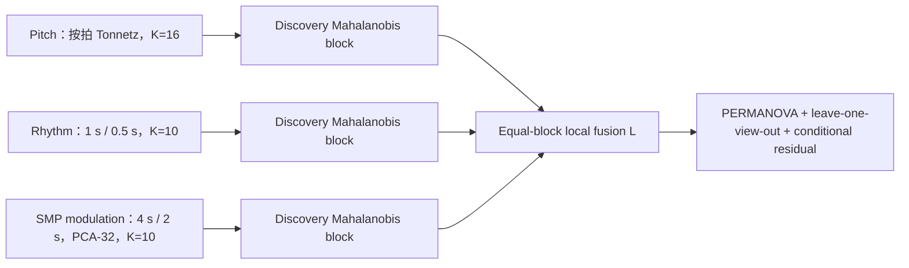

# 音高—节奏—SMP 调制局部 Path Homology 融合与消融分析

生成日期：2026-08-06。本研究将 [音高视角](path-homology-pitch-v2-analysis.md)、[节奏视角](path-homology-rhythm-analysis.md) 与更新后的 [SMP 调制 K=10 视角](path-homology-modulation-smp-k10-analysis.md) 视为三个短时间尺度状态转移块，进行等权融合、留一视角消融和条件非冗余检验。所有归一化、协方差估计和分类器选择只使用 discovery/180 s；主分析为 validation/180 s，validation/300 s 仅作同曲目时长敏感性。由于 SMP K=10 方法是在旧 holdout 打开后提出，本次整合属于**探索性验证**，不检验或重新解释旧 holdout。多重检验统一要求 BH-FDR $q\le0.05$。

## 1. 结论摘要

- 三视角等权融合在 validation/180 s 上形成显著组间距离几何：pseudo-$F=6.27$，置换 $p=0.001$，BH $q=0.001$；300 s 为 pseudo-$F=10.5$、$q=0.001$。
- 180 s 单视角中 pseudo-$F$ 最大的是 Pitch（7.59）。完整融合相对它的差值为 -1.32；因此“融合空间可分”不能自动写成“融合优于最佳单视角”。
- 留一视角增量中，通过 $q\le0.05$ 且 $\Delta$ pseudo-$F>0$ 的加入项为：pitch。条件残差仍可分的视角为：Pitch、Rhythm、Modulation SMP K=10。前者检验几何增量，后者检验新块是否含有无法由另外两块预测的组别信息。
- 辅助分类中，完整融合的 balanced accuracy=0.967、Macro-F1=0.967、AUROC=0.991；Pitch 分别为 0.925、0.925、0.986。分类结果不替代主要的距离置换检验。
- 完整融合相对 Pitch 的 balanced accuracy 增量为 0.0417，分层 bootstrap 95% CI [0.0165, 0.075]。因此当前数据呈现“分类改善、pseudo-$F$ 不改善”的指标分歧，必须并列报告，而不能只挑有利指标。
- 本研究支持的是 Focus 与 Classical 在短时状态转移组织上的观察性差异；不支持注意力改善、功能疗效、生成质量或因果机制。三个视角的普通图与 $H_0$ 描述子贡献较多，单视角报告均不支持稳定、普遍的 $H_1$ 差异。

## 2. 为什么先融合三个短时视角

三个视角都把局部时间窗口或节拍映射为离散状态，并由相邻状态构造有向转移图：音高使用按拍 Tonnetz 原型，节奏使用 1 s/0.5 s 八维节奏块，SMP 调制使用 4 s/2 s 调制谱形与共享 PCA-32、固定 $K=10$ 原型。它们共享“局部状态—相邻转移—有向过滤”的数学接口，但观察的物理内容不同，因此适合在进入相位或宏观结构层之前先构造局部块 $L$。



## 3. 单视角 Path Homology 接口

对状态序列 $s_t$，相邻非自转移计数和条件边权为

$$
C_{ij}=\left|\{t:s_t=i,s_{t+1}=j,i\ne j}\right|,
\qquad
w_{ij}=\frac{C_{ij}}{\sum_{k\ne i}C_{ik}}.
$$

每个源节点最多保留 top-6 非自环边。主过滤为

$$
G_\tau=(V,\{(i,j):w_{ij}\ge\tau}),
\qquad
\tau\in\{0.50,0.60,0.70,0.80,0.90,0.95\}.
$$

允许有向 $p$-路径张成 $A_p$，$\Omega_p=A_p\cap\partial^{-1}A_{p-1}$，路径同调为

$$
H_p^{\mathrm{path}}(G)=
\frac{\ker(\partial_p|_{\Omega_p})}{\operatorname{im}(\partial_{p+1}|_{\Omega_{p+1}})}.
$$

每个视角最终使用同一组 20 个预设图、$H_0$ 与 $H_1$ 描述子。SMP K=10 的单视角稳定发现为状态数、边数更高而边密度、互惠性更低；音高与节奏视角的稳定结果详见各自报告。

## 4. 块归一化与等权融合

直接拼接会让有效维数较高或协方差尺度较大的视角主导距离。对视角 $v$ 的 discovery/180 s 描述子矩阵，去除常量列并估计均值 $\mu_v$ 与协方差 $\Sigma_v$。设有效秩为 $r_v$，其伪逆特征分解诱导白化坐标

$$
z_v(x)=\frac{(x-\mu_v)W_v}{\sqrt{r_v}},
\qquad
W_vW_v^\mathsf T=\Sigma_v^+.
$$

本轮有效秩为：Pitch 13、Rhythm 13、Modulation SMP K=10 14。除以 $\sqrt{r_v}$ 后，每个块的期望平方距离处于相近尺度。三视角等权融合定义为

$$
z_L(x)=\frac1{\sqrt3}\left[z_P(x)\;\Vert\;z_R(x)\;\Vert\;z_M(x)\right].
$$

两视角消融使用相同规则，例如 $z_{PR}=2^{-1/2}[z_P\Vert z_R]$。没有根据 validation 结果调节 $1/3$ 权重。

## 5. 统计检验

### 5.1 整体分离

对欧氏距离 $d_{ij}$，PERMANOVA pseudo-$F$ 写为

$$
SS_T=\frac1N\sum_{i<j}d_{ij}^2,
\qquad
SS_W=\sum_g\frac1{n_g}\sum_{i<j\in g}d_{ij}^2,
$$

$$
F^*=\frac{(SS_T-SS_W)/(G-1)}{SS_W/(N-G)}.
$$

每个表示使用 999 次标签置换；七个表示按时长分别作 BH 校正。

### 5.2 配对增量与消融

在同一次标签排列下比较候选与基线：

$$
\Delta F=F^*_{\mathrm{candidate}}-F^*_{\mathrm{baseline}}.
$$

主要消融为 $L-(R+M)$、$L-(P+M)$、$L-(P+R)$，分别检验加入音高、节奏和 SMP 调制是否带来正增量。另将完整融合与每个单视角比较。六个增量检验按时长分别作 BH 校正，要求 $\Delta F>0$ 且 $q\le0.05$。

### 5.3 条件残差

仅有正增量仍不能说明信息不可预测。对目标视角 $v$，在 discovery/180 s 上用另外两个块拟合多输出岭回归 $\widehat f_v$，在 validation 中计算

$$
R_v=Z_v-\widehat f_v(Z_{-v}),
$$

再对 $R_v$ 做 PERMANOVA。三个残差检验按时长作 BH 校正。这是“条件非冗余”诊断，不是因果分解。

## 6. 结果

### 6.1 整体融合与组合消融

| 表示 | 维数 | 180 s pseudo-F | 180 s p | 180 s FDR | 300 s pseudo-F | 300 s FDR |
|---|---:|---:|---:|---:|---:|---:|
| Pitch | 16 | 7.59 | 0.001 | 0.001 | 18.2 | 0.001 |
| Rhythm | 16 | 6.47 | 0.001 | 0.001 | 10.2 | 0.001 |
| Modulation SMP K=10 | 17 | 4.13 | 0.001 | 0.001 | 4.24 | 0.001 |
| Pitch + Rhythm | 32 | 7.08 | 0.001 | 0.001 | 14.1 | 0.001 |
| Pitch + Modulation | 33 | 6.17 | 0.001 | 0.001 | 10.7 | 0.001 |
| Rhythm + Modulation | 33 | 5.4 | 0.001 | 0.001 | 7.1 | 0.001 |
| Pitch + Rhythm + Modulation | 49 | 6.27 | 0.001 | 0.001 | 10.5 | 0.001 |


[SVG](../runs/local_smp_k10_fusion/figures/local_smp_k10_permanova_ablation.svg)

### 6.2 增量检验

| 比较 | 180 s $\Delta F$ | 180 s FDR | 300 s $\Delta F$ | 300 s FDR |
|---|---:|---:|---:|---:|
| Full − Pitch | -1.32 | 1 | -7.65 | 1 |
| Full − Rhythm | -0.205 | 1 | 0.298 | 0.342 |
| Full − Modulation | 2.14 | 0.003 | 6.3 | 0.003 |
| Add Pitch to Rhythm+Modulation | 0.864 | 0.003 | 3.44 | 0.003 |
| Add Rhythm to Pitch+Modulation | 0.101 | 0.462 | -0.146 | 1 |
| Add Modulation to Pitch+Rhythm | -0.814 | 1 | -3.56 | 1 |


[SVG](../runs/local_smp_k10_fusion/figures/local_smp_k10_incremental_tests.svg)

### 6.3 条件非冗余与视角互补性

| 目标视角（条件于其余两视角） | 180 s residual pseudo-F | 180 s FDR | validation $R^2$ | 300 s residual pseudo-F | 300 s FDR |
|---|---:|---:|---:|---:|---:|
| Pitch | 4.53 | 0.0015 | 0.0476 | 11.7 | 0.0015 |
| Rhythm | 3.39 | 0.0015 | -0.0089 | 6.34 | 0.0015 |
| Modulation SMP K=10 | 2.22 | 0.01 | 0.00338 | 1.88 | 0.031 |


[SVG](../runs/local_smp_k10_fusion/figures/local_smp_k10_conditional_residuals.svg)


[SVG](../runs/local_smp_k10_fusion/figures/local_smp_k10_distance_correlations.svg)

距离相关只描述三个视角对样本两两关系的相似程度；低相关支持互补可能性，但不能单独证明加入后提高组间分离。

### 6.4 二维投影


[SVG](../runs/local_smp_k10_fusion/figures/local_smp_k10_pca_validation_180.svg)

PCA 仅用于显示 discovery 拟合坐标下的 validation 投影，不参与置换检验。二维重叠不能否定高维距离差异，二维分离也不能替代 PERMANOVA。

### 6.5 辅助分类

| 表示 | 180 s balanced accuracy | 180 s Macro-F1 | 180 s AUROC | 300 s balanced accuracy | 300 s AUROC |
|---|---:|---:|---:|---:|---:|
| Pitch | 0.925 | 0.925 | 0.986 | 0.925 | 0.989 |
| Rhythm | 0.758 | 0.752 | 0.857 | 0.717 | 0.83 |
| Modulation SMP K=10 | 0.675 | 0.673 | 0.712 | 0.65 | 0.715 |
| Pitch + Rhythm | 0.933 | 0.933 | 0.986 | 0.933 | 0.992 |
| Pitch + Modulation | 0.958 | 0.958 | 0.99 | 0.942 | 0.991 |
| Rhythm + Modulation | 0.842 | 0.839 | 0.879 | 0.8 | 0.868 |
| Pitch + Rhythm + Modulation | 0.967 | 0.967 | 0.991 | 0.95 | 0.994 |


[SVG](../runs/local_smp_k10_fusion/figures/local_smp_k10_classification_ablation.svg)

分类器为 discovery/180 s 内部五折选择 $C$ 的 L2 logistic regression；validation 只报告，不参与调参。分类差值的分层 bootstrap 结果保存在数值产物中。分类性能衡量逐曲判别，pseudo-$F$ 衡量组间/组内距离比，两者不要求同方向变化。

值得单独披露的是：在 Pitch+Rhythm 上加入 SMP 调制后，balanced accuracy 增加 0.0333，95% CI [0.00833, 0.0667]；但对应的距离增量 $\Delta$ pseudo-$F$ 为 -0.814、FDR=1。这说明 SMP 调制含有条件信息，却在当前等权距离中稀释组间/组内距离比；不能据此事后降低其权重。

## 7. 证据边界与最终判断

- **探索性主分析：** validation/180 s 的三视角融合、七表示 PERMANOVA、六个增量和三个条件残差 family，统一 $q\le0.05$。
- **敏感性：** validation/300 s 使用同一个 discovery/180 s 变换和分类器，只检验时长稳健性，不称为独立复制。
- **未使用：** 当前融合没有检验 holdout。SMP K=10 在旧 holdout 打开后提出，因此旧 holdout 不能转化为其确认性证据。
- **融合判定：** 只有完整块显著不足以证明融合有益；必须同时查看相对单视角、留一视角增量与条件残差。分类只作辅助。
- **拓扑解释：** 结果描述离散状态覆盖、转移集中度、连通过程与少量低发生率环；不把 $H_1$ 零膨胀改写为“音乐缺少循环”。
- **因果边界：** 数据集比较不能推出专注效果、治疗作用、认知机制或 ACE-Step 生成改善。

## 8. 复现与审计

```powershell
$env:PYTHONPATH = "packages/pyglmy/src;src"
.\.venv\Scripts\python.exe scripts\run_local_smp_k10_fusion_analysis.py
```

输入 SHA-256：

- `metadata/pitch_v2_topology_segments.csv`: `c3926081ca9708bafb940b5d51ccca309199b3253c1f70ab239b826dbe66fb56`
- `metadata/rhythm_topology_segments.csv`: `559dc788d227dd2ed7aea3f0d1dd73279e9782ad27ad182f47f2f52b3eb3edb9`
- `metadata/modulation_smp_prototype_topology_segments.csv`: `aca9512abaa272007529691df135507275f5d8674c2efe77f31811cd34e44f12`

主要数值产物：`metadata/local_smp_k10_fusion_permanova.csv`、`metadata/local_smp_k10_fusion_incremental.csv`、`metadata/local_smp_k10_fusion_conditional_residual.csv`、`metadata/local_smp_k10_fusion_distance_correlations.csv`、`metadata/local_smp_k10_fusion_classification.csv`、`metadata/local_smp_k10_fusion_classification_deltas.csv`、`metadata/local_smp_k10_fusion_validation_scores.csv` 与 `metadata/local_smp_k10_fusion_summary.json`。
