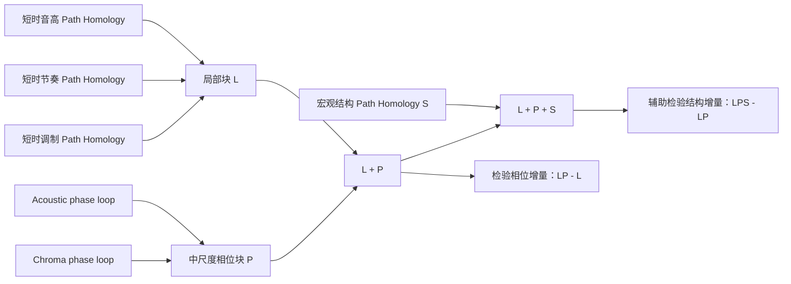

# Path Homology 多尺度层级融合分析：L → L+P → L+P+S

生成日期：2026-08-02

## 摘要

本研究把音乐的有向拓扑表征分成三个时间尺度：短时局部状态转移块
`L`、中尺度相位闭环块 `P`、宏观曲式结构块 `S`，并按预先固定的层级

```text
L  →  L+P  →  L+P+S
```

依次检验相位与结构是否提供条件增量。`L` 等权融合音高、节奏、调制；主
`P` 等权融合 Acoustic phase 与 Chroma phase 的 `loop_score`；`S` 使用宏观
结构 Path Homology。每个原始块只在 discovery 上估计缺失值、均值、协方差
和有效秩，随后才转换 validation 与 holdout。`L+P` 中两个尺度各占一半，
`L+P+S` 中三个尺度各占三分之一，不使用 validation 或 holdout 调权。

validation/180 s 的主要探索结果是：`L`、`P`、`L+P`、`S`、`L+P+S` 均有
组间分离，但“单独显著”不等于“融合后有增量”。相位加入 `L` 后，
Δpseudo-F = +6.910，单侧置换 p=0.001，BH-FDR=0.002；相位在回归掉 `L`
后仍有残差分离（pseudo-F=4.712，p=0.020，FDR=0.040）。相反，结构加入 `L+P` 后
Δpseudo-F = -4.477，p=1.000，且 180 s 条件残差不显著（p=0.107）。

相位的正增量只出现在距离几何与条件残差检验中，没有转化为分类性能提升：
`L` 与 `L+P` 的 balanced accuracy 都是 0.933，后者 AUROC 还低 0.007。
因此最稳妥的结论是：**相位为局部状态转移补充了可分的中尺度几何信息，但
没有证明它提高预测；结构可作为宏观解释层保留，却不应替换相位，也不应在
当前等权方案下并入主融合终点。**

本融合方案是在既有单视角 validation 结果已被查看后形成，holdout 也已在
此前研究中开启。因此全文属于探索性多尺度整合；holdout 仅报告描述性数值，
不计算新 p 值，也不用于调参、选指标或改变权重。

## 1. 研究问题与尺度假设

三个尺度回答不同问题：

- `L`：短时间窗内，音高、节奏、调制状态怎样发生有向转移？
- `P`：跨若干局部块，候选重复周期的相位是否按顺序稳定闭合？
- `S`：整段音乐的段落角色与宏观段落转移怎样组织？

它们不是三个同义特征。相位提升把短时轨迹投影到候选周期内部，属于连接
局部和全局的中尺度；结构视角在更稀疏的段落序列上工作，属于宏观尺度。



核心零假设分别为：

\[
H_{0,P}: F_{L+P}-F_L\leq 0,
\qquad
H_{0,S}: F_{L+P+S}-F_{L+P}\leq 0.
\]

第二步被预先定位为辅助/探索性检验；即使 `S` 单块显著，也不能绕过
`L+P+S - (L+P)` 的条件增量检验。

## 2. 数据与证据层级

当前数据为 Open Focus 300 首与 Classical 300 首，对称分割如下：

| split | 每组曲目 | 两组合计 | 角色 |
|---|---:|---:|---|
| discovery | 195 | 390 | 拟合块变换、岭回归与分类器超参数 |
| validation | 60 | 120 | 180 s 主要探索检验；300 s 时长敏感性 |
| holdout | 45 | 90 | 已开启后的描述性核对，不做新推断 |

每首曲目都有 180 s 与 300 s 版本。300 s 与 180 s 来自同一首曲目，因而
300 s 不是独立复制。四个状态转移视角各有 1,200 行且无失败行。相位表在
validation 和 holdout 完整；`classical_musicnet_2305` 的三个相位表示在
discovery 的 180/300 s 各缺一行，融合时使用相应 discovery 中位数填补。

主 `P` 使用 Acoustic/Chroma，是参考既有 validation 结果后的证据启发选择，
不是预注册选择。为检验该选择的脆弱性，另做 Acoustic/Chroma/Rhythm 三相位
等权敏感性分析。这个设计选择进一步限定了本研究的探索性身份。

## 3. 数学原理

### 3.1 局部与结构 Path Homology

对离散状态序列 \(s_1,\ldots,s_T\)，以转移频数或权重构造有向图
\(G=(V,E,w)\)。在阈值 \(\tau\) 下保留强边：

\[
G_\tau=(V,\{(i,j)\in E:w_{ij}\geq\tau\}).
\]

允许的 \(p\)-路径是相邻顶点之间都有有向边的序列
\(e_{i_0\ldots i_p}\)，其边界为

\[
\partial e_{i_0\ldots i_p}
=\sum_{q=0}^{p}(-1)^q
e_{i_0\ldots\widehat{i_q}\ldots i_p}.
\]

只保留边界仍合法的链空间

\[
\Omega_p=\{v\in A_p:\partial v\in A_{p-1}\},
\qquad
H_p=\ker \partial_p/\operatorname{im}\partial_{p+1},
\]

并在阈值过滤上汇总 Betti 曲线、持续性、熵、复现与图密度等 20 个指标。
`L` 的三块共享同一数学框架，但状态分别来自音高、节奏和调制；`S` 则把
状态换成宏观段落角色，所以时间粒度与图稀疏度不同。

### 3.2 相位提升与中尺度闭环

相位提升先从块级轨迹的距离矩阵 \(D\) 中寻找候选主周期：

\[
P^*=\arg\min_{P\in\mathcal P}\operatorname{median}_i D_{i,i+P}.
\]

把周期内位置映射到 \(K=6\) 个相位节点：

\[
q_i=\left\lfloor\frac{(i\bmod P^*)K}{P^*}\right\rfloor,
\qquad
r_i=\exp(-D_{i,i+P^*}/s).
\]

相位一致性与相邻相位边权为

\[
c_k=\operatorname{mean}\{r_i:q_i=k\},
\qquad
w_k=\min(c_k,c_{k+1}).
\]

六条有向边全部保留时存在相位环，因此连续临界值

\[
\lambda=\min_k w_k
\]

就是本研究使用的 `loop_score`。这里的 Path \(H_1\) 由预定义六相位闭环
构造诱导；它不能被解释成普通稀疏状态转移图中发现了同一种一般性 \(H_1\)。

### 3.3 discovery 拟合的块标准化

不同视角的维数、量纲和相关结构不同。对原始块 \(X_b\)，只用 discovery
估计中位数填补、均值 \(\mu_b\)、协方差与有效秩 \(r_b\)，得到白化坐标

\[
Z_b=\frac{(X_b-\mu_b)W_b}{\sqrt{r_b}},
\qquad W_b^\top\Sigma_bW_b\approx I.
\]

除以 \(\sqrt{r_b}\) 后，每个块的期望平方距离不再随维数线性增加，从而避免
高维块仅因维数更多而支配融合。180 s 的有效秩为 pitch 13、rhythm 13、
modulation 14、structure 13；三个相位标量块的秩均为 1。

### 3.4 固定等权层级融合

对已经标准化的 \(k\) 个块，定义

\[
\operatorname{Eq}(B_1,\ldots,B_k)
=\frac{1}{\sqrt{k}}[B_1|\cdots|B_k].
\]

因此

\[
\begin{aligned}
L&=\operatorname{Eq}(Z_{pitch},Z_{rhythm},Z_{modulation}),\\
P&=\operatorname{Eq}(Z_{acoustic\ phase},Z_{chroma\ phase}),\\
LP&=\operatorname{Eq}(L,P),\\
LPS&=\operatorname{Eq}(L,P,Z_{structure}).
\end{aligned}
\]

这使 `LP` 的局部/相位距离贡献各为 1/2，`LPS` 的局部/相位/结构贡献各为
1/3。权重固定，不进行 validation 搜索。

### 3.5 检验与辅助模型

对欧氏距离 \(d_{ij}\)，PERMANOVA 的平方和可写为

\[
SS_T=\frac1n\sum_{i<j}d_{ij}^2,
\qquad
SS_W=\sum_g\frac1{n_g}\sum_{i<j\in g}d_{ij}^2,
\]

\[
F=\frac{(SS_T-SS_W)/(G-1)}{SS_W/(n-G)}.
\]

每个 validation 单块的 p 值和两项增量检验都使用 999 次标签置换。增量统计量
为同一次标签排列下候选空间与基线空间 pseudo-F 的配对差：

\[
\Delta_P=F_{LP}-F_L,
\qquad
\Delta_S=F_{LPS}-F_{LP}.
\]

两项增量 p 值按时长分别做 BH 校正。为检验“新块只是重复旧块”还是保留条件
信息，在 discovery 上拟合多输出岭回归

\[
\widehat B=\arg\min_B\|Y-XB\|_F^2+\alpha\|B\|_F^2,
\]

再在 validation 检验残差 \(R=Y-X\widehat B\) 的组间分离：`P | L` 与
`S | LP`。此外，discovery 内五折 CV 从固定 \(C\) 网格选择 L2 逻辑回归，
在 validation 报告 balanced accuracy、Macro-F1 与 AUROC；融合差值使用
1,000 次分层配对 bootstrap。

## 4. validation/180 s 主要探索结果

### 4.1 单块分离与层级融合

| 表示 | 维数 | pseudo-F | 置换 p | BH-FDR | 解释 |
|---|---:|---:|---:|---:|---|
| L | 49 | 6.696 | 0.001 | 0.00125 | 短时局部状态转移可分 |
| P | 2 | 20.580 | 0.001 | 0.00125 | 相位闭环强度有明显组间几何差异 |
| L+P | 51 | 13.606 | 0.001 | 0.00125 | 多尺度联合空间可分 |
| S | 16 | 2.503 | 0.008 | 0.008 | 宏观结构单块可分，但较弱 |
| L+P+S | 67 | 9.129 | 0.001 | 0.00125 | 联合空间仍可分，但不等于有结构增量 |


[SVG](../runs/multiscale_hierarchical_fusion/figures/hierarchical_permanova.svg)

`P` 的 pseudo-F 高于 `L`，并不表示它是更好的分类器；pseudo-F 衡量组间与
组内距离比，而预测指标衡量逐样本判别。两者必须分别解释。

### 4.2 两次真正的增量检验

| 增量 | Δpseudo-F | 单侧 p | BH-FDR | 零分布 95% 区间 | 结论 |
|---|---:|---:|---:|---:|---|
| L+P − L | +6.910 | 0.001 | 0.002 | [-0.637, 2.005] | 支持正的距离几何增量 |
| L+P+S − L+P | -4.477 | 1.000 | 1.000 | [-0.703, 0.447] | 不支持结构增量 |


[SVG](../runs/multiscale_hierarchical_fusion/figures/hierarchical_incremental_tests.svg)

因此，“`S` 单块 p=0.008”不能被写成“结构改善了融合”。在等权融合下，
结构把联合 pseudo-F 从 13.606 降到 9.129。

### 4.3 条件残差

| 条件检验 | discovery R² | validation R² | 残差 pseudo-F | p | BH-FDR |
|---|---:|---:|---:|---:|---:|
| P \| L | 0.189 | 0.095 | 4.712 | 0.020 | 0.040 |
| S \| L+P | 0.109 | 0.011 | 1.542 | 0.107 | 0.107 |


[SVG](../runs/multiscale_hierarchical_fusion/figures/hierarchical_conditional_residuals.svg)

`P | L` 的结果说明相位差异不能完全由局部块线性预测，支持“相位含有非冗余
中尺度信息”。`S | LP` 在主要 180 s 分析中不显著，所以不能声称结构提供
稳定的条件信息。

### 4.4 分类不能证明相位提升预测

| 表示 | Balanced accuracy | Macro-F1 | Macro AUROC |
|---|---:|---:|---:|
| L | 0.933 | 0.933 | 0.989 |
| P | 0.683 | 0.683 | 0.733 |
| L+P | 0.933 | 0.933 | 0.982 |
| S | 0.633 | 0.633 | 0.656 |
| L+P+S | 0.908 | 0.908 | 0.972 |


[SVG](../runs/multiscale_hierarchical_fusion/figures/hierarchical_classification.svg)

`L+P − L` 的 balanced-accuracy 差为 0.000，95% bootstrap CI
[-0.033, 0.033]；AUROC 差为 -0.007，CI [-0.024, 0.003]。因此分类证据既不
支持相位提高预测，也没有显示灾难性下降。结构加入后 balanced accuracy
下降 0.025，CI [-0.058, 0.000]；至少没有正向改善证据。

### 4.5 尺度之间的关系

validation/180 s 的成对距离 Spearman 相关为：

| 块对 | ρ |
|---|---:|
| L 与 P | 0.211 |
| L 与 S | -0.088 |
| P 与 S | -0.043 |


[SVG](../runs/multiscale_hierarchical_fusion/figures/hierarchical_distance_correlations.svg)

`L` 与 `P` 低度正相关，说明二者有关联但远非同一几何；这与 `P | L` 的残差
结果一致。`S` 与前两块几乎不相关，但“不相关”本身并不保证有助于组间分离；
它也可能主要增加组内方差，这正是当前等权 `L+P+S` 所显示的情况。

下面的 PCA 仅用于观察 discovery 拟合空间的低维投影，不参与显著性检验。


[SVG](../runs/multiscale_hierarchical_fusion/figures/hierarchical_pca_validation_180.svg)

## 5. 300 s 时长敏感性

| 表示/增量 | 300 s 结果 | 与 180 s 的关系 |
|---|---:|---|
| L pseudo-F | 9.101 | 同向且更强 |
| P pseudo-F | 29.419 | 同向且更强 |
| L+P pseudo-F | 19.188 | 同向且更强 |
| L+P − L | +10.087，p=0.001，FDR=0.002 | 支持相位正增量 |
| S pseudo-F | 4.214 | 单块可分 |
| L+P+S − L+P | -7.033，p=1.000 | 仍不支持结构增量 |
| P \| L 残差 | pseudo-F=3.978，p=0.026，FDR=0.026 | 支持相位非冗余 |
| S \| L+P 残差 | pseudo-F=2.372，p=0.021，FDR=0.026 | 仅敏感性阳性 |

结构残差在 300 s 为阳性，但主要 180 s 结果为阴性，而且等权增量在两个时长
均为负。故它只能记为一个需要未来独立数据复核的时长依赖信号，不能推翻
“当前不支持把 S 加入主融合”的结论。

分类敏感性与 180 s 一致：`L` 与 `L+P` 的 balanced accuracy 都是 0.942，
`L+P` 的 AUROC 比 `L` 低 0.005；加入结构后 balanced accuracy 降到 0.933。

## 6. 相位定义敏感性

主 `P` 只含 Acoustic 与 Chroma。加入 Rhythm phase 后结果如下：

| 时长 | 融合阶段 | 主 P pseudo-F | 三相位 pseudo-F |
|---:|---|---:|---:|
| 180 s | P | 20.580 | 14.976 |
| 180 s | L+P | 13.606 | 10.757 |
| 180 s | L+P+S | 9.129 | 7.400 |
| 300 s | P | 29.419 | 24.723 |
| 300 s | L+P | 19.188 | 16.519 |
| 300 s | L+P+S | 12.155 | 10.611 |

三相位版本在所有阶段仍有 p=0.001，但 pseudo-F 一致变小。它说明相位结论
不依赖把 Rhythm phase 完全排除，但 Rhythm phase 在当前等权构造中会稀释
组间几何。由于主 P 的选择看过 validation，这项对照是透明度检查，不能把
主版本重新包装成确认性最优模型。

## 7. 已开启 holdout 的描述性核对

holdout 不计算新 p 值。180 s 描述值为：

| 表示 | pseudo-F（描述性） | Balanced accuracy | Macro AUROC |
|---|---:|---:|---:|
| L | 5.359 | 0.933 | 0.992 |
| P | 15.193 | 0.700 | 0.728 |
| L+P | 9.297 | 0.911 | 0.982 |
| S | 2.829 | 0.611 | 0.665 |
| L+P+S | 6.266 | 0.911 | 0.963 |

这些数值在描述方向上复现了 validation 的模式：`P` 的距离分离较强，
`L+P` 的 pseudo-F 高于 `L`，加入 `S` 后下降；分类上 `L` 仍最好。但该
holdout 已在此前分析中开启，也不是 pristine 外部数据，不能被当作本次新方案
的一次独立确认，更不能用于再选择相位视角或权重。

## 8. 综合解释

### 8.1 可以支持的陈述

1. 在当前 Open Focus/Classical 数据上，短时局部、相位、结构三个尺度分别
   存在不同程度的组间几何分离。
2. 相位加入局部块后，validation/180 s 与 300 s 的配对 pseudo-F 增量均为
   正，且 `P | L` 条件残差在两个时长均可分。
3. 相位因此可作为局部状态转移的中尺度补充，而不是结构视角的替代品。
4. 结构虽然单块可分，却没有改善 `L+P`；主要 180 s 条件残差也不支持稳定
   结构增量。

### 8.2 不能支持的陈述

1. 不能说相位提高了分类或个体曲目预测；balanced accuracy 没有增加。
2. 不能因 `L+P+S` 仍显著，就说三尺度融合优于 `L+P`。
3. 不能把预定义相位环的 `loop_score` 当作普通状态图中自然发现的一般 H1。
4. 不能推断专注效果、认知机制、临床效果、生成质量或因果关系。
5. 不能把 300 s 当作独立复制，也不能把已开启 holdout 当作新确认集。

### 8.3 建议的最终分析架构

- 若目标是稳定分类或预测：保留 `L` 作为主表示；当前没有证据要求加入 P/S。
- 若目标是解释多尺度组间拓扑几何：采用 `L+P` 作为探索性联合表示，同时分别
  报告 `L` 与 `P`，并给出 `P | L` 条件残差。
- `S` 保留为独立宏观描述层与未来验证对象，不替换 `P`，暂不并入主终点。
- 不使用当前 validation/holdout 继续优化 `P` 的组成、融合权重或指标集合。

换言之，研究问题不应被压缩成一个“越多视角越好”的总分。当前证据更适合
两条并列结论：`L+P` 揭示多尺度几何，`L` 保持最佳预测；`S` 负责宏观解释，
但尚未证明对前两者有正增量。

## 9. 局限性

- 主 P 的 Acoustic/Chroma 选择参考过 validation 单视角结果，存在选择偏差。
- Classical 与 Open Focus 在风格、乐器、制作来源上可能有系统混杂。
- 相位节点数、周期搜索与 `loop_score` 构造固定；当前研究没有独立检验其他
  相位分辨率。
- discovery 有一首曲目的相位值因质量排除而被中位数填补。
- ridge 条件残差只移除了线性可预测部分，不能证明所有非线性独立性。
- pseudo-F、分类、残差和距离相关回答不同问题，不应相互替代。

## 10. 可复现产物

分析入口：

- `scripts/run_multiscale_hierarchical_fusion_analysis.py`

机器可读结果：

- `metadata/multiscale_hierarchical_fusion_permanova.csv`
- `metadata/multiscale_hierarchical_fusion_incremental.csv`
- `metadata/multiscale_hierarchical_fusion_classification.csv`
- `metadata/multiscale_hierarchical_fusion_classification_deltas.csv`
- `metadata/multiscale_hierarchical_fusion_correlations.csv`
- `metadata/multiscale_hierarchical_fusion_residuals.csv`
- `metadata/multiscale_hierarchical_fusion_phase_sensitivity.csv`
- `metadata/multiscale_hierarchical_fusion_holdout_descriptive.csv`
- `metadata/multiscale_hierarchical_fusion_summary.json`

图形目录：

- `runs/multiscale_hierarchical_fusion/figures/`（每图同时提供 PNG 与 SVG）

运行配置：999 次置换、1,000 次分层 bootstrap、随机种子 `20260716`。摘要
JSON 同时记录输入 SHA-256、有效秩、缺失填补数和全部产物路径。
