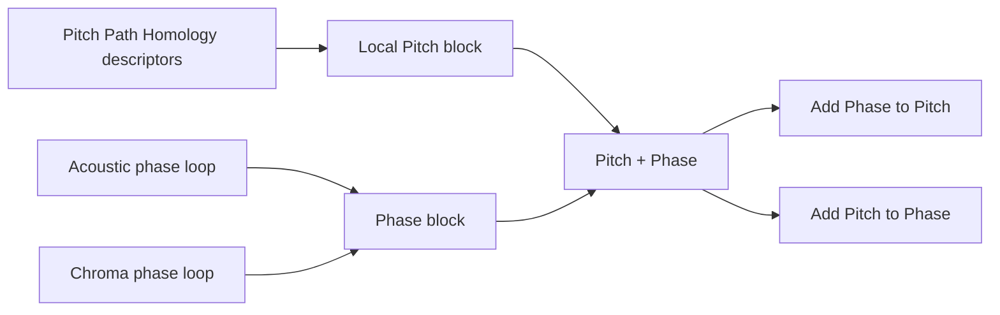

# Pitch–Phase Path Homology 双尺度融合与消融分析

生成日期：2026-08-07

## 摘要

根据此前局部多视角分析中“局部融合没有稳定优于 Pitch 单视角”的结果，本次
将局部块重新冻结为 Pitch Path Homology，并与宏观长程相位块进行双尺度融合：

```text
Pitch  →  Pitch + Phase
```

其中 Phase 只包含 Acoustic phase loop 与 Chroma phase loop 两项
`loop_score`，不纳入 Rhythm phase 或其他结构分支。分析比较 Pitch、Phase 与
Pitch+Phase 三种表示，并通过配对 pseudo-F 增量、条件残差、辅助分类和已开启
holdout 描述，区分“单块可分”“加入后有几何增量”与“提高逐曲预测”三个问题。

validation/180 s 中，Pitch、Phase 和 Pitch+Phase 的 PERMANOVA pseudo-F
分别为 7.588、20.580 和 13.486，三者均有置换 p=0.001、BH-FDR q=0.001。
在 Pitch 上加入 Phase 后，Δpseudo-F=+5.898、q=0.002；但在 Phase 上加入
Pitch 后，Δpseudo-F=-7.094、q=1。因此，融合显著优于 Pitch 基线，却没有
优于更强的 Phase 单块。

条件残差给出更谨慎的结果：Phase | Pitch 在 180 s 不显著（pseudo-F=1.481，
q=0.230），Pitch | Phase 则显著（pseudo-F=5.191，q=0.002）。这表明 Phase
能够提高以 Pitch 为基线的等权联合距离，但尚无证据证明其组间信息在移除 Pitch
可线性预测部分后仍然独立；Pitch 反而保留了 Phase 不能解释的条件信息，只是
这些信息加入强 Phase 空间后没有继续提高整体 pseudo-F。

辅助分类也不支持“融合全面优于 Pitch”：180 s balanced accuracy 为 Pitch
0.933、Phase 0.683、Pitch+Phase 0.925；融合相对 Pitch 的差为 -0.008，
bootstrap 95% CI [-0.042,0.017]。因此当前最稳妥的结论是：**Phase 是当前
距离几何中最强的组间分离块，Pitch 是逐曲分类与条件非冗余信息的主要来源；
Pitch+Phase 提供联合双尺度表示，但不能宣称优于两个单块中的最佳者。**

局部块改为 Pitch 是在既有 validation 结果之后作出的设计选择，因此本轮属于
结果知情后的重新冻结与探索性重跑，而不是新的独立确认。300 s 来自同一曲目，
只作时长敏感性；holdout 已在此前开启，仅报告描述值，不进行新的推断或调参。

## 1. 分析设计

### 1.1 两个拓扑块

- **Pitch 局部块**：使用冻结 Pitch-v2 状态表示产生的 20 个预设 Path Homology
  与有向图描述子。融合变换自动删除 discovery 内常量列；180 s/300 s 分别
  保留 16/17 个坐标，有效秩均为 13。
- **Phase 长程周期块**：分别标准化 Acoustic phase 与 Chroma phase 的
  `loop_score`，再作等块融合。每项有效秩为 1，联合块维数为 2。
- **Pitch+Phase 联合块**：将标准化后的 Pitch 与 Phase 两块等权拼接；两个
  尺度各占联合平方距离的一半。



本文把 Phase 称为宏观长程周期块，是因为它在完整 180/300 s 片段上估计
12--64 s 的候选周期并跨至少三个周期汇总；该术语不表示主歌、副歌、再现部等
完整曲式识别。

### 1.2 数据与证据层级

| split | 每组曲目 | 两组合计 | 角色 |
|---|---:|---:|---|
| discovery | 195 | 390 | 拟合块标准化、岭回归与分类器 |
| validation | 60 | 120 | 180 s 主分析；300 s 同曲目敏感性 |
| holdout | 45 | 90 | 已开启后的描述性核对 |

Pitch 数据无失败行。`classical_musicnet_2305` 在 discovery 的 Acoustic phase
与 Chroma phase 各缺一个 180 s/300 s 值；缺失值只用相应 discovery 中位数
填补。validation 与 holdout 的两项 Phase 输入完整。

### 1.3 discovery 拟合的块变换

对块 (X_b)，只在相应时长的 discovery 中估计中位数填补、均值
(mu_b)、协方差与有效秩 (r_b)，得到

\[
Z_b=\frac{(X_b-\mu_b)W_b}{\sqrt{r_b}},
\qquad W_b^\top\Sigma_bW_b\approx I.
\]

等块融合定义为

\[
\operatorname{Eq}(B_1,\ldots,B_k)
=\frac{1}{\sqrt{k}}[B_1|\cdots|B_k],
\]

故

\[
P=\operatorname{Eq}(Z_{Acoustic},Z_{Chroma}),
\qquad
F=\operatorname{Eq}(Z_{Pitch},P).
\]

这里 (F) 是 Pitch+Phase 联合表示，不使用 validation 或 holdout 搜索权重。

### 1.4 检验与消融协议

三种表示分别使用 999 次标签置换的 PERMANOVA，并在每个时长的三项表示内
进行 BH-FDR。两项配对增量为

\[
\Delta_{Phase|Pitch}=F^*_{Pitch+Phase}-F^*_{Pitch},
\]

\[
\Delta_{Pitch|Phase}=F^*_{Pitch+Phase}-F^*_{Phase},
\]

在每个时长内对两项单侧检验作 BH-FDR。只有 Δpseudo-F>0 且 q≤0.05 才
记为正几何增量。

条件残差在 discovery 上以多输出岭回归拟合一个块对另一个块的预测，再在
validation 对 Phase | Pitch 与 Pitch | Phase 残差做 PERMANOVA。辅助 L2
逻辑回归在 discovery 内五折选择 (C)，冻结后应用 validation；分类差异使用
1,000 次组内分层配对 bootstrap。

## 2. validation/180 s 主要结果

### 2.1 单块与联合空间的组间分离

| 表示 | 维数 | pseudo-F | 置换 p | BH-FDR q |
|---|---:|---:|---:|---:|
| Pitch | 16 | 7.588 | 0.001 | 0.001 |
| Acoustic+Chroma Phase | 2 | 20.580 | 0.001 | 0.001 |
| Pitch+Phase | 18 | 13.486 | 0.001 | 0.001 |


[SVG](../runs/pitch_phase_hierarchical_fusion/figures/pitch_phase_permanova_ablation.svg)

图 1 显示两种时长下均为 Phase 单块 pseudo-F 最高，联合表示居中。pseudo-F
衡量组间距离相对组内离散的比例，不能直接当作分类准确率，也不能仅凭联合空间
显著就声称融合优于单块。

### 2.2 双向增量消融

| 增量 | Δpseudo-F | 单侧 p | BH-FDR q | 零分布 95% 区间 | 判断 |
|---|---:|---:|---:|---:|---|
| 加 Phase 到 Pitch | +5.898 | 0.001 | 0.002 | [-0.715,1.920] | 支持正增量 |
| 加 Pitch 到 Phase | -7.094 | 1.000 | 1.000 | [-1.728,0.877] | 不支持正增量 |


[SVG](../runs/pitch_phase_hierarchical_fusion/figures/pitch_phase_incremental_tests.svg)

两项检验不是互相矛盾：Phase 单块的组间/组内距离比远高于 Pitch，因此加入
Phase 会提高 Pitch 基线；反向加入 Pitch 则把联合 pseudo-F 拉回两者之间。
所以可写“Phase 改善 Pitch 基线”，但不能写“融合优于最佳单块”。

### 2.3 条件非冗余

| 条件检验 | discovery R² | validation R² | 残差 pseudo-F | p | BH-FDR q |
|---|---:|---:|---:|---:|---:|
| Phase \| Pitch | 0.195 | 0.114 | 1.481 | 0.230 | 0.230 |
| Pitch \| Phase | 0.055 | -0.015 | 5.191 | 0.001 | 0.002 |


[SVG](../runs/pitch_phase_hierarchical_fusion/figures/pitch_phase_conditional_residuals.svg)

Phase | Pitch 未通过主尺度 FDR，因此不能把配对增量进一步表述为“Phase 含有
经条件验证的独立组别信息”。Pitch | Phase 显著，说明 Pitch 保留了 Phase
不能线性解释的组别结构；但这部分信息加入 Phase 后可能同时增加组内离散，
因而没有产生正的整体 pseudo-F 增量。

### 2.4 辅助分类

| 表示 | Balanced accuracy | Macro-F1 | AUROC |
|---|---:|---:|---:|
| Pitch | 0.933 | 0.933 | 0.988 |
| Acoustic+Chroma Phase | 0.683 | 0.683 | 0.733 |
| Pitch+Phase | 0.925 | 0.925 | 0.982 |


[SVG](../runs/pitch_phase_hierarchical_fusion/figures/pitch_phase_classification_ablation.svg)

Pitch+Phase 相对 Pitch 的 balanced-accuracy 差为 -0.008，95% CI
[-0.042,0.017]；AUROC 差为 -0.006，CI [-0.019,0.003]。因此主尺度没有融合
提高逐曲预测的证据。相对 Phase，融合的 balanced accuracy 增加 0.242，
95% CI [0.158,0.325]，说明 Pitch 是分类性能的主要来源。

### 2.5 两块距离关系与二维投影

Pitch 与 Phase 成对距离的 Spearman 相关为 0.228，表明二者有关但并非相同
几何。图 5 从左到右并列给出 L、P 与 L+P 三种表示的 PCA 投影。每幅子图均在
对应表示的 discovery/180 s 数据上独立拟合 PCA，再投影同一批 validation/180 s
样本，因此三幅图的坐标值不能直接横向比较。L 的 PC1 与 PC2 各解释 7.7% 的
方差，P 分别解释 79.9% 与 20.1%，L+P 分别解释 40.9% 与 10.4%。


[SVG](../runs/pitch_phase_hierarchical_fusion/figures/pitch_phase_pca_validation_180.svg)

L 中两组沿 PC1 呈较清楚的整体位移；P 的方差主要集中在 PC1，但两组投影仍
明显重叠，且 Open Focus 的组内离散更大；L+P 同时保留了组间位移与 Phase
方向上的较大离散。椭圆表示各投影空间中的组内二维协方差范围，不是 bootstrap
置信区间；PCA 只提供低维几何直觉，不参与 PERMANOVA 或增量检验。

## 3. 300 s 同曲目时长敏感性

| 指标 | 300 s 结果 | 与 180 s 的关系 |
|---|---:|---|
| Pitch pseudo-F | 13.437 | 同向且增强 |
| Phase pseudo-F | 29.419 | 同向且增强 |
| Pitch+Phase pseudo-F | 21.392 | 同向且增强 |
| 加 Phase 到 Pitch | Δ=+7.955，q=0.002 | 再次支持正增量 |
| 加 Pitch 到 Phase | Δ=-8.027，q=1 | 再次不支持正增量 |
| Phase \| Pitch | F=2.907，q=0.061 | 提示性，未过主阈值 |
| Pitch \| Phase | F=9.719，q=0.002 | 再次支持条件信息 |

300 s 分类中，Pitch、Phase、Pitch+Phase 的 balanced accuracy 分别为 0.933、
0.750、0.950。融合相对 Pitch 的差为 +0.017，95% CI [0.000,0.042]；但
AUROC 从 0.986 降至 0.978。由于 300 s 与 180 s 来自同一曲目，且主要
180 s 未显示分类增量，不能把这一边界结果当作独立预测改善。

## 4. 已开启 holdout 的描述性核对

holdout 不计算新 p 值。180 s 描述值为：

| 表示 | pseudo-F | Balanced accuracy | AUROC |
|---|---:|---:|---:|
| Pitch | 7.402 | 0.911 | 0.984 |
| Acoustic+Chroma Phase | 15.193 | 0.700 | 0.728 |
| Pitch+Phase | 10.292 | 0.911 | 0.987 |


[SVG](../runs/pitch_phase_hierarchical_fusion/figures/pitch_phase_holdout_descriptive.svg)

holdout 描述方向与 validation 一致：Phase 的距离几何分离最强，Pitch 与融合
的逐曲分类明显高于 Phase，且融合没有提高 Pitch 的 balanced accuracy。该
holdout 已经开启，不是 pristine 外部确认集，不能用于新的显著性声明。

## 5. 综合判断

### 5.1 可以支持的陈述

1. Pitch 局部拓扑与 Acoustic/Chroma 相位闭环均存在 Open Focus--Classical
   组间距离几何差异。
2. 在等权联合距离中，Phase 相对 Pitch 提供正的配对 pseudo-F 增量，且这一
   方向在 300 s 保持。
3. Phase 是当前三种表示中 pseudo-F 最强的单块；Pitch 是主尺度逐曲分类的
   最强单块。
4. Pitch | Phase 条件残差显著，说明 Pitch 保留了 Phase 不能线性解释的信息。
5. Pitch+Phase 可以作为同时包含局部状态组织和长程周期闭合的联合描述空间。

### 5.2 不能支持的陈述

1. 不能说 Pitch+Phase 优于最佳单块；其 pseudo-F 低于 Phase，180 s 分类也
   低于 Pitch。
2. 不能说 Phase 已通过条件非冗余检验；Phase | Pitch 在主尺度 q=0.230。
3. 不能把较高 pseudo-F 解释为更高分类准确率、音乐质量或专注功效。
4. 不能把 300 s 当作独立复制，也不能把已开启 holdout 当作新确认集。
5. 不能把相位环解释为完整曲式、注意力机制、治疗效果或因果效应。

### 5.3 建议的论文与生成表述

- 将 Pitch 与 Phase 作为两个并列、功能不同的拓扑块报告：Pitch 负责局部状态
  组织与个体判别，Phase 负责长程周期闭合的组间距离几何。
- 若需要联合拓扑指纹，可采用 Pitch+Phase 等权表示，但应称为“联合描述空间”，
  不宣称其优于 Pitch 或 Phase 中的最佳单块。
- 若生成控制优先考虑逐曲稳定性，以 Pitch 为主要预测块；Phase 适合作为独立
  的长程周期约束或监测端点，而不是依据当前结果提高其融合权重。

## 6. 局限性

- 将局部融合改为 Pitch 是参考既有 validation 结果后的设计选择，本轮不构成
  独立确认。
- Pitch 与 Phase 的融合权重固定为 1:1；当前结果不能支持继续用相同 validation
  搜索更有利的权重。
- 融合标准化按时长分别在 discovery 拟合，因此 300 s 是同曲目流程敏感性，
  不是对 180 s 变换的完全外推。
- Phase 仅含 Acoustic 与 Chroma；这是一项结果知情的冻结选择，不是经独立
  数据证明的最优相位组合。
- 六相位节点数与候选周期范围固定，尚未完成独立的 (K) 值敏感性验证。
- Classical 与 Open Focus 可能存在流派、乐器和制作来源等系统混杂。

## 7. 可复现产物

分析入口：

- `scripts/run_pitch_phase_hierarchical_fusion_analysis.py`

机器可读结果：

- `metadata/pitch_phase_hierarchical_permanova.csv`
- `metadata/pitch_phase_hierarchical_incremental.csv`
- `metadata/pitch_phase_hierarchical_residuals.csv`
- `metadata/pitch_phase_hierarchical_classification.csv`
- `metadata/pitch_phase_hierarchical_classification_deltas.csv`
- `metadata/pitch_phase_hierarchical_correlations.csv`
- `metadata/pitch_phase_hierarchical_holdout_descriptive.csv`
- `metadata/pitch_phase_hierarchical_summary.json`

图形目录：

- `runs/pitch_phase_hierarchical_fusion/figures/`

图表采用与论文局部融合图一致的白底、DejaVu Sans、蓝灰色 180 s、橙色 300 s、
浅灰网格和去除上/右边框风格，并同时提供 220 dpi PNG 与 SVG。运行配置为
999 次置换、1,000 次分层 bootstrap、随机种子 `20260716`；摘要 JSON 记录
输入 SHA-256、有效秩、缺失填补数与全部产物路径。
