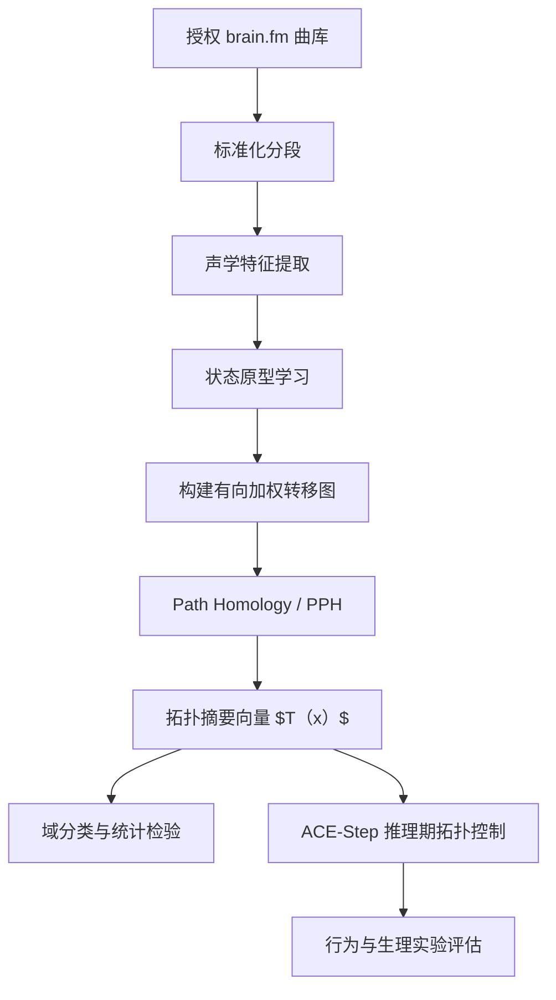

## 数据集与预处理方案

### 建议的样本量与切分单位

由于 brain.fm 单首时长可达 **30 分钟到 2 小时**，最容易犯的错误是把“长曲目切出大量片段”后，造成**同一首曲目泄漏到训练与测试**。因此你必须采用**源曲目级分组切分**：同一源曲目的全部片段只能进入一个 split。

我给你三档建议：

| 档位     | 每类原始音频时长 |            标准化片段 | 适用目标                       |
| :------- | ---------------: | --------------------: | :----------------------------- |
| 最小可行 |       15 小时/类 |  300 个 3 分钟片段/类 | 先做 topology 分类与可行性验证 |
| 竞赛推荐 |       30 小时/类 |  600 个 3 分钟片段/类 | 足够做分类、生成控制、消融     |
| 理想扩展 |       50 小时/类 | 1000 个 3 分钟片段/类 | 可做更稳的跨域泛化分析         |

这里的“3 分钟片段”是为了兼顾**生成任务**与**计算成本**。对于长脑波/注意实验，你再额外建立一个 **5 分钟片段集**，专供 persistent path topology 与 human study 使用。也就是说，建议做**双尺度数据集**：

- **3 分钟片段集**：给分类器、拓扑摘要学习器、ACE-Step 训练/评估用。
- **5 分钟片段集**：给长时拓扑分析和受试实验用。

### 对照组曲目选择标准

对照组不要简单按“流派标签”取歌，而要增加筛选条件，尽量避免**歌词、人声、极端响度、极端节拍变化**把结果污染掉。

**pop 对照**建议优先选**纯音乐或人声极弱**片段，因为 ADHD 专注音乐最常被批评的一点就是“歌词吸引注意力”。如果你拿高人声流行歌直接对比，最后可能只是证明“歌词会分心”，而不是证明“拓扑特征有效”。

**classical 对照**建议分成两层：主集使用 FMA 的 classical/instrumental；稳健性集用 MAESTRO 钢琴古典，专门检验“你的结论是否只是钢琴纹理带来的假效应”。这样一来，你既有广义 classical，也有高质量强标签的 piano-classical。

### 训练、验证、测试划分

推荐的主划分是 **70/15/15**，但要满足四条约束：

1. **按源曲目分组**。
2. **按类别分层**，保证 brain.fm / pop / classical 比例稳定。
3. **按时长桶分层**，如 0–10 分钟、10–30 分钟、30–60 分钟、60–120 分钟。
4. 在可行时加入**艺人/作曲家 disjoint**，至少在 FMA 与 MAESTRO 上做到元数据去泄漏。

如果你只用少量 brain.fm 曲目，也可以改成 **5-fold grouped cross-validation** 做稳健估计；但最终论文仍要保留一个完全不参与调参的**固定 hold-out test set**。

### 预处理流程与参数建议

对于音频分析副本，建议统一为 **mono、22.05 kHz、float32**。这样做的理由有两个：第一，`librosa.load` 默认就是 22,050 Hz，便于与 MIR 工具链一致；第二，你的拓扑建模重点是**时间结构与状态转移**，而不是立体声声像。需要注意的是：**ACE-Step 生成本身保留模型原生采样设置，分析时再另存一个 22.05 kHz 副本**，不要反向改坏生成链路。

建议的分析默认参数如下。

| 模块              | 建议参数                  | 说明                                    |
| :---------------- | :------------------------ | :-------------------------------------- |
| 载入              | mono=True, sr=22050       | 统一分析分辨率                          |
| 截取              | 3 min 与 5 min 双尺度     | 兼顾生成和长时拓扑                      |
| 响度              | 峰值裁切后做整体响度对齐  | 避免“更响更好听”偏差                    |
| STFT              | n_fft=2048, hop=512, hann | 与主流 librosa 默认一致                 |
| Mel 谱            | 64 或 128 mel bins        | 64 更省算，128 更细                     |
| MFCC              | 13 维 + Δ + ΔΔ            | 传统音色描述                            |
| Chroma            | 12 维                     | 和声/调性轮廓                           |
| Spectral Contrast | 7 维左右                  | 峰谷对比、纹理清晰度                    |
| Tempo/Tempogram   | 局部 tempo、tempogram     | 节奏稳定性与调制结构                    |
| HPSS              | 可选                      | 把 harmonic / percussive 分开做拓扑更稳 |

`librosa` 文档明确给出了相关特征接口：mel spectrogram、MFCC、chroma、spectral contrast、tempo、tempogram 等都在统一 feature 模块中；`chroma_stft` 文档也给出了常用的 `n_fft=2048`、`hop_length=512` 默认配置。

### 为 path homology 构建有向图的首选方案

我建议你采用**“状态原型转移图”**作为主方案，而不是“每一帧一个节点”的原始时间图。原因是：PPH 虽然理论上能处理有向网络，但直接把 5 分钟音频按 23 ms hop 切帧，会得到上万节点，计算和解释都不理想。

**主方案**：

1. 用 1 秒窗、0.5 秒滑动步长，对片段提取综合特征向量
   $$
   z_t=[\text{log-mel},\ \text{MFCC},\ \text{chroma},\ \text{contrast},\ \text{tempogram}]
   $$

2. 对训练集全部 $z_t$ 做 PCA 到 16–32 维，再做 k-means，取 $K=64$ 或 $128$ 个“声学状态原型”。

3. 每个窗口被映射到一个状态 $s_t\in{1,\dots,K}$。

4. 定义有向边 $i\to j$ 的权重为转移概率
   $$
   w_{ij}=P(s_{t+1}=j\mid s_t=i)
   $$
    并可加入 2–4 个滞后步长的衰减转移项。

5. 由于 GLMY/PPH 通常不使用自环，可把自转移计数存到节点权重中，而把自环从图里删去。

这个表示法的优点是：它把音乐看成“在若干声学状态间流动的有向动态系统”，正好对应 path homology 想抓的**有向循环、回返、分支与层次性**。

### 阈值、时间窗口与敏感性分析

阈值不要只取单点。建议你做一个标准的敏感性网格：

| 参数           | 备选值                    | 权衡                           |
| :------------- | :------------------------ | :----------------------------- |
| 原型数 K       | 32 / 64 / 128             | K 小更稳，K 大更细             |
| 窗长           | 0.5 s / 1 s / 2 s         | 0.5 s 抓局部纹理，2 s 抓慢结构 |
| 滞后边数       | 1 / 2 / 4                 | 更多滞后能表达回返，但图更密   |
| 边保留策略     | top-3 / top-5 / prob≥0.02 | top-k 保证稀疏，阈值法更直观   |
| 最大 path 维度 | 1 / 2 / 3                 | 先以 β0、β1 为主，β2 做扩展    |

你的论文里最好把“主结果是否对参数稳定”写成单独一节。因为 PPH 的优点之一是它对有向非对称结构敏感，但这也意味着结果会受图构造方式影响；把敏感性分析做扎实，反而能显著提升论文可信度。

## Path Homology 拓扑建模与统计分析

### GLMY 与 PPH 在你的问题里到底解决什么

GLMY path homology 最关键的价值，在于它不是把数据强行变成无向 simplicial complex；它从**有向图/路径复形**出发，能直接表达“先后顺序”和“方向性循环”。原始 GLMY 论文把 path complex 视为 simplicial complex 的一般化，并专门把 digraph 作为主要动机对象；Chowdhury 与 Mémoli 则进一步把它扩展到 persistent path homology，用来处理**带权、非对称、随阈值变化的有向网络**，并证明了稳定性与可计算性。

对于音乐而言，这一点非常关键。传统持久同调更适合无向邻近结构；但你研究的是“音频状态如何沿时间单向流动、回环、重复和转调”。这类信息如果强行对称化，会损失掉真正的音乐语法感。因此，path homology 是你这篇论文的**理论抓手**，而不是普通“再加一个特征”。

### 需要计算的拓扑不变量

你不要把输出只停留在“算了个 Betti number”。建议把拓扑表征拆成三层：

**基础层**：
$\beta_0,\ \beta_1,\ \beta_2$ 分别对应连通分量、主要有向环、较高维关系。对于音乐图，主分析建议重点看 **$beta_0,\beta_1$**，$\beta_2$ 只做扩展，因为高维路径在稀疏有向图里通常稳定性更差。

**持久层**：条形码/持久图上的

- longest bar
- total persistence
- persistence entropy
- 各维 bar 数量
- birth/death 分布
- persistence landscape / persistence image

这些摘要比单个 Betti 数更适合拿去做分类与生成控制。PPH 本来就是 persistent framework，所以你的主特征最好直接来自**barcode 向量化**，而不是只取单阈值。

**统计层**：把 PPH 摘要再压缩成一个**目标拓扑嵌入向量** $T(x)$，例如 32–128 维。后续无论是分类、可视化还是 ACE-Step 控制，都统一用这个 $T(x)$ 作为接口。

### 软件包与实现建议

如果你重视**理论出处的权威性**，优先引用并复现：

- GLMY 原始理论论文；
- Chowdhury & Mémoli 的 **pypph**；
- Weilab 的 **PathHom** Python 实现。

具体上，我建议这样用：

| 实现       | 优点                                                         | 局限                         | 你的用法                 |
| :--------- | :----------------------------------------------------------- | :--------------------------- | :----------------------- |
| pypph      | 直接对应 Persistent Path Homology of Directed Networks 原始实现 | Python 2.7；工程较旧         | 作为理论基线与小样本复核 |
| PathHom    | Python≥3.7，给出 path homology 与 persistent path homology 示例 | 更偏科研代码，接口需自行包装 | 作为主工作流实现         |
| 自写包装层 | 可直接接入你的音频图与批处理                                 | 开发成本高                   | 必须做                   |

`PathHom` 仓库已经给出了从**节点/边输入**到 `path_homology(...)`、以及 persistent path homology 的调用示例；`pypph` 则强调它正是基于 Chowdhury & Mémoli 的 PPH 工作实现。

### 统计分析路线

建议按照“**区分性—相关性—可迁移性**”三步走。

第一步，做**域区分**。用 PPH 特征区分 brain.fm / pop / classical，可用 logistic regression、XGBoost 或线性 SVM，并报告 balanced accuracy、macro-F1、AUROC。最好同时做一个**只用传统声学特征**的基线，再做“声学 + 拓扑”的融合模型，看拓扑是否真正带来增益。

第二步，做**机制相关**。把 PPH 摘要与调制谱峰值、tempo stability、spectral contrast 等做相关分析，检查 brain.fm 域内是否表现出“更稳定的有向循环结构”或“更集中的状态回返模式”，并与文献中的 16 Hz beta-range modulation 线索建立联系。这里不要一开始就把结论写死，应该写成“检验是否存在相关关系”。

第三步，做**可迁移性验证**。如果基于 PPH 训练出来的拓扑鉴别器能够把“拓扑约束生成”的样本判到 brain.fm 域附近，而把“无约束生成”判到中间区域，你就有了很漂亮的一条证据链：**拓扑可描述、可控制、可迁移**。

上图对应的工作流与 GLMY/PPH 的理论路径是一致的：先保留有向结构，再做多尺度拓扑摘要，而不是先做无向化。