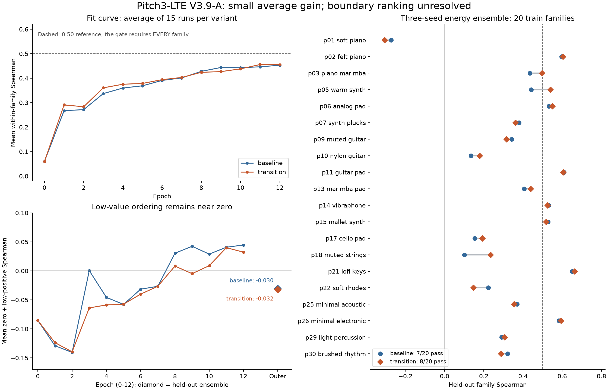

# V3.9-A 生成物复核与下一步建议

分析日期：2026-09-19。结论依据同步到 `runs/pitch3_lte_v39a` 的真实服务器产物，以及本目录 `analyze.py` 的离线复算。未执行新训练、checkpoint forward/backward 或音频生成；原实验文件、配置、教师和门禁均未修改。

## 结论

**V3.9-A 有小幅、部分可复现的平均排序收益，但没有解决核心低值排序与最差家族问题，不建议进入正式全 train、development model-screen 或 guidance。** 保留 A 作为架构对照，停止增加 A 的种子或扩大 Transformer；下一阶段先以独立 fit-only 诊断排除预算不足，再优先设计 V3.9-B 的冻结状态转移联合分布蒸馏。

这是 train-family CV 的失败与机制分析，不是一次已经执行完毕的 development 门禁结果。A 新分支获得了梯度和参数更新；低值区域在训练样本中仍未学好，因此不能把失败全部解释为未见家族的泛化问题，也不能据此断言增加任何训练预算都无效。

## 产物完整性与证据范围

- 30 个 CV 训练：2 variants × 5 folds × 3 seeds（20260941/42/43）；各训练固定 12 epochs、192 optimizer steps，外折评估一次。
- 10 个小集诊断：2 variants × 5 folds × 1 seed；各 24 epochs、48 steps。
- 30 个 checkpoint 的 SHA-256、ZIP 及内部 CRC 检查通过；manifest、protocol、预测和诊断附件的绑定通过。
- 两份服务器汇总（单种子、三种子）完整复现；比较时仅去除服务器/本机不同的绝对 manifest 路径。
- train/selection 预测 ID、标签及冻结指标复算一致；baseline/transition 共享初始化、normalizer 和 split 匹配。
- 数据清单、配置和冻结 fingerprint 的哈希一致。两个源码文件的原始字节哈希差异仅为 Windows CRLF/Linux LF；换行归一化后全部实现源码匹配，没有改写任何原始 hash。
- 同步目录不含 `checks` 自检产物，也没有 `final`/development screen。不能据此断言服务器未跑过自检，但本次没有该项证据。
- 本机无 Torch；checkpoint 校验不等同于重新执行模型推理。结论来自完整、可复算的服务器预测和训练记录。

## 三种子外折比较

每折先按成员能量等权平均，再计算冻结指标。每个家族只使用它对应的外折预测。

| 指标 | baseline | transition |
|---|---:|---:|
| 家族 Spearman ≥0.50 | 7/20 | 8/20 |
| 家族 Spearman 均值 | 0.367663 | 0.380271 |
| 最差家族 Spearman | -0.273157 | -0.306316 |
| 通过全部原模型门禁的折数 | 0/5 | 0/5 |
| 同 prompt 排序正确率，1707 对 | 64.9678% | 65.3193% |
| 局部方向正确率，476 对 | 254/476 = 53.3613% | 258/476 = 54.2017% |
| 外折塌缩 prompt | 0 | 0 |
| 零/正 AUC，家族均值 | 0.617128 | 0.618869 |
| 正值区域 Spearman，家族均值 | 0.444196 | 0.468437 |
| 零值+最低正值桶 Spearman，家族均值 | -0.030073 | -0.032346 |

平均家族相关性增量 +0.012609。11 个家族改善、9 个下降，仅 p05 新增通过，最差 p01 进一步下降。方向仅净增加 4 对，不能认为局部能力已得到可靠改善。

| 单种子 | baseline 平均家族 ρ | transition 平均家族 ρ | 增量 | 方向净正确数 |
|---|---:|---:|---:|---:|
| 20260941 | 0.366400 | 0.380183 | +0.013783 | +5 |
| 20260942 | 0.366917 | 0.378002 | +0.011085 | 0 |
| 20260943 | 0.374368 | 0.381010 | +0.006643 | -8 |

平均排序的小收益在三个种子上方向一致，局部方向收益不一致。这些共用数据的种子和家族不应作为独立临床式重复，本文不作显著性宣称。

逐家族完整数据见 `audit.json`；关键例子：

| 家族 | baseline 外折 ρ | transition 外折 ρ | 解释 |
|---|---:|---:|---|
| p01_soft_piano | -0.2732 | -0.3063 | 最差家族恶化；transition 在包含它的其他四折 fit 平均也仅 0.1148 |
| p05_warm_synth | 0.4420 | 0.5401 | 唯一新增通过家族 |
| p18_muted_strings | 0.1012 | 0.2344 | 有改善，但远未到 0.50 |
| p03_piano_marimba | 0.4349 | 0.4978 | 接近但仍未通过，不能四舍五入为通过 |
| p22_soft_rhodes | 0.2226 | 0.1465 | 明显下降 |
| p10_nylon_guitar | 0.1348 | 0.1781 | fit 平均也仅 0.1942 |

`audit.json` 另存拼接 OOF 的总体 rho（0.4226/0.4426），仅作为描述：不同外折使用不同模型，跨折尺度可影响 pooled 排序，不能把它冒充同一个正式 ensemble 的 development 门禁。

## 训练曲线、低值排序与梯度更新



图中 fit 曲线是每组 15 个训练的平均；外折菱形是三成员能量 ensemble 的逐家族均值，二者统计对象不同。低值阈值来自每折 fit 的正值三分位点，未使用 development 调阈值。0.50 线只是参照，正式家族门禁要求每个家族均达到该值。

### 1. 模型确实学习，但后期进步有限，低值拟合接近零

CV 的平均 fit 家族 rho：

| epoch | baseline | transition |
|---|---:|---:|
| 0 | 0.0599 | 0.0599 |
| 4 | 0.3598 | 0.3753 |
| 8 | 0.4279 | 0.4240 |
| 12 | 0.4528 | 0.4555 |

value 的归一化贡献由约 1 降到 0.463/0.480；prompt rank 降到约 0.833/0.832；family rank 降到 0.848/0.851；coordinate 贡献由约 0.267/0.265 降到 0.134/0.130。没有发现损失或梯度非有限、整块永远零更新或输出完全塌缩。

但三成员 ensemble 的 fit/外折低值表现为：

| 家族均值 | baseline fit | transition fit | baseline 外折 | transition 外折 |
|---|---:|---:|---:|---:|
| 全范围 ρ | 0.45758 | 0.45787 | 0.36766 | 0.38027 |
| 零+低正值 ρ | 0.01845 | 0.01151 | -0.03007 | -0.03235 |

fit 数值平均 80 个 fold-family 条目，每个家族出现于四个 fit；外折覆盖 20 个家族。两组外折均有 11/20 家族低值 rho 非正。**这是训练时就存在的低值辨识缺口，而非仅仅外折过拟合。** 当前低值证据也不支持只因整体 rho 上升而宣告 A 解决了边界问题。

小集合第 0 折最终 min-family rho 为 0.5863/0.5784；零+低正值 rho 家族均值为约 0.2909/0.2946，并未显示明确的 transition 优势。其余诊断中，fold 2/3/4 都使用相同 p01+p02，数值近乎重复：5 折诊断实际上只有 **3 组独特 fit 家族组合**，不能视作五组独立小集成功。

### 2. 裁剪较强，但新分支不是没有梯度

| CV 训练统计 | baseline | transition |
|---|---:|---:|
| 全部更新的裁剪比例 | 84.79% | 83.33% |
| 最后一轮裁剪比例，15 次运行均值 | 98.33% | 96.67% |
| 最后一轮裁剪前全局范数均值 | 9.273 | 10.159 |
| 各运行最后一轮最大范数的均值 | 27.282 | 28.184 |

clip=1 将梯度明显缩小；但 AdamW 的实际更新不能由裁剪比例直接推断。transition 最后一轮的分块均值：

| 参数块 | 裁剪前梯度范数 | 裁剪后梯度范数 | epoch 相对净更新 |
|---|---:|---:|---:|
| latent_backbone | 9.9308 | 0.9518 | 0.744% |
| prompt | 0.0146 | 0.00217 | 0.849% |
| readouts | 1.7172 | 0.1961 | 0.959% |
| transition_features | 0.4552 | 0.0729 | 0.729% |
| transition_output | 0.3272 | 0.0452 | 5.229% |

所有 CV epoch 的新分支特征梯度范数均值均为正，最低约 0.01637；特征参数的 epoch 净更新最低约 0.08734。新分支有真实任务梯度，不是单靠 weight decay 移动。输出层从零初始化开始，第一轮相对更新量无定义是正常现象；后期输出层相对变化较大也需结合其较小初始尺度理解。

主干占据大部分梯度范数，新分支较小，但不能仅凭范数大小认定支路无效或决定加权。最后的 value/family-rank 梯度冲突仅在部分固定样本快照中出现：baseline 4/15、transition 2/15 为负，transition 中位 cosine 为 +0.828。个别快照到 -0.933，说明存在局部冲突，**不支持把普遍梯度冲突当作主因并立即上 PCGrad**。这些快照来自固定 fit batch 的 eval 模式，不覆盖每一步更新。

### 3. 资源成本

模型新增 80,160 参数，约为 baseline 1,518,599 的 5.28%。记录的 peak CUDA allocated 从均值 2.922 GiB 增至 5.856 GiB；每次 CV 的累计训练区段从约 64.9 秒增至 74.9 秒，约 +15.4%。时间不含全部诊断、初始化及其他墙钟开销，显存不等同于进程总占用。当前收益与这部分成本尚不相称。

## 为什么下一步优先考虑中间教师监督

使用原冻结 fingerprint 和全部 train base 的 exact coordinates 重构 Band，最大误差为 0，说明此次分解与教师标签一致。最低正值三分之一共有 299 个样本，逐样本归一化后，三个坐标对 Band 的平均贡献约为：

- H0 observed persistence：25.14%。
- **self-transition ratio：53.98%。**
- directed recurrence：20.88%。

这只是 train 内机制分析分桶，不修改冻结门禁或原 CV 阈值。各外折低值样本的 q2（self-transition ratio）预测 rho 家族均值从 baseline **0.3170** 变为 transition **0.3094**；fit 仅为 **0.3264→0.3288**。高分辨率分支没有改善最需要改善的这一坐标。

我另做了一项未训练的离线读出诊断：每个成员先把预测坐标代入原冻结 Band，再取 log1p 并按原规则平均成员能量。结果不支持直接替换现有能量头：

| transition 外折，事后诊断 | 原能量头 | 预测坐标经冻结 Band |
|---|---:|---:|
| 通过家族 | 8/20 | 6/20 |
| 平均家族 rho | 0.3803 | 0.3443 |
| 同 prompt 排序 | 65.32% | 61.22% |
| 塌缩 prompt | 0/320 | 41/320 |

此检查没有生成新 checkpoint 或修改正式汇总，是未选择、未校准的事后 probe。它说明现有坐标误差仍然过大，硬 Band 读出会把一批预测压入零区；不能靠换读出公式补救。也不把该 probe 的局部单项提升当作新方案获胜。

## 与既往尝试的关系

以下均为原 train-family CV 汇总，不能与历史四个 development 家族混算。

| 历史设置 | 种子数 | 通过家族 | 平均家族 rho | 方向正确数/476 |
|---|---:|---:|---:|---:|
| V3.8-B G0/L0 | 1 | 7 | 0.3664 | 251 |
| V3.8-B G1/L0 | 3 | 7 | 0.3742 | 261 |
| V3.8-B G1/L2 | 3 | 7 | 0.3742 | 240 |
| V3.9-A baseline | 3 | 7 | 0.3677 | 254 |
| V3.9-A transition | 3 | 8 | 0.3803 | 258 |

来源为 `runs/pitch3_lte_v38b/cv/.../pitch3_lte_v38b_cv_summary_*.json` 和本次复核的 V3.9-A 汇总。历史设置存在损失与训练流程差异，不当作与 A 完全匹配的架构消融。重复出现的模式是：ordinal/局部损失/高分辨率支路各自都没有解决低值结构辨识；新增种子也不能消除系统性最差家族错误。A 的严格因果对照仅为本次 baseline 与 transition。

## 建议的下一阶段

### 第一步：独立 fit-only 可拟合性审查，控制成本

保留 A 原结果和 12/24 轮合同。在新的诊断目录，先预先固定一个更长的小集预算（例如 48 epochs）并对两组使用相同预算，始终只使用各折 fit、禁止 outer/development 选 checkpoint；这不是给 A 追加 CV 训练，也不是以“终于达标”的轮数反向选择预算。保留全部曲线并比较固定终点。

覆盖不同的 fit 家族组合，包含 fit 中的弱家族与较易家族；不要再次把相同 p01+p02 重复当成五组证据。进一步记录每个家族、每个低值层的 loss/gradient，必要时在一个 fit batch 上用单独的低值目标作机制探针，区分“表示无法表达”与“多目标训练时学不到”。任何改变 objective 的探针都单独标记，不与原 CV 混算。

若同一表示在这一诊断中能很好地拟合低值，优先解决优化预算或目标干扰；若仍不能，优先进入下面的教师对齐实验。当前数据不足以断言 12 轮已经充分收敛，也没有证据支持直接将 clip 提高。

### 第二步：V3.9-B 以冻结状态转移联合分布为主要新增监督

保留 A 的时序分支规模和原 G0/L0 全局损失，不同时扩大主干、引入 local head、更换 ensemble 或修改门禁。只增加一个明确的中间教师任务：从对应同一 sample_id 的冻结 Pitch 状态序列提取有向转移联合计数。

建议教师目标为 `P_ij = C_ij / sum(C)`，**保留对角线，按所有有效相邻转移全局归一化**。不能用删除自环后的 top-k 图，也不能把每行归一化的条件转移矩阵冒充 P。当前冻结描述量的原始定义满足：

```
self_transition_ratio = sum_i P_ii
directed_recurrence = sum_ij P_ij^2
```

两者再经原冻结 center/scale 转成 q2/q3。使用教师的原有效帧/缺失帧规则、原窗口与聚合层级；若教师跨 segment 先算指标再平均，必须在相同层级复现，不能先合并所有 P 再计算非线性 recurrence。H0 指标继续保留原坐标监督，不能声称仅靠这两个公式已经复现 H0。

先验证从导出的 P 重构 q2/q3 与现有 exact coordinates 在原精度下吻合，再启动训练。只用 fit teacher；保留样本、解码音频/latent、冻结状态字典、预处理配置和代码 hash 绑定。优先复用同一 x0 的已缓存解码音频或重算冻结特征，不改变生成种子、采样步或教师。若必须重新解码，先证明重建链路与原 exact teacher 一致。

网络可以从现有 transition 特征预测 P，先作为辅助蒸馏，配合由 P 推出的 q2/q3 一致性约束。蒸馏损失类型、权重和是否预训练须在 fit 内确定后冻结；一次只比较 A 对照与这一新增监督，不能事后按 outer 成绩挑权重。这个方案针对可验证的结构瓶颈，仍是待检验假设，不能保证通过门禁。

### 第三步：按固定顺序复验

1. 中间教师重构校验、共享初始化和分支梯度检查。
2. 独立 fit-only 诊断确认低值/q2/q3 学习能力；不能只看总体 rho。
3. 冻结方案后进行五折单种子匹配 CV，优先审查通过家族数、最差家族及低值增量。
4. 有一致收益才补另外两种子。当前 A 已完成三种子，无需继续补种子。
5. 全局问题改善后再单独设计局部方向实验；本次 local=0 的 54.2% 不能用于授权梯度 guidance。所有原模型门禁和后续 exact/质量门禁继续保留。

## 复算方式

在仓库根目录、具有 NumPy 的 Python 环境执行；作图另需 matplotlib：

```powershell
.\.venv\Scripts\python.exe reports/pitch3_lte_v39a_audit_20260919/analyze.py
.\.venv\Scripts\python.exe reports/pitch3_lte_v39a_audit_20260919/plot.py
```

`analyze.py` 只读取原产物，将派生结果写入本目录 `audit.json`；没有修改训练或正式汇总。图提供 PNG/PDF 两种格式。
